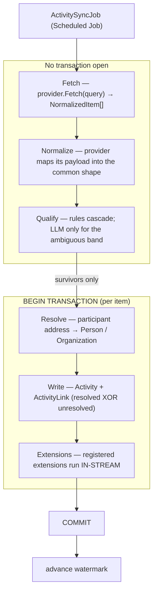

# Activity Sync Engine — Design & Build Plan

**Status:** P1 + P3 complete; P2 (CodeGen) next
**Owner:** BizApps Common
**Created:** 2026-08-29

---

## 1. What this is

A purpose-built ingestion engine in **bizapps-common** that fills the Activity spine
(`Activity` / `ActivityLink` / `ActivityFile`) from external sources — mailboxes, calendars, SMS,
WhatsApp, social feeds — through a **provider plugin model**, and lets downstream apps contribute
extra links **in-process and inside the same transaction** without Common knowing they exist.

Three things it must be true of, in priority order:

1. **A message that should not be captured is never persisted.** Qualification runs before the
   write, not after it.
2. **A new source is a new package, not a migration to Common.** Provider identity is data.
3. **A downstream app can enrich an Activity atomically** without Common naming it.

---

## 2. Why not the MJ Integration Engine

The Integration Engine is the right tool for syncing external *business objects* into MJ entities,
and its plugin distribution model (connector = Open App + `@memberjunction/connector-<name>`,
resolved by `DriverClass` through `MJGlobal.ClassFactory`) is the model this design imitates.

It is the wrong tool for this job, for reasons of **shape**, not quality:

| Integration Engine assumes | Activity ingestion has |
|---|---|
| A discoverable external schema | A mailbox — nothing to introspect |
| A primary key to classify (`SoftPKClassifier`) | A provider message id, known up front |
| DDL to generate for the target | A fixed target schema that already ships |
| One external object → **one** MJ entity row | One message → **a small graph**: `Activity` + N `ActivityLink` |
| Records land in MJ, then are processed | A **pre-write** privacy gate |

The last two are disqualifying rather than inconvenient.

**The graph write.** `CK_ActivityLink_Target` is an exclusive-or: a link carries either
`EntityID` + `RecordID` or `IdentityKind` + `IdentityValue`, never both. Choosing the target
conditionally, per participant, is not something a field map with a transform pipeline expresses.

**The privacy gate.** In the Integration Engine, rows are fetched and written, and only then can
anything else act on them. The only exclusions it supports are **field-level**
(`ResolveExcludedSourceNames`, from a connector's `SyncDirective`); there is no row-level "do not
sync this record" rule anywhere in it. For a mailbox that inverts the requirement — the body would
be persisted before the rule that says it should not have been.

We adopt its **plugin distribution pattern** and reject its **write model**.

### Why not `MJ: Record Processes` for the gate either

`RecordSetProcessor` is the natural home for "run rules and an LLM over a set of records," and its
four work types (`FieldRules` / `Action` / `Agent` / `Infer`) are exactly the escalation vocabulary
this design needs. But `RecordRef` is `{ EntityID, RecordID, Record? }` — **it can only iterate
records that already exist.** Ingestion's entire job is deciding what becomes a record.

Record Processes remains the right tool for a different, real job we should keep in view:
**re-processing Activities that already exist** — re-running classification after a rule change,
backfilling a new derived field across the last quarter. Not the gate.

---

## 3. Pipeline



**Two ordering rules, both load-bearing:**

- **No model call inside a transaction.** Qualification — including any LLM stage — completes
  before `BEGIN`. This is fine at ten messages and catastrophic at ten thousand.
- **No model call before the deterministic filter.** A message whose participants match no known
  contact is discarded having been read only by a string comparison. Inference is only ever
  reached by items that already passed a cheap, local test. This is inherited from the sales
  implementation and is the single most important rule in the design.

---

## 4. Schema

Nine tables/changes. Everything here is CONFIGURATION — nothing is seeded by the migration; provider
types and system rule sets ship as `metadata/`.

### 4.1 `ActivitySyncProviderType` — identity, and the defaults set once per fleet

Replaces `CK_ActivitySyncConnection_Provider`, which made every new source a **migration to Common**.

| Column | Notes |
|---|---|
| `Code` | stable key — `Microsoft365`, `Gmail`, `Twilio.SMS`, `LinkedIn` |
| `DriverClass` | the `@RegisterClass(BaseActivitySyncProvider, …)` key |
| `SupportedKinds` | JSON, e.g. `["Message","Calendar"]` |
| `DefaultQualificationPolicy` | `Include` \| `Exclude` — what an abstained cascade means |
| `DefaultSkippedContentPolicy` | `None` \| `SubjectEncrypted` \| `FullEncrypted` |
| `DefaultEncryptionKeyID` | → `__mj.EncryptionKey` |
| `DefaultStorageProviderID` | → `__mj.FileStorageProvider` |
| `DefaultMaxAttachmentBytes` | |

**These defaults live on the provider type, not the connection, on purpose.** An operator configures
storage and encryption once for "all our Microsoft 365 mailboxes" rather than per mailbox. A
connection overrides only when that mailbox is genuinely different.

`CK_ActivitySyncProviderType_KeyRequired` refuses a retaining policy with no key: keeping content
from a message you declined to ingest is permissible *encrypted*, or not at all.

### 4.2 `ActivitySyncRuleSet` + `ActivitySyncConnectionRuleSet`

Rules used to hang off one connection (`NOT NULL`), so an org-wide prohibition had to be retyped for
every mailbox and a **new mailbox started with none** — governance by copy-paste.

A rule set is authored once and **bound** to many connections, many-to-many and ordered, so a mailbox
composes: org baseline + team overlay + anything specific to itself.

`ActivitySyncRuleSet.InternalDomains` (JSON) is what makes internal/external rules expressible at
all. "Internal" is a property of the **deployment**, not of a message.

`ActivitySyncRule` gains `ActivitySyncRuleSetID` with a strict exclusive-or against the legacy
`ActivitySyncConnectionID` (widened to NULL), so existing rows stay valid — additive.

### 4.3 `ActivitySyncRule` — participant scope and size

- **`ParticipantScope`**: `Any` \| `AllInternal` \| `AllExternal` \| `HasExternal` \| `HasInternal` \| `Mixed`.
  This is the Outlook-rules control. "Exclude internal chatter" is `Action=Exclude` +
  `AllInternal`. **`Mixed` exists because it is the case an all-or-nothing rule gets wrong** — three
  colleagues and one customer on a thread is neither internal chatter nor an external conversation.
- **`MaxAttachmentBytes`** — per-rule cap, narrowing the connection's, narrowing the provider's.

**An unclassifiable address is never counted as internal** (`participants.ts`). A malformed address
siding with "internal" would let one bad entry turn a mixed thread into internal-only, and an
internal-only *exclusion* rule would then silently drop a customer conversation. Erring the other way
costs one extra captured message, which is recoverable; a silent drop is not.

### 4.4 `ActivitySyncExclusion` — the never-ingest list

Rows, not a delimited string. An exclusion you cannot query cannot be audited, and this is exactly
what a legal hold, an HR matter or an opt-out has to be able to prove.

`IdentityKind` covers `Email` \| `Phone` \| `Handle` (social) \| `Domain`. `PersonID` is optional —
an address is often excluded before anyone knows whose it is, and a Person has several
`ContactMethod`s, so the identity is the durable key. `EffectiveFrom`/`EffectiveTo` because holds
have dates. Scoped to a rule set, or **global** when `ActivitySyncRuleSetID` is null.

### 4.5 `ActivitySyncRun` / `ActivitySyncRunDetail` — the audit

`ActivitySyncRun` is one pass over one connection: counts (`Fetched` / `Included` / `Excluded` /
`Duplicates` / `Failed` / `ExtensionErrors`), the watermark before and after, trigger type, and
`IsDryRun`.

`ActivitySyncRunDetail` is **the decision made about every message, including every skip** — which
is what makes *"why did my email not appear"* answerable:

| Column | |
|---|---|
| `ExternalID`, `ExternalThreadID`, `OccurredAt` | opaque ids and a timestamp — always safe to keep |
| `Decision` | `Included` \| `Excluded` \| `Duplicate` \| `Failed` \| `WouldInclude` \| `WouldExclude` |
| `DecidedByStage`, `Reason` | which stage, and why — a rule name, not content |
| `ActivitySyncRuleID`, `ActivitySyncExclusionID` | **the cause**, not a narrative |
| `Confidence`, `AIPromptRunID` | the LLM's decision and its trace, when inference decided |
| `ActivityID` | only ever set when `Decision = 'Included'` (CHECK-enforced) |
| `CapturedContent`, `EncryptionKeyID` | ciphertext + its key, both or neither (CHECK-enforced) |

**`ActivitySyncRunDetail` gets permissions distinct from `Activity`** — it can hold fragments of
messages that were deliberately *not* ingested, a different security class, and the reason
`CapturedContent` is never plaintext regardless of policy. Two mechanisms, decided 2026-08-30.

**1. Field-level security on `CapturedContent`.** MJ is implementing FLS via an
`EntityFieldPermission` table. Assume it: `CapturedContent` is restricted at the *field* level
rather than by hiding the entity. That is what keeps the run log useful — the decision rows **are**
the answer to *"why did my email not appear"*, and the people asking should be able to read them.

This **supersedes the earlier recommendation to split the table** into a 1:1 child. That child
existed only to work around MJ's inability to express "entity readable, this column not"; once FLS
can say it directly, the workaround is strictly worse than the thing it stood in for.

**2. Default-deny at the entity level, authored as metadata.** CodeGen emits `UI` read /
`Developer` CRUD / `Integration` CRUD for every new entity. Nobody chose that for this table, and
it is wrong here. `metadata/entities/` carries explicit `EntityPermission` rows denying read to
every role except Developer, keyed by nested `@lookup` exactly as MJ pins JSONType metadata to an
`EntityField` — no hardcoded UUIDs, resolved at push time:

```json
[
  {
    "_comments": [
      "ActivitySyncRunDetail can hold encrypted fragments of messages deliberately NOT ingested.",
      "CodeGen's default UI read is wrong for this entity — deny explicitly rather than inherit it."
    ],
    "fields": { "Name": "MJ_BizApps_Common: Activity Sync Run Details" },
    "relatedEntities": {
      "MJ: Entity Permissions": [
        {
          "fields": { "CanRead": 0, "CanCreate": 0, "CanUpdate": 0, "CanDelete": 0 },
          "primaryKey": {
            "ID": "@lookup:MJ: Entity Permissions.EntityID=@lookup:MJ: Entities.Name=MJ_BizApps_Common: Activity Sync Run Details&RoleID=@lookup:MJ: Roles.Name=UI"
          }
        }
      ]
    },
    "primaryKey": { "ID": "@lookup:MJ: Entities.Name=MJ_BizApps_Common: Activity Sync Run Details" }
  }
]
```

`EntityPermission`'s natural key is `(EntityID, RoleID)` and both halves resolve **by name**, so the
file survives a re-mint of entity IDs — which this branch has already done once, when the
single-pass CodeGen regenerated all seven.

⚠️ **One consequence, because it fails quietly.** The permissive rows CodeGen emitted are *inside
the migration*, so a host gets `UI CanRead = 1` the moment it installs. The deny lives in
`metadata/`, which reaches a host only through a release-time `*__Metadata_Sync.sql` (§11). Until
that migration carries it, a host is permissive and every step still reports success. The migration
is the deliverable here, not the `mj sync push`.

### 4.6 `ActivitySyncConnection` — activation window and overrides

- **`StartAt` / `EndAt`** — combine with `Status`: syncs only when `Status = 'Active'` **and** now is
  inside the window, either bound open when null. A mailbox can be provisioned ahead of a start date
  or retired on one without anyone remembering to flip a switch.
- **`SkippedContentPolicy`, `EncryptionKeyID`, `StorageProviderID`, `MaxAttachmentBytes`** — nullable
  overrides of the provider-type defaults. Null inherits.
- `ActivitySyncProviderTypeID` FK; `Provider` deprecated in place.

### 4.7 `ActivitySyncExtension`

Unchanged from the original design: `DriverClass`, connection/provider-type scope, `Sequence`,
`FailurePolicy` (`Skip` default), `TimeoutMS`, `IsEnabled`, `LastError`.

---

## 4A. Dry run

`SyncRunOptions.DryRun` fetches, qualifies and resolves exactly as a real run does, then writes
**only** the run and its details — never an `Activity`, never a link, never an attachment, and it
never advances the watermark. Decisions are recorded as `WouldInclude` / `WouldExclude`.

`CK_ActivitySyncRun_DryRunNoWatermark` enforces the watermark half **at the database**, so a bug in
the engine cannot produce a dry run that quietly moved the connection forward.

This is the only safe way to see what a rule set does to a real mailbox before pointing it at one,
and it is the answer to "what is the blast radius" before first ingest.

---

## 4B. Attachments and storage

Attachments go to **MJ Storage**, never into the database. The storage provider is
`ActivitySyncProviderType.DefaultStorageProviderID` (→ `__mj.FileStorageProvider`), overridable per
connection — again, configured per fleet rather than per mailbox.

Size caps narrow down the chain: provider → connection → rule. `IncludeAttachments` remains the
on/off switch; `MaxAttachmentBytes` is the ceiling. Attachments are the highest-risk payload and the
most expensive to keep, so the default is off and bounded.

---

## 5. `BaseActivitySyncProvider`

A **base class**, not an interface, so shared behaviour lives once and subclasses fill in only what
is genuinely provider-specific.

**The base class owns** (subclasses do not reimplement, and mostly cannot break):

- The fetch loop, the `Limit` cap, and batch assembly.
- **The watermark.** Subclasses report `HighWatermark` on the batch; the base decides whether to
  advance it. Two rules the sales implementation learned and that belong here as *behaviour*, not
  as advice:
  - A **calendar** source must never advance on `max(StartedAt)` — a meeting's start is routinely
    in the future, so one December event pins the watermark to December and the calendar silently
    stops ingesting, permanently and with no error. Calendar sources advance on ingest time.
  - **Never advance past a failure.** A *discarded* item has been seen to a conclusion and the
    watermark may pass it; a *failed* one has not, and because most sources have no date filter,
    anything the watermark passes can never be re-fetched. Losing it is permanent.
- Credential resolution via the MJ Credentials engine (`CredentialsRef`) — secrets never in the row.
- `LastSyncAt` / `LastError` / `Status` maintenance on the connection.
- Issue collection: a partial batch is reported, never thrown away.

**Subclasses implement** (abstract):

```
abstract Kind: 'Message' | 'Calendar' | 'Social' | 'Chat'
abstract ProviderTypeCode: string          // matches ActivitySyncProviderType.Code
abstract FetchRaw(query): Promise<RawBatch>
abstract Normalize(raw): NormalizedItem[]
abstract ComputeHighWatermark(items): Date | null
```

**Hooks subclasses may override** (all no-op by default):

```
OnBeforeFetch / OnAfterFetch
OnBeforeNormalize / OnAfterNormalize
OnBeforeQualify / OnAfterQualify
OnBeforeWrite / OnAfterWrite
OnError
```

Providers wrap existing MJ plumbing rather than reimplementing transport: MJ Communication
providers for Gmail and MSGraph (`GetMessages`, `GetSingleMessage`, `SearchMessages`, and
`CreateSubscription` / `ParseNotification` where push is available), Twilio for SMS and WhatsApp,
and MJ Actions for social feeds. The provider's job is to speak that transport in this engine's
vocabulary.

---

## 6. Qualification cascade

Ordered stages, each returning **decide or defer**:

```ts
type QualificationVerdict = {
    Decision: 'Include' | 'Exclude' | 'Undecided';
    Reason: string;               // always populated, including on Include
    StageName: string;
    Confidence?: number;
    AIPromptRunID?: string;       // when a model decided
    ActivitySyncRuleID?: string;  // THE CAUSE — what ActivitySyncRunDetail records
    ActivitySyncExclusionID?: string;
}
```

A verdict must be able to **name its cause**, because that is what the run log stores. A log that
says "excluded" without saying by what is a narrative, not evidence.

Stage order, cheapest and most certain first:

0. **Exclusions** — `ActivitySyncExclusion`, matched on any participant identity or its domain.
   **Absolute and first.** An exclusion is not a rule that a later `Include` can outrank: a legal
   hold, an HR matter or an opt-out must not be defeatable by rule ordering, or the guarantee is
   only as good as whoever sequenced the rule set last.
1. **Rules** — every `ActivitySyncRuleSet` bound to the connection, in binding order then rule
   `Sequence`: `Include`/`Exclude`, direction, date window, folders, domains, subject, attachment
   size, and **`ParticipantScope`** for the internal/external tests.
2. **Known-participant test** — an exact `ContactMethod` address match. Never a domain match: a
   domain rule captures every internal message and a customer's entire company, and it *reads as
   working* while putting private correspondence on a deal timeline.
3. **Inference** — an MJ AI Prompt, reached only by items the earlier stages left `Undecided`, and
   only when the connection enables it. Records the `AIPromptRunID` for trace.

Stage 3 running last is **enforced in code**, not documented: stages declare `RequiresInference`
and `RunQualificationCascade` throws if a deterministic stage is ordered after an inference one —
before consulting the model.

**The abstention rule:** a stage that is not confident returns `Undecided` rather than guessing.
If the chain ends `Undecided`, the provider type's `DefaultQualificationPolicy` decides — and for
anything mailbox-shaped that default is **Exclude**. Fail closed.

**The effective default is therefore known-participant allow**, and that is worth stating out loud
rather than leaving to be discovered: an item no rule matches, whose participants include a known
`ContactMethod`, is captured. An item nothing matches at all is not.

> **On reusing `pk-classifier`:** we copy the *pattern*, not the code. Its cascade — convention →
> naming heuristic → statistical sampling → one-shot LLM, *returning no candidate when nothing is
> confident enough* — is the right shape and the right honesty. Its stages are about identifying a
> primary key from schema metadata; none of them transfer. The transferable asset is the contract
> above plus the discipline of explicit abstention.

---

## 7. Extensions

```
abstract class BaseActivitySyncExtension {
    abstract Enrich(context: ActivityWriteContext): Promise<void>;
}
```

`ActivityWriteContext` carries the saved `Activity`, its links so far, the `NormalizedItem`, the
resolved parties, the connection, the provider being written through, and the ambient transaction.

**Four rules, decided rather than discovered:**

1. **Ordering is explicit.** `Sequence`, ascending. No implicit registration order.
2. **Failure defaults to `Skip`,** with the error recorded on the run and the extension's
   `LastError`. `Abort` is available and is opt-in. The activity is worth more than the
   enrichment, and one buggy consumer app must not be able to halt ingestion for every app on the
   host.
3. **Timeouts are enforced,** because an extension holds the write transaction open.
4. **Extensions enrich; they never veto.** Qualification is the engine's job and has already run.
   If an extension could reject an activity, whether a message is captured would depend on which
   apps happen to be installed — precisely the coupling this design exists to prevent.

Consumer blindness holds: the interface and the table live in Common and reference only Common
types; `Sales.DealLinker` is a class in the sales package and a row in sales' metadata. A host
without sales installed has no row and no binding.

---

## 8. What migrates from bizapps-sales

Sales built roughly 80% of this against these exact entities. This is a promotion, not a rewrite.

| Sales today (`packages/CoreEntitiesServer/src/activities/`) | Destination |
|---|---|
| `ActivitySource.ts` (the port) | → `BaseActivitySyncProvider` (Common) |
| `MSGraphActivitySource`, `MSGraphCalendarSource`, `GraphMessageMapper` | → Common provider plugin |
| `ImportedGraphActivitySource`, `FixtureActivitySource` | → Common (fixture provider is how this is tested) |
| `RelevanceFilter` | → qualification stage 2 (Common) |
| `ActivityWriterService` | → Common writer |
| `ActivityIngestService`, `ActivitySyncJob` | → `ActivitySyncEngine` (Common) |
| `ActivityReader` | → Common (or stays; it is a read model) |
| **`DealMatcher`** | → **stays in sales**, re-expressed as `Sales.DealLinker` extension |
| `Sales.SyncActivities` action + hourly ScheduledJob | → Common ships the action; sales' row retires |

Sales' integration checks AC1–AC13 are the acceptance suite. They were written against this
behaviour and should move with it, minus the deal-specific ones which stay in sales to cover the
extension.

**Sequencing:** Common ships first and sales' removal PR follows. They cannot land together —
sales cannot delete code whose replacement is not yet published. Tracked as
MemberJunction/bizapps-sales#37.

---

## 9. Engine

`ActivitySyncEngine extends BaseEngine<ActivitySyncEngine>` — metadata load and cache of provider
types, connections, rule sets, exclusions and extension registrations, with `@RegisterForStartup`,
`EnsureLoaded`, and cross-server cache invalidation inherited rather than written.

Scheduling stays MJ's: a `MJ: Scheduled Jobs` row invoking an Action, exactly as sales does today
(`ConcurrencyMode: Skip` — two runs racing to advance one watermark can leave it *behind* where
the earlier run reached; `MissedRunPolicy: RunOnce` — with no date filter on most fetches, ten
catch-up runs make ten identical requests).

### On borrowing the watermark helper from Integration

Considered and **rejected**. The valuable part is not code — it is ~30 lines plus the two rules in
§5, which belong in the base class as enforced behaviour rather than as a utility a provider
might forget to call. Taking `@memberjunction/integration-engine` as a dependency to get it would
re-introduce the coupling this whole design rejects, and Integration's watermark is a *table*
keyed to `CompanyIntegrationEntityMap` — the storage does not transfer; we already have
`ActivitySyncConnection.LastSyncAt`.

If a genuinely shared abstraction emerges later, extract a small `@memberjunction/sync-watermark`
that Integration also adopts. Do not do that speculatively.

---

## 10. Known risk this design does not solve

`MSGraphProvider` authenticates with `ClientSecretCredential` — **app-only auth**. An app-only
`Mail.Read` grant is tenant-wide: it reads every mailbox in the tenant, not one. Scoping it needs
an Exchange **Application Access Policy** binding the app registration to a security group, which
is a tenant-admin action that has not been performed.

Nothing in this plan changes that. The Graph provider ships refusing to fetch unless explicitly
allowed, and the fixture provider is how the engine is exercised until the policy exists.

---

## 11. Phases

| Phase | Work | Blocked on |
|---|---|---|
| **P0** | This document | — |
| **P1** | Migration: provider types, rule sets + binding, exclusions, run + run detail, extensions, connection window + overrides | a database for CodeGen |
| **P2** | CodeGen + generated entities; metadata seeds for the four provider types | P1 |
| **P3** | `BaseActivitySyncProvider`, qualification cascade, participant classification, run/dry-run vocabulary, `BaseActivitySyncExtension` | ✅ done (50 tests) |
| **P4** | `ActivitySyncEngine`, writer, resolver | P2 |
| **P5** | Graph + fixture providers ported from sales | P4 |
| **P6** | Sales: `Sales.DealLinker` extension; delete migrated code; retire its ScheduledJob row | Common published |

---

## 12. Open questions

**Answered in this design** (Amith, 2026-08-29) and recorded here so they are not re-opened:

- *Global rules* — `ActivitySyncRuleSet`, bound many-to-many. Was: retyped per mailbox.
- *Person-level exclusion* — `ActivitySyncExclusion`, queryable rows, optional `PersonID`.
- *Exclusion audit* — `ActivitySyncRunDetail`, including the LLM's decision and its `AIPromptRunID`.
- *Dry run* — `SyncRunOptions.DryRun`, with the watermark half CHECK-enforced.
- *Attachment size + storage* — capped down the chain, stored in MJ Storage, defaulted per provider.
- *Retention of skipped content* — `SkippedContentPolicy`, encrypted or not at all, per provider
  with a per-connection override.

**Still open:**

1. **Body storage for INCLUDED activities.** Distinct from `SkippedContentPolicy`, which governs
   messages we declined. `ActivityFile` joins to MJ Files: full bodies, headers-and-snippet, or a
   per-connection setting? Recommendation on the PR is a `StoreBody` flag defaulting to `Snippet`.
2. **`Activity.Visibility` for synced mail.** The column defaults `Internal`, which is right for a
   manually logged activity and wrong for a synced personal mailbox. Recommendation: the engine
   sets `Private` explicitly on write rather than changing the column default.
3. **Composes with #46 / #47 — CLOSED for this design (Amith, 2026-08-30). Not a gate.**
   #47 records that `MJ_BizApps_Common: People` grants the `UI` role `CanRead = 1` — CodeGen's
   default, not a choice made for People — so on a host whose middleware grants `UI` to every
   authenticated user, every authenticated user reads every Person row.

   **Ruling: the shipped default staying open is fine.** Who may read `People` is the deploying
   implementor's call; a real MJ deployment defines its own roles and grants to suit. This design
   does not gate on it and should not try to solve it.

   Two things that make that ruling safe to hold, and both are ours rather than the host's:

   - `ActivitySyncRunDetail` does **not** inherit the permissive default — §4.5 denies read to every
     role but Developer, with FLS on `CapturedContent`. The one entity here that holds fragments of
     messages we declined is closed by construction, whatever a host does with `UI`.
   - The Graph provider still refuses live fetch, but for an unrelated reason: app-only `Mail.Read`
     is **tenant-wide** until an Exchange Application Access Policy scopes it. That is a Microsoft
     consent boundary, not a role question, and it does not move with this ruling.

   Worth keeping the framing straight for whoever reads #47 next: it is a property of a host's
   role-assignment policy, not a dependency of any app here. Its evidence comes from BCSaaS's
   `ensureUIRole()` middleware, and #47's own closing note says a host that never calls it has a
   much smaller `UI` population. **Nothing in bizapps-common or bizapps-sales references BCSaaS** —
   sales has zero hits across `.ts`, `.md`, `.json` and `.sql`; common's only mentions are a
   deprecation note in `PersonEntityServer` and a branching-model aside in `CLAUDE.md`. The general
   statement is: *whatever population holds `UI` on a given host reads whatever `UI` reads.*
4. **Dedupe key across mailboxes.** A Graph message id is not stable across mailboxes, so the same
   thread ingested from two connections yields two rows. Recommendation: **two rows is correct** —
   two observations, each with its own owner's visibility — grouped later via `Details.MessageID`,
   the RFC-822 header, which `activity-json-types.ts` already has a field for.
