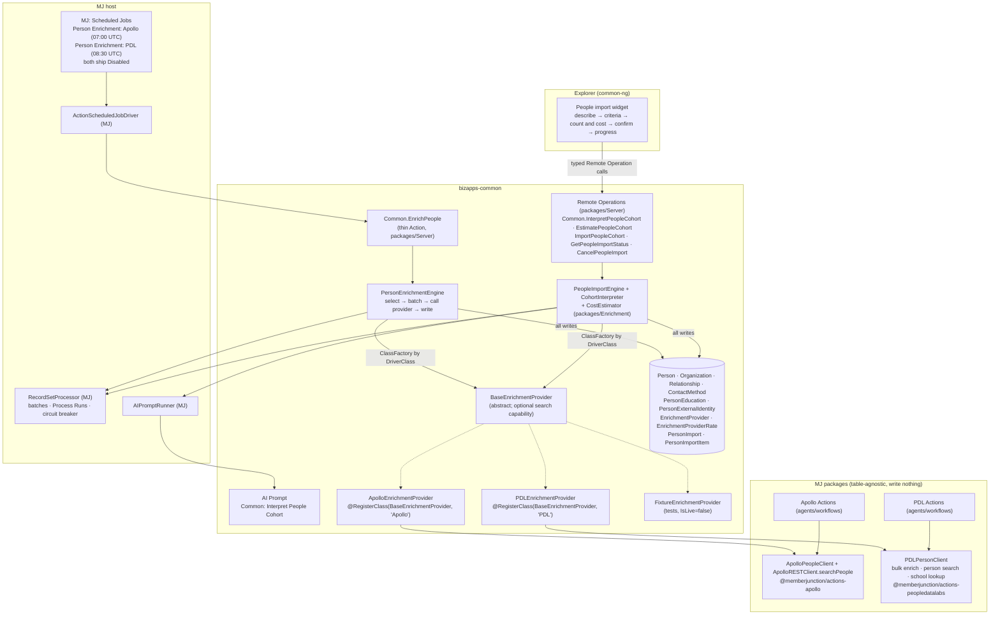

# Person Enrichment: education history, vendor identity, and a scheduled enrichment job

> **Status:** Plan, ready for implementation. No code in this PR.
> **Drafted:** 2026-10-08. The decisions in §2 were agreed with the requester on that date.
> **Revised:** 2026-10-10. People Data Labs now ships in the first release alongside Apollo (D13),
> instead of in later phases.
> **Revised again:** 2026-10-10. Common also gets a **people importer**: a user describes a cohort in
> English, sees a count and an estimated cost per provider, and confirms before anything is bought
> (Phases 5 and 6, D2 and D15–D18). Vendor costs now live in the database (D16). The plan also records
> why the engine runs on MJ's record-set processor rather than on saved Record Processes (D14,
> Appendix D).
> **Repos touched:** `MemberJunction/MJ` (Phases 0 and 1) and `MemberJunction/bizapps-common`
> (Phases 2 to 6).
> **Read first:** §1, §2 and §3. The phases are written to be picked up one at a time. Phases 5 and 6
> come after the enrichment release (Phases 0 to 4) and do not block it.

---

## Contents

0. [Summary](#0-summary)
1. [Why, goals and non-goals](#1-why-goals-and-non-goals)
2. [Decisions](#2-decisions)
3. [Architecture](#3-architecture)
4. [Phase 0: Apollo and PDL live spike](#4-phase-0-apollo-and-pdl-live-spike)
5. [Phase 1 (MJ): vendor clients, Apollo action bug fixes, integration rows, scheduler fix](#5-phase-1-mj-vendor-clients-apollo-action-bug-fixes-integration-rows-scheduler-fix)
6. [Phase 2 (common): schema migration](#6-phase-2-common-schema-migration)
7. [Phase 3 (common): enrichment engine, action and fixture provider](#7-phase-3-common-enrichment-engine-action-and-fixture-provider)
8. [Phase 4 (common): Apollo and PDL providers and the scheduled jobs](#8-phase-4-common-apollo-and-pdl-providers-and-the-scheduled-jobs)
9. [Phase 5 (common): people importer, server side](#9-phase-5-common-people-importer-server-side)
10. [Phase 6 (common): people importer UI](#10-phase-6-common-people-importer-ui)
11. [People Data Labs reference](#11-people-data-labs-reference)
12. [Testing strategy](#12-testing-strategy)
13. [Privacy, security and cost](#13-privacy-security-and-cost)
14. [Release and rollout](#14-release-and-rollout)
15. [Out of scope and follow-ups](#15-out-of-scope-and-follow-ups)
16. [Risks](#16-risks)
17. [Open questions](#17-open-questions)
- [Appendix A: Apollo action bug inventory](#appendix-a-apollo-action-bug-inventory)
- [Appendix B: Where the facts in this plan come from](#appendix-b-where-the-facts-in-this-plan-come-from)
- [Appendix C: Notes on the People Data Labs brief](#appendix-c-notes-on-the-people-data-labs-brief)
- [Appendix D: Record Set Processing on 6.1, what works and what to report](#appendix-d-record-set-processing-on-61-what-works-and-what-to-report)

---

## 0. Summary

We want to know where the people in our database went to school, and keep that current, so apps
can answer questions like "which of our members are Harvard Kennedy School graduates?"

The work:

1. **Common gets four new tables for enrichment:**
   - `PersonEducation`: a person's schools and degrees.
   - `PersonExternalIdentity`: the person's ID at each data vendor, and whether the vendor matched
     them.
   - `EnrichmentProvider`: a registry of vendor plugins, the same pattern as
     `ActivitySyncProviderType`.
   - `EnrichmentProviderRate`: how many credits each vendor operation uses (item 5).

   The importer adds two more, `PersonImport` and `PersonImportItem`, in its own migration (item 6).

   Common's `Relationship` table also gains two provenance columns, so the engine can tell the
   employment rows it wrote from the ones a person entered.
2. **Common gets an enrichment engine.** It picks People who already exist, asks a provider about
   them in batches, and writes the answers into common's own tables. A thin `Common.EnrichPeople`
   action wraps it. Two scheduled jobs run the action, one per provider, and both ship **Disabled**.
3. **Each vendor is a provider subclass of `BaseEnrichmentProvider`. Apollo and People Data Labs
   (PDL) both ship in the first release.** Each provider wraps a **table-agnostic client class in
   MJ**. It does not wrap MJ's Actions: MJ's rule is that code never calls code through an Action.
   PDL is the stronger source for education (it stores schools, degrees and majors as structured
   fields); Apollo is the stronger source for current employment.
4. **MJ gets the two client classes:** an `ApolloPeopleClient` in the existing Apollo package and a
   `PDLPersonClient` in a new `@memberjunction/actions-peopledatalabs` package. MJ also gets fixes
   for 12 bugs in the Apollo enrichment actions, `Apollo` and `People Data Labs` rows in
   `MJ: Integrations`, and a scheduler fix. The PDL client also covers PDL's person search, and the
   Apollo search client gains location and keyword filters, both for the importer.
5. **Vendor costs live in the database.** Each provider row gets a credit price that the host enters
   from its own contract, and a new `EnrichmentProviderRate` table says how many credits each
   operation uses. Every preview, estimate and run reports credits, and money when a price is set.
6. **Common gets a people importer (Phases 5 and 6).** A user describes the people they want in
   English, for example "Harvard Kennedy School graduates working in Boston". An AI Prompt turns that
   into structured criteria the user can check. For each active provider, common shows how many
   people match and what importing them would cost. Only when the user confirms does it create the
   People. Someone already in the database, matched by vendor ID or LinkedIn URL, is linked rather
   than created again, and a likely duplicate is held back for review. It is built on Remote
   Operations, so the same calls work from the UI, from server code and from other apps.

The **nightly enrichment** never creates People: it enriches rows that already exist. The
**importer** is the only part of this plan that creates People, and only after a user has seen the
count and cost and confirmed (D2, D9, D17). Outreach on top of an imported cohort (campaigns,
sequences, scoring) still belongs above common (§15).

---

## 1. Why, goals and non-goals

### Why now

- **No education data exists.** The only education data in the BizApps family today is a single
  `School` / `Degree` / `GPA` / `GraduationDate` set on ATS's `Applicant`
  (`bizapps-ats/migrations/V202608081816__v0.1.x__ATS_Core_Schema.sql:226-248`). Nothing stores
  more than one school per person, and nothing pulls education from outside.
- **Our Apollo integration already reads education but has nowhere sensible to put it.** MJ's
  `Apollo Enrichment - Contacts` action extracts schools and degrees from Apollo's response
  (`MJ/packages/Actions/ApolloEnrichment/src/contacts.ts:788-839`), but only into flat columns the
  caller names. It also has the bugs listed in Appendix A.
- **Several apps need the same data.** Education is a fact about who a person is, like employment,
  which common already holds as an `Employee` relationship. ATS, the planned credentialing app and
  association apps such as more-cheese all have a use for it.

### Goals

1. A person can have any number of education records, entered by hand, imported, or written by an
   enrichment provider. Every row records where it came from.
2. An admin can switch on a nightly job that enriches existing People through a chosen vendor. It
   respects rate limits and a per-run cap, and never pays twice for the same person within a refresh
   window.
3. Adding a vendor means adding a provider subclass and a seed row, not changing the engine or the
   schema.
4. Enrichment never overwrites data a person entered, and the nightly enrichment never creates
   People.
5. The MJ Apollo actions work correctly with UUID keys, per-company credentials and header
   authentication.
6. A user can describe a cohort in English, review the criteria, see a count and cost per provider,
   and import it with one confirmation. Imported people are deduplicated against existing People and
   enriched in the same pass.
7. Nobody spends vendor credits without seeing an estimate first: the importer shows one before every
   import, and the enrichment action's Preview mode reports one.

### Non-goals (this plan)

- **Outreach on imported people.** Campaigns, sequences, lead scoring, territory routing and saved
  searches that re-run on a schedule belong in sales, marketing or a prospecting app (§15). The
  importer stops at "these people now exist in common".
- **Licensed bulk extracts.** Buying a whole cohort as a file (the 80,000-person brief in Appendix C)
  is a contract decision and a one-off load, not a user-driven import (§15).
- **A school-alias system.** Mapping "HKS", "Harvard Kennedy School" and "John F. Kennedy School of
  Government" to one Organization is a follow-up (§15). v1 keeps the raw institution name on every row
  and links an Organization only on an exact name match.
- **Enriching Organizations.** MJ's `Apollo Enrichment - Accounts` action keeps doing this for
  whoever uses it today. Common gets no organization enrichment in this plan.
- **A custom enrichment UI.** The CodeGen-generated forms show the new tables on the Person form as
  related lists. A dedicated Education section is a follow-up. The importer is the one new UI in this
  plan (Phase 6).
- **PostgreSQL migrations.** The release engineer converts them (§14).

---

## 2. Decisions

Each decision records the option we turned down, so nobody has to re-argue it.

| # | Decision | Rejected alternative, and why |
|---|---|---|
| D1 | **The education table and the enrichment job live in bizapps-common.** | *A higher BizApps app.* Education is identity data that several apps read. Sales draws the same line from the other side: it keeps outreach consent on its own `SalesContact` table because "consent is a sales-outreach fact, not an identity fact" (`bizapps-sales/migrations/V202608042101__v0.1.x__Tables_and_Objects.sql:445-449`). The new tables reference only Person and Organization, so common's consumer-blindness rule (`CLAUDE.md`, "Consumer blindness") holds. |
| D2 | **Common ships a user-initiated people importer (Phases 5 and 6). Outreach on the imported people does not live in common.** *Revised 2026-10-10; the first draft kept all vendor search out of common.* | *No importer in common; put prospecting in a higher app* (the first draft). Every app that wants "bring these people in" (sales, marketing, ATS sourcing, association membership) would rebuild the provider registry, the cost data and the dedupe against Person. The cost and consent concerns that drove the first draft are handled by how the import works (user-initiated, estimated, capped, confirmed and audited, D17), not by which repo it lives in. The importer knows no consumer app, so consumer blindness holds. *An automatic importer (saved searches that re-run on a schedule).* That is list-building with recurring spend and no human decision each time; it stays above common (§15). |
| D3 | **Education gets its own table, `PersonEducation`.** | *A new "Alumnus" `RelationshipType` on `Relationship`.* (a) Relationship has no degree, field-of-study or graduation columns. (b) `vwOrganizations.ActivePersonCount`, labelled "Active Staff Count" on the form, counts every Active PersonToOrganization row (`migrations/V202609290300…:210-218`), so alumni would count as staff. (c) Common's entity action logs a timeline Activity on every Relationship create (`metadata/entity-actions/.common-entity-actions.json`), so an import would flood timelines. |
| D4 | **Employment stays on `Relationship` with type `Employee`.** Enrichment writes employment there too. | *A separate employment table.* `vwPeople` already derives `CurrentOrganization*` and `CurrentJobTitle` from Employee relationships (`migrations/V202609290300…:92-95, 141-161`), and more-cheese's data uses them heavily. A second model would split the truth. |
| D5 | **`Relationship` gains `Source` and `SourceSystem` columns.** | *Leave Relationship alone.* Without them the engine cannot tell the rows it wrote from rows a person entered, so it could not update or end its own rows safely. `PersonJobFunction.Source` is the precedent (`migrations/V202609211200…:54-72`). Risk and mitigation: §16 R1. |
| D6 | **Vendor plugins are registered through an `EnrichmentProvider` table plus a `BaseEnrichmentProvider` class, resolved by `DriverClass`.** | *A hard-coded switch on vendor name.* The registry is the pattern common uses for Activity Sync (`ActivitySyncProviderType` and `BaseActivitySyncProvider`) and MJ uses for scheduled job drivers. |
| D7 | **Providers wrap a table-agnostic MJ client class, not an MJ Action.** | *Wrap the existing Apollo Actions.* `MJ/packages/Actions/CLAUDE.md` says "Code-to-code calls should NEVER go through Actions". The existing Apollo actions also have the wrong shape: they write into columns you name, while common needs something that fetches and returns data and writes nothing. |
| D8 | **Providers never write. The engine owns every write.** | *Each provider writes its own rows.* Write rules such as "never overwrite manual data" and "end only rows we own" must be identical for every vendor, so they live once, in the engine. |
| D9 | **The nightly enrichment engine never creates People. It only enriches rows that already exist. The importer is the only code that creates People, and only after a user confirms an estimate (D17).** | *Let enrichment upsert People from vendor matches.* Enrichment runs unattended on a schedule, so it would add strangers' personal data and spend credits with no human decision. |
| D10 | **Both scheduled jobs ship `Status: Disabled`.** An admin turns each on in MJ's Scheduling app. | *Ship them Active and guard inside the action.* An Active job does nothing on a host without credentials, but a host that has an Apollo or PDL key for another purpose would start spending credits on install. Precedent for shipping Disabled: `bizapps-caliber/metadata/scheduled-jobs/caliber-sweeps.json`. |
| D11 | **PDL's client lives in MJ, in a new `packages/Actions/PeopleDataLabs` package next to Apollo's.** | *The separate Integrations repo.* That repo holds Integration-framework sync connectors. This is a client plus thin Actions, the same shape as the Apollo package. Revisit if MJ moves all vendor action packages out of core. |
| D12 | **First-time enrichment of a person writes its history rows with `SkipEntityActions: true`. Later changes save normally.** | *Always fire entity actions.* That floods timelines with years of past jobs. *Never fire them.* That hides real signals such as "this person changed jobs", which downstream apps may bind to. |
| D13 | **Apollo and PDL both ship in the first release, each with its own Disabled scheduled job.** The jobs run at staggered times so they never overlap. An admin enables whichever vendor they have a contract and credential for, or both. | *Ship Apollo first and PDL later* (this plan's first draft). Education is the reason for the feature, and PDL is the vendor that indexes it as structured data. If Phase 0 finds Apollo no longer returns education, an Apollo-only first release would ship without the feature's main purpose. Building both at once also proves the provider seam with two real implementations rather than one. *One job whose `ProviderCode` the admin edits.* Two jobs are clearer in the Scheduling app, keep separate run histories, and let a host run both. |
| D14 | **The enrichment engine and the importer run on MJ's record-set processor directly (`RecordSetProcessor.Instance.Process`), not as saved `MJ: Record Processes` rows.** The processor gives them keyset paging, batches, Process Run audit rows, an error-rate circuit breaker, a rate limit and an after-batch stop hook. | *Configure each as a saved Record Process and schedule it there.* On 6.1: (a) the work type is a fixed CHECK list, so a "batched vendor call" type needs a core migration; (b) the Action work type calls once per record, while the vendors take 10 to 100 people per call; (c) cancel and resume don't work, and the UpdatedAt watermark compares the wrong column (Appendix D); (d) Record Process schedules hit the same next-run bug as §5.5. Revisit when MJ ships a batched work type and the Appendix D fixes. |
| D15 | **The AI Prompt turns English into provider-neutral criteria. Each provider's code translates those criteria into its own vendor query.** The LLM never writes a vendor query and never invents an ID: school names are resolved through PDL's free school lookup. | *Let the LLM write each vendor's query directly* (PDL's query language, Apollo's params). That query can't be shown to the user as criteria they can check, can't be validated against a schema, may be broader than the user meant (and so cost more), and needs a prompt per vendor. Neutral criteria are validated, shown as editable chips, shared by every provider, and each provider says exactly which criteria it can't apply. |
| D16 | **Vendor costs live in the database.** `EnrichmentProviderRate` holds credits per operation; `EnrichmentProvider.CreditPrice` and `CreditCurrency` hold the host's own price per credit. **An empty price means unpriced, never free**, following MJ's AI cost rule (`MJ/guides/AI_USAGE_AND_COST_ANALYTICS_GUIDE.md` §1: NULL is unpriced, 0 is free). | *Hard-code costs in each provider class.* Prices change and differ per contract; changing a number should not need a release. *Effective-dated price rows, like `MJ: AI Model Costs`.* Estimates only need today's numbers; MJ's Record Changes keep the history of every edit, and each import and run stamps the price it used. *An FK to a Currency table.* Common has none and must not depend on bizapps-accounting; store an ISO 4217 code, as `MJ: AI Model Costs.Currency` does. |
| D17 | **The server enforces the confirm step.** An import runs only against a fresh estimate saved as a `PersonImport` row, for the same provider and criteria, and never past the people and credit caps the user confirmed. | *Rely on the UI's confirm dialog.* Remote Operations can be called by any client and by other apps' server code, so a check that lives only in the UI can be skipped by a bug or a different caller, straight into spending. |
| D18 | **The importer's API is a set of Remote Operations in the `Common.` namespace, not Actions.** | *Actions.* MJ's rule is that Actions are boundaries for agents and workflows, not the way an app's own UI calls its server. Remote Operations are MJ's typed calls that work the same from the browser and the server, report progress, and carry an API scope (`MJ/guides/REMOTE_OPERATIONS_GUIDE.md`). An agent-facing Action can wrap the same engine later (§15). |

---

## 3. Architecture

### 3.1 Layers



### 3.2 One run, end to end

1. The scheduler fires the job. `ActionScheduledJobDriver` runs `Common.EnrichPeople` with the
   job's static params, for example `ProviderCode=Apollo` and `MaxPeople=500`.
2. The action validates params and calls `PersonEnrichmentEngine.Run(options)`.
3. The engine loads the `EnrichmentProvider` row by `Code` and refuses if it is missing or inactive.
   It creates the provider instance through the ClassFactory using `DriverClass`, then asks the
   provider to resolve credentials.
4. The engine builds the eligibility filter (§7.5) and iterates eligible People by primary key in
   batches of `provider.MaxBatchSize` (Apollo 10, PDL 100).
5. For each batch:
   1. Load everything the batch needs in **one** `RunViews` call (§7.6).
   2. Build one request per person.
   3. Call `provider.EnrichPeople(requests, context)` and get one result per person.
   4. Write each person's results in its own entity transaction (§7.7).
6. The engine stops when the eligible set is exhausted, `MaxPeople` is reached, the time budget runs
   out, the vendor returns a rate-limit error, or the error-rate circuit breaker trips. It returns
   counts and a `StoppedReason`.
7. The action copies the counts into output params. The job run row stores them in `Details`.

A person whose results were written has a fresh `PersonExternalIdentity.LastCheckedAt`, so they drop
out of the eligible set. A run that stops early simply leaves the rest for the next run. There is no
cursor to resume from.

### 3.3 One import, end to end

Phases 5 and 6 build this. §9 has the detail.

1. **Describe.** The user types "Harvard Kennedy School graduates working in Boston" into the import
   widget, which calls `Common.InterpretPeopleCohort`.
2. **Interpret.** The operation runs the AI Prompt `Common: Interpret People Cohort`, which returns
   provider-neutral criteria (§9.3): a school of "Harvard Kennedy School" and a location of "Boston,
   Massachusetts, United States". Common resolves the school name through PDL's free school lookup.
   For each active provider, it reports which criteria that provider can apply. Apollo can't filter
   on schools, so its row says so. No vendor credits are spent; the prompt's own model cost is
   recorded on its prompt run as usual.
3. **Review.** The widget shows the criteria as chips the user can edit, with the prompt's
   assumptions ("Boston means the metro area").
4. **Estimate.** The widget calls `Common.EstimatePeopleCohort`. Each provider that can apply the
   criteria counts the matches (PDL: a one-record search, which costs 1 credit when anything matches,
   §11.4). The cost estimator turns counts into credits and money with the provider's rate rows and
   credit price (D16). Each estimate is saved as a `PersonImport` row in status `Estimated`.
5. **Confirm.** The user picks a provider and a number of people, for example 200 of about 1,240, and
   sees "200 people, 200 credits, about $50". On confirm the widget calls
   `Common.ImportPeopleCohort` with the estimate's ID and the caps the user saw.
6. **Import.** The server re-checks the estimate (fresh, same criteria, caps within it; D17), then the
   import engine pages through the vendor's search results on the record-set processor (D14). For
   each person it either links an existing Person (matched by vendor ID, LinkedIn URL or email) or
   creates a new one, then writes education, employment, LinkedIn and the vendor identity with the
   same write rules as enrichment (§7.7). Progress streams back to the widget.
7. **Finish.** The `PersonImport` row records what happened: people created, linked and skipped,
   credits used and cost. One `PersonImportItem` row per person says whether it was created or linked.
   The user can cancel at any time; the import stops after the current page.

---

## 4. Phase 0: Apollo and PDL live spike

**Do this before Phase 1. It takes about three hours and needs a real Apollo API key and a real PDL
API key.** The sandbox the plan was written in could not reach either vendor's API or full docs, so
these points are unverified, and they decide part of Phase 1. Questions S7, S8 and P8 to P12 are for
the importer (Phases 5 and 6). Answer them in the same session, because they decide the rate rows
seeded in §8.4 and what the importer can promise users.

Use the same 5 to 10 known people for both vendors, including at least one person known to have an
HKS degree. That gives a direct comparison of what each vendor returns for the same person, which is
worth recording for the team.

### 4.1 Apollo

Call `people/bulk_match` for the test people. Save one redacted response as a test fixture:
`MJ/packages/Actions/ApolloEnrichment/src/__tests__/fixtures/bulk-match.redacted.json`. Strip emails,
phone numbers and photo URLs, and replace names with placeholders.

Answer each question in the Phase 1 PR description:

| # | Question | Why it matters |
|---|---|---|
| S1 | Which base path serves `people/bulk_match` with **header** auth (`X-Api-Key`): `https://api.apollo.io/v1` (today's `ApolloAPIEndpoint`) or `https://api.apollo.io/api/v1` (`ApolloRESTEndpoint`)? | The client must use one. Today's actions send `api_key` in the body or query string. |
| S2 | Does the response still include education, and in what shape: entries in `employment_history` that carry a `degree` (what the current code assumes), a separate field, or not at all? Is there a major or field-of-study key? | **If Apollo returns no education, the Apollo provider supplies employment and LinkedIn only, and education comes from PDL (§8.3).** Record the outcome in this plan. |
| S3 | Is `matches[]` positionally aligned with `details[]`, with `null` for misses? | The client maps results back to people by position. A misalignment would attach one person's data to another (§5.2). |
| S4 | What does `credits_consumed` report per call, and is a miss free? | Cost reporting and the defaults in §13. |
| S5 | What does a 429 look like (status, headers, body) for per-minute and per-hour limits? Is there a `Retry-After` or `x-rate-limit-*` header? | Typed rate-limit errors (§5.2). |
| S6 | Does `mixed_people/search` (used by the Accounts action) still work, and does it still return emails? | Decides fix A-13 (Appendix A). |
| S7 | Does `mixed_people/api_search` consume credits? Is `pagination.total_entries` exact, or capped or approximate (the older response type carries `partial_results_only` and `partial_results_limit`)? How far can you page (the client assumes 500 pages of 100)? | The importer's Apollo count and its cost rows (§8.4). Whether the UI may say "exactly N" or "about N". |
| S8 | Do `person_locations` and `q_keywords` work on `api_search` with a scoped key, and in what format does location take values ("Boston, Massachusetts, United States" or something else)? | The search filters added in §5.8. |

### 4.2 People Data Labs

Call `POST https://api.peopledatalabs.com/v5/person/bulk` for the same people, once with
`min_likelihood` 6 and once with 8. Save one redacted response as
`MJ/packages/Actions/PeopleDataLabs/src/__tests__/fixtures/person-bulk.redacted.json`, with the same
redaction rules. §11 lists what the plan already confirmed about this API and what it did not.

Answer each question in the Phase 1 PR description:

| # | Question | Why it matters |
|---|---|---|
| P1 | Does each `requests[i].params` accept `min_likelihood`? Does the response echo `requests[i].metadata` back on the matching result? | The client uses `metadata` to carry the Person ID and checks it against position (§5.7). `min_likelihood` is our false-positive control. |
| P2 | What exactly is in `data.education[]` for the HKS graduate: the field names for the school's name and ID, degrees, majors, and start and end dates, and the date formats? | The education mapping (§11.3). Confirm against PDL's current Person Schema page too. |
| P3 | Same for `data.experience[]`: company name, website or domain, title, dates, and the current-job flag. | The employment mapping (§11.3). |
| P4 | Is the person `id` in `data` stable across calls, and can it be sent back as a param (`pdl_id`, or whatever the docs name it) to re-enrich exactly? | `PersonExternalIdentity.ExternalID` and the cheapest re-match. |
| P5 | Is a `required` or `data_include` parameter available on our plan? `required: "education"` would return (and bill) only matches that have education; `data_include` would cut the response to the fields we keep. | Cost and data minimization (§13). Optional provider `Configuration` keys if they work. |
| P6 | What do an out-of-credits response and a rate-limit response look like (status, headers, body)? Which response headers report credits used and limits remaining? | Typed errors (§5.7) and `CreditsConsumed` reporting. |
| P7 | Does our PDL plan include the education fields, or are they in a premium field bundle? | If education isn't in our bundle, PDL can't deliver the feature's main purpose until the contract changes. Raise it before building. |
| P8 | Person Search (`POST /v5/person/search`) with `size: 1`: what does it cost when something matches, and when nothing does? Is `total` in the response exact? | The importer's count. The plan assumes 1 credit when anything matches and nothing when no record is returned (§11.4); the rate rows depend on it. |
| P9 | Does each Person Search result carry the same `education[]` and `experience[]` fields as bulk enrichment, so the import writes education without a second paid call? Is it billed one credit per record returned? | The import cost (one credit per person, not two) and the mapping reuse (§11.3). |
| P10 | Are Autocomplete (`GET /v5/autocomplete`, `field=school`) and the School Cleaner (`GET /v5/school/clean`) free? What do they return for "HKS", "Harvard Kennedy School" and "John F. Kennedy School of Government", and does Autocomplete report a count per suggestion? | Resolving school names to PDL school IDs without spending credits (§9.3), and a free rough size before the paid count. |
| P11 | Person Search paging: the page size limit, how `scroll_token` works, how many results can be paged in total, and the search rate limit on our plan. | The import loop (§9.6) and the import size cap (§9.6, Q8). |
| P12 | Which query form does Person Search accept on our plan (SQL, Elasticsearch, or both), and do these fields filter as expected: `education.school.id`, `education.degrees`, `education.majors`, `education.end_date`, `location_locality`, `location_region`, `location_country`, `job_title`, `job_title_levels`, `job_company_website`, `industry`? | The PDL criteria translation (§9.4). Build the translation in the form Phase 0 proves works. |

---

## 5. Phase 1 (MJ): vendor clients, Apollo action bug fixes, integration rows, scheduler fix

**Repo:** `MemberJunction/MJ`. **Branch** from `origin/next`, tracking a same-named remote, for
example `fix/apollo-enrichment-client` and `feat/pdl-person-client`.

**Recommended PRs:**
- **1a:** Apollo client and action fixes (§5.1 to §5.4), plus the Apollo search filters the importer
  needs (§5.8).
- **1b:** scheduler fix (§5.5).
- **1c:** `ProcessBatch` backport (§5.6).
- **1d:** the new PDL package (§5.7), including person search and school lookup for the importer.

They touch different packages and can be reviewed separately. 1a and 1d can be built in parallel by
different people. Common needs **all four** in the same 6.1.x release before Phase 4.

**Every Phase 1 PR needs the `backport lts/6.1` label.** Common pins MJ `~6.1.5`
(`mj-app.json` `mjVersionRange >=6.1.5 <7.0.0`). Nothing reaches common until it ships in a 6.1.x
release. If a fix cannot be isolated, hand-port it with a PR against `lts/6.1`. Never patch
MemberJunction from a consuming repo.

### 5.1 Refactor first, as its own commit

Extract the HTTP plumbing from `ApolloRESTClient.request()` (`src/lists/ApolloRESTClient.ts:211` onward)
into `src/http/ApolloHttp.ts`. It covers the `X-Api-Key` header, JSON handling, rewriting 403s into a
message about master keys, and parsing errors. `ApolloRESTClient` then calls the shared helper, with
no behaviour change, and the existing `apollo-lists.test.ts` must stay green. Commit this before any
behaviour change.

### 5.2 New `ApolloPeopleClient`

**File:** `src/people/ApolloPeopleClient.ts`. Export it from `src/index.ts`.

**Responsibilities:**
- Call Apollo's people and organization endpoints and return normalized data.
- **Write nothing.**
- Throw typed errors.
- Do no long sleeping.

**Public surface** (MJ naming: PascalCase public members; vendor payload types keep vendor casing):

```typescript
export interface ApolloPersonMatchInput {
    /** Caller's correlation key (common passes the Person ID). Echoed back on the result. */
    Key: string;
    ApolloPersonID?: string;     // when we already know it: the cheapest, most exact match
    Email?: string;
    LinkedInURL?: string;
    FirstName?: string;
    LastName?: string;
    OrganizationDomain?: string;
    OrganizationName?: string;
}

export interface ApolloEmploymentEntry {
    OrganizationName: string;
    ApolloOrganizationID: string | null;
    OrganizationDomain: string | null;   // when Apollo includes it
    Title: string | null;
    StartDate: string | null;            // 'YYYY-MM-DD', normalized; null when Apollo's value won't parse
    EndDate: string | null;
    IsCurrent: boolean;
}

export interface ApolloEducationEntry {
    InstitutionName: string;
    ApolloOrganizationID: string | null;
    Degree: string | null;
    FieldOfStudy: string | null;         // only if S2 finds a key for it
    StartDate: string | null;
    EndDate: string | null;
}

export interface ApolloPersonMatch {
    Key: string;
    Matched: boolean;
    ApolloPersonID: string | null;
    Title: string | null;
    LinkedInURL: string | null;
    PhotoURL: string | null;
    Organization: { ApolloOrganizationID: string | null; Name: string | null; Domain: string | null } | null;
    Employment: ApolloEmploymentEntry[];
    Education: ApolloEducationEntry[];
    /** Raw `matches[i]` element. Only populated when IncludeRaw is set. Never persist it. */
    Raw?: Record<string, unknown>;
}

export interface ApolloBulkMatchOptions {
    RevealPersonalEmails?: boolean;   // default FALSE. The legacy Contacts action passes true to keep today's behaviour.
    IncludeRaw?: boolean;             // default false
}

export interface ApolloBulkMatchResult {
    Matches: ApolloPersonMatch[];     // same length and order as the input
    CreditsConsumed: number;
}

export class ApolloPeopleClient {
    public static readonly MaxBatchSize = 10;
    public constructor(apiKey: string, options?: { FetchImpl?: typeof fetch; BaseURL?: string });

    /** Resolve the key through the existing credentials path, then construct a client. */
    public static async ForCompany(companyID: string | null, contextUser: UserInfo):
        Promise<{ Client: ApolloPeopleClient; KeySource: 'credential' | 'environment' }>;

    public BulkMatch(inputs: ApolloPersonMatchInput[], options?: ApolloBulkMatchOptions): Promise<ApolloBulkMatchResult>;

    /** Used by the Accounts action (fix A-9). */
    public EnrichOrganization(domain: string): Promise<OrganizationEnrichmentResponse>;
}

export class ApolloRateLimitError extends Error { RetryAfterSeconds: number | null; Window: 'minute' | 'hour' | 'day' | 'unknown'; }
export class ApolloAuthError extends Error { Status: 401 | 403; }
export class ApolloRequestError extends Error { Status: number; Body: string; }
```

**Rules:**
- **Input size.** Reject more than 10 inputs with an `Error` before any HTTP call. Reject inputs that
  have no identifying field (none of `ApolloPersonID`, `Email`, `LinkedInURL`, or a first name, last
  name and organization).
- **Auth.** Use the `X-Api-Key` header only. Never put the key in the body or query string. Use the
  base path S1 settled.
- **Correlation.** If `matches.length !== inputs.length`, **throw** `ApolloRequestError`. Never guess an
  alignment: a shifted index writes one person's degrees onto another person.
- **Education split.** Follow what S2 found. If education arrives inside `employment_history`, an entry
  with a non-empty `degree` (or whatever marker S2 finds) goes to `Education` and **not** to
  `Employment`. That fixes A-7.
- **Dates.** Normalize to `YYYY-MM-DD`. Apollo sometimes sends `YYYY-MM` or `YYYY`; map those to the
  first day of the month or year, and to `null` when they won't parse.
- **Rate limits.**
  - Per-minute 429: wait at most 60 s, retry **once**, then throw `ApolloRateLimitError`.
  - Hourly or daily 429: throw immediately. Never sleep for an hour inside a call. That fixes A-10:
    an hour-long sleep holds a scheduled job's lock past its runtime limit.
- **Credentials.** `ForCompany` reuses `ResolveApolloAPIKey` from `src/lists/credentials.ts`: company
  credential first, then the environment variable, and never `CompanyIntegration.APIKey`.

### 5.3 Rewire the two enrichment actions onto the client and fix the bugs

Rewire `ApolloEnrichmentContactsAction` (`src/contacts.ts`) and `ApolloEnrichmentAccountsAction`
(`src/accounts.ts`) to call the client. Both keep their column-mapping write behaviour for existing
users. Fix every item in **Appendix A**; each row there says what to change and what test proves it.

Also in this PR:
- Add an optional **`CompanyID`** input param to both actions in `metadata/actions/.actions.json`.
  Copy the param shape from `.apollo-lists.json` and route it to `ApolloPeopleClient.ForCompany`.
  Keep the environment-variable fallback so existing single-tenant deployments still work.
- Fix the README's history-mapping documentation (A-12).
- Delete `UpsertContactEmploymentAndEducationHistoryByOrganizationID` (`contacts.ts:623`). Nothing
  calls it, and it holds an unescaped filter (A-11).
- Replace every hand-written `EscapeSingleQuotes` used to build a filter with `EscapeSQLString` from
  `@memberjunction/global`. **Check it is exported by the 6.1.x version you backport to.**
  bizapps-orders found it unexported on a published 6.1 build and uses a local copy
  (`bizapps-orders` CLAUDE.md, "SQL Safety"). If it isn't exported there, add a package-local helper
  for the backport.
- Build key filters from entity metadata (`CompositeKey`, `EntityInfo.FirstPrimaryKey` with a
  `// first-pk-ok:` note where single-column is by design). Never interpolate a raw ID. That fixes
  A-1 and A-2 and follows MJ's primary-key rule (`MJ/.claude/rules/data-access.md`).

### 5.4 Seed the `Apollo` row in `MJ: Integrations`

`src/lists/credentials.ts` already looks for a Company Integration whose Integration is named
`Apollo`, but **no such Integration row exists anywhere**. A search of MJ `metadata/` and the
migrations found none, so the per-company path cannot work today. Common's `EnrichmentProvider` also
points at this row (§6.2).

- Add `metadata/integrations/.mj-sync.json` (entity `MJ: Integrations`) and
  `metadata/integrations/.apollo-integration.json` with:
  - `Name: "Apollo"`
  - `Description`
  - `NavigationBaseURL: "https://app.apollo.io"`
  - `ClassName: null` (no sync connector)
  - `BatchMaxRequestCount: 10`
  - `BatchRequestWaitTime: 0`
  - `CredentialTypeID: "@lookup:MJ: Credential Types.Name=API Key"`
  - `Icon`
  - a `primaryKey` UUID from `uuidgen`
  - **no `sync` block**
- Add `integrations` to MJ `metadata/.mj-sync.json` `directoryOrder`, after `credential-types`.
- **Check first** that nothing iterates `MJ: Integrations` assuming `ClassName` is non-null, such as
  integration discovery or the sync driver. Grep for consumers of `Integration.ClassName`. If
  something does, set the class name to a sentinel that the integration engine skips, and note it.
  The same check covers the `People Data Labs` row, which goes in the same folder (§5.7).
- Changeset: **minor**, because this is a metadata change (`MJ/.claude/rules/changesets.md`).

### 5.5 Scheduler fix (PR 1b): activating a Disabled job doesn't fire until restart

**Bug.** `ScheduledJobEngine.isJobDue` returns false when `NextRunAt` is null (`MJ/packages/Scheduling/engine/src/ScheduledJobEngine.ts:872-874`). `NextRunAt` is only seeded in `initializeNextRunTimes`, and that runs only inside `StartPolling` (`:1738-1761`). Polling is normally already running, because core ships Active jobs. So a job an admin switches from Disabled to Active at runtime never fires until the server restarts. Our job ships Disabled (D10), so this bug would make "turn it on" silently do nothing.

**Fix.** In `onBaseJobsChanged` (`:505` on both `next` and `lts/6.1`), after `UpdatePollingInterval()`:
- For each Active job whose `NextRunAt` is null, compute `NextRunAt` the same way
  `initializeNextRunTimes` does, honouring `RunImmediatelyIfNeverRun`.
- Persist it with a **targeted update, not a full `Save()`**. The comment in `initializeNextRunTimes`
  explains why: once polling is live, a full entity save can overwrite lock columns.
  - If no existing sproc sets only `NextRunAt`, add `spSetScheduledJobNextRunAt` in a migration, in
    the latest `migrations/vN/` folder that matches the filename's major version.
  - That makes PR 1b **minor**.

**Test.** Add a case next to `SchedulingEngine.test.ts:594`: "job activated while polling gets a
NextRunAt and becomes due".

### 5.6 `ProcessBatch` backport (PR 1c)

Common's engine wants MJ's record-set processor (`@memberjunction/record-set-processor`), which gives
it Process Run audit rows, the error-rate circuit breaker, `maxRecords`, `rateLimit` and
`onAfterBatch`. **All of that exists on `lts/6.1`.**

What does not exist there is the batch hook,
`IRecordProcessor.ProcessBatch?(records, context)`. It is on `next`
(`RecordSetProcessor/base/src/interfaces.ts:93`, used at `engine/src/RecordSetProcessor.ts:245-249`)
but not on `lts/6.1`, where `IRecordProcessor` has only `ProcessRecord`. Apollo's bulk endpoint
takes 10 people per call, and PDL's takes up to 100.

- **Preferred:** backport the change that added `ProcessBatch` to `lts/6.1`. Find it in a full clone
  with `git log -S'ProcessBatch?(' origin/next -- packages/RecordSetProcessor`. It is additive: an
  optional interface method plus one engine branch.
- **Fallback if the backport is refused:** the engine runs its own loop (§7.4, "fallback loop"). The
  engine is written against a small internal seam, so the switch is local to one file.

### 5.7 New PDL package (PR 1d): `packages/Actions/PeopleDataLabs` → `@memberjunction/actions-peopledatalabs`

Same shape as the Apollo package: a table-agnostic client, a credentials resolver, one thin Action
for agents and workflows, tests and a README. §11 holds the PDL API facts this section relies on, and
which of them Phase 0 still has to confirm.

**Scaffold.**
- Copy `packages/Actions/ApolloEnrichment/package.json`, `tsconfig.json`, `vitest.config.ts` and
  `typedoc.json`, then rename. Dependencies: `@memberjunction/actions`, `actions-base`, `core`,
  `core-entities`, `credentials`, `global` and `network-utils`, pinned the way the Apollo package pins
  them on the target branch.
- **Register it in the server bootstrap**, or its Action class gets tree-shaken out. Add it to
  `packages/ServerBootstrap/package.json` and `packages/ServerBootstrapLite/package.json` (both list
  the Apollo package today), then regenerate the pre-built manifest with
  `npm run mj:manifest:server-bootstrap`. Check that `mj-class-registrations.ts` now lists the new
  action class.

**Files:**

```
packages/Actions/PeopleDataLabs/src/
  index.ts
  config.ts                     PDLAPIEndpoint = 'https://api.peopledatalabs.com/v5', PDL_API_KEY env fallback
  credentials.ts                ResolvePDLAPIKey(): same two paths and rules as Apollo's resolver
  PDLPersonClient.ts            the client (below)
  pdl.types.ts                  vendor payload types (vendor casing, with the case-violation marker)
  PDLEnrichPeopleAction.ts      thin Action, returns data, writes nothing
  __tests__/
    fixtures/person-bulk.redacted.json    from Phase 0
    pdl-person-client.test.ts
    pdl-enrich-people-action.test.ts
```

**Client surface:**

```typescript
export interface PDLPersonInput {
    Key: string;                  // correlation key; common passes the Person ID
    PDLID?: string;               // exact re-match, when known (param name per P4)
    Email?: string;
    LinkedInURL?: string;         // sent as PDL's `profile` param
    FirstName?: string;
    LastName?: string;
    Company?: string;             // employer name or domain
}

export interface PDLEducationEntry {
    SchoolName: string;
    SchoolID: string | null;
    Degrees: string[];
    Majors: string[];
    StartDate: string | null;     // normalized 'YYYY-MM-DD'
    EndDate: string | null;
}

export interface PDLExperienceEntry {
    CompanyName: string;
    CompanyDomain: string | null; // host of company.website, normalized
    Title: string | null;
    StartDate: string | null;
    EndDate: string | null;
    IsCurrent: boolean;           // from the field P3 identifies
}

export interface PDLPersonMatch {
    Key: string;
    Matched: boolean;
    PDLID: string | null;
    Likelihood: number | null;    // 1..10
    LinkedInURL: string | null;
    Education: PDLEducationEntry[];
    Experience: PDLExperienceEntry[];
    ErrorMessage: string | null;  // set when this one item failed (non-200, non-404)
    Raw?: Record<string, unknown>;// only with IncludeRaw; never persist
}

export interface PDLBulkOptions {
    MinLikelihood?: number;       // default 6, PDL's recommended default
    Required?: string;            // e.g. 'education', only if P5 confirms it
    DataInclude?: string[];       // only if P5 confirms it
    IncludeRaw?: boolean;
}

export interface PDLBulkResult {
    Matches: PDLPersonMatch[];    // same length and order as the input
    CreditsConsumed: number;      // count of per-item 200s; PDL bills per match
}

// ---- Person search and school lookup, for common's importer (§9). Shapes per P8 to P12. ----

/** A typed subset of PDL's Elasticsearch query. Built from typed clauses, so no value is ever spliced into query text. */
export type PDLQueryClause =
    | { term: Record<string, string> }
    | { terms: Record<string, string[]> }
    | { match: Record<string, string> }
    | { range: Record<string, { gte?: string; lte?: string }> }
    | PDLBoolQuery;
export interface PDLBoolQuery {
    bool: { must?: PDLQueryClause[]; should?: PDLQueryClause[]; minimum_should_match?: number };
}

export interface PDLPersonSearchRequest {
    Query: PDLBoolQuery;
    Size: number;                 // 1..100 (P11)
    ScrollToken?: string;         // from the previous page
}

export interface PDLPersonSearchPage {
    Total: number;                // PDL's total for the query
    People: PDLPersonMatch[];     // normalized exactly like BulkEnrich; Key = PDL person ID, Matched = true
    ScrollToken: string | null;   // null on the last page
    CreditsConsumed: number;      // records returned (P9)
}

export interface PDLSchoolSuggestion {
    Name: string;
    SchoolID: string | null;
    Count: number | null;         // Autocomplete's per-suggestion count, if P10 finds one
}

export class PDLPersonClient {
    public static readonly MaxBatchSize = 100;
    public static readonly MaxSearchPageSize = 100;
    public constructor(apiKey: string, options?: { FetchImpl?: typeof fetch; BaseURL?: string });
    public static async ForCompany(companyID: string | null, contextUser: UserInfo):
        Promise<{ Client: PDLPersonClient; KeySource: 'credential' | 'environment' }>;
    public BulkEnrich(inputs: PDLPersonInput[], options?: PDLBulkOptions): Promise<PDLBulkResult>;

    /** One page of Person Search. Billed per record returned (P9). */
    public SearchPeople(request: PDLPersonSearchRequest): Promise<PDLPersonSearchPage>;
    /** Size-1 search that returns only the total; the one record is discarded unmapped. */
    public CountPeople(query: PDLBoolQuery): Promise<{ Total: number; CreditsConsumed: number }>;
    /** Autocomplete on field=school. Free if P10 confirms; never spends credits silently. */
    public SuggestSchools(text: string, size?: number): Promise<PDLSchoolSuggestion[]>;
    /** School Cleaner. Free if P10 confirms. Returns null when PDL can't resolve the name. */
    public CleanSchool(name: string): Promise<PDLSchoolSuggestion | null>;
}

export class PDLRateLimitError extends Error { RetryAfterSeconds: number | null; }
export class PDLCreditsExhaustedError extends Error {}
export class PDLAuthError extends Error { Status: number; }
export class PDLRequestError extends Error { Status: number; Body: string; }
```

**Client rules:**
- **Input size.** Reject more than 100 inputs, or an input with no identifying field, before any
  HTTP call.
- **Auth.** `X-Api-Key` header only. Never put the key in the query string, even though PDL accepts it
  there; query strings end up in logs.
- **Request.** `POST {PDLAPIEndpoint}/person/bulk` with
  `{ "requests": [ { "params": {…, "min_likelihood": n}, "metadata": { "key": "<Key>" } } ] }`.
- **Correlation.** PDL returns results in request order. The client **also** checks each result's
  echoed `metadata.key` against the input at that position. On any mismatch, or a length mismatch,
  **throw** `PDLRequestError`. Never attach a result to the wrong person.
- **Per-item status.** 200 = matched. 404 = not matched, which is not an error and not billed. Any
  other per-item status sets `ErrorMessage` on that item only; the rest of the batch still counts.
- **Top-level status.** Map the out-of-credits response to `PDLCreditsExhaustedError`, the
  rate-limit response to `PDLRateLimitError`, and 401/403 to `PDLAuthError`. The exact codes come from
  P6. No sleeping inside the client.
- **Minimization.** Map only the fields above. The normalized result never contains emails, phone
  numbers, addresses or anything else PDL returns. `Raw` exists for debugging and is off by default.
- **Dates.** PDL dates can be `YYYY`, `YYYY-MM` or `YYYY-MM-DD`. Normalize to the first day of the
  year or month, and to `null` when they won't parse.
- **Search.** `POST {PDLAPIEndpoint}/person/search` with the query as Elasticsearch JSON. Reject a
  `Size` outside 1 to 100 before any HTTP call. A "no records" response (404, per P8) is
  `Total: 0`, not an error. Search results go through the same mapping and the same minimization as
  `BulkEnrich`. Use the SQL form only if P12 shows Elasticsearch isn't available on our plan; then
  every value goes through one escaping helper with its own tests.
- **Count.** `CountPeople` sends `size: 1`, reads the total, and drops the record without mapping
  it. It reports what it was billed, so the caller can show it.
- **School lookup.** `SuggestSchools` and `CleanSchool` are GETs with the same header auth. If P10
  shows either one spends credits, report that in its result and record it in the rate rows (§8.4);
  never call a paid endpoint from a code path the UI treats as free.

**Credentials.** `credentials.ts` copies Apollo's resolver (`ApolloEnrichment/src/lists/credentials.ts`)
with Integration name `People Data Labs` and environment variable `PDL_API_KEY`. The same rules
apply: `MJ: Credentials` only, never `CompanyIntegration.APIKey`, and a present-but-broken credential
fails rather than falling back to the environment.

**Integration row.** Add `metadata/integrations/.pdl-integration.json`, next to the Apollo row from
§5.4:
- `Name: "People Data Labs"`
- `Description`
- `NavigationBaseURL: "https://dashboard.peopledatalabs.com"`
- `ClassName: null`
- `BatchMaxRequestCount: 100`
- `BatchRequestWaitTime: 0`
- `CredentialTypeID: "@lookup:MJ: Credential Types.Name=API Key"`
- `Icon`
- a `primaryKey` from `uuidgen`, and no `sync` block

**Action.** `People Data Labs - Enrich People`, in a new `metadata/actions/.peopledatalabs-actions.json`.
Use category `Data Enrichment`, the same as the Apollo actions.

| Param | Type | Notes |
|---|---|---|
| People | Input, required | JSON array of `{ Email, LinkedInURL, FirstName, LastName, Company }`, at most 100. Accepts an array or a JSON string, like the Apollo list actions' params. |
| MinLikelihood | Input | Default 6. |
| CompanyID | Input | Per-company credential, as for Apollo. |
| Matches | Output | The normalized `PDLPersonMatch[]`. |
| MatchedCount, CreditsConsumed, KeySource | Output | |

Result codes: `SUCCESS`, `NO_MATCHES` (success), `RATE_LIMITED`, `CREDITS_EXHAUSTED`,
`CREDENTIALS_NOT_FOUND`, `VALIDATION_ERROR`, `ERROR`. The action writes nothing to the database.

**Tests.** Use a fake `FetchImpl` and the Phase 0 fixture. Never call PDL from a test. Cover:
- the header is sent and no key appears in the URL;
- more than 100 inputs is rejected;
- a correlation mismatch throws;
- per-item 404 gives `Matched: false`, and per-item 500 gives `ErrorMessage` without failing the batch;
- likelihood passes through and `CreditsConsumed` counts the 200s;
- no email or phone appears in the normalized output;
- dates are normalized;
- each typed error;
- search: the query is sent as JSON, `Size` bounds are enforced, `ScrollToken` round-trips, a
  no-records response gives `Total: 0`, and search results are minimized like bulk results;
- count: the one returned record is never mapped or returned;
- school lookup: suggestions map to `Name` and `SchoolID`, and an unknown name gives `null`.

Save a redacted Person Search response and a School Cleaner response from Phase 0 as fixtures next to
the bulk one.

**This adds a new package to the 6.1 line.** Confirm with the MJ maintainers that an additive package
is acceptable as a backport (Q6). If it isn't, see R13 for the fallback.

Changeset: **minor** (the Integration row and the action are metadata). Label `backport lts/6.1`.

### 5.8 Apollo search filters for the importer (in PR 1a)

The importer counts and searches Apollo through the existing `ApolloRESTClient.searchPeople`
(`lists/ApolloRESTClient.ts:445-462`), which returns `pagination.total_entries` as `totalEntries`.
Its filter, `ApolloPeopleSearchFilter` (`generic/apollo-lists.types.ts:194-200`), maps only
organization domains, organization IDs, titles and seniorities.

- **Add, additively:** `locations?: string[]` → `person_locations`, and `keywords?: string` →
  `q_keywords`, in the format S8 confirms. Keep the existing rule that a call with no filters is
  rejected.
- **Leave out a school filter.** Apollo's people search has none that we could find (Appendix C).
  Common's Apollo provider reports education criteria as unsupported (§9.4).
- **Fix the action's count** (A-14, Appendix A).
- **Tests:** each new filter maps to its vendor param, and a call with only the new filters is
  accepted.

Apollo's search results are thin: name, title, LinkedIn URL and organization, and no email, phone,
education or location (`generic/apollo-lists.types.ts:112-124`). So an Apollo import is two steps
for each person: a free search (if S7 confirms it's free), then a paid `BulkMatch` for the details.
The estimate includes the second step (§9.7).

**Phase 1 is done when:**
- Every item in Appendix A is fixed and tested.
- Both clients exist and are unit-tested against their Phase 0 fixtures, including PDL search, count
  and school lookup, and the new Apollo search filters.
- The `Apollo` and `People Data Labs` Integration row JSON has merged.
- The PDL package is registered in both server bootstrap manifests.
- The scheduler fix has merged.
- The backport has merged, or been refused.
- A 6.1.x release containing all of the above is published.

`pnpm test` must be green in `packages/Actions/ApolloEnrichment`, `packages/Actions/PeopleDataLabs`
and the Scheduling packages. Report pass, fail and skip counts in each PR.

---

## 6. Phase 2 (common): schema migration

**Repo:** `bizapps-common`. **Branch** from `origin/next`, for example `feat/person-enrichment-schema`.
**One migration:** `migrations/V<YYYYMMDDHHMM>__v5.52.x__Person_Enrichment.sql`.

- **The stamp must sort after every migration on `next` at merge time.** `changes.yml` rejects one that
  doesn't. Today the last is `V202610062323__v5.51.x__Metadata_Sync.sql`.
- **The `v5.52.x` label is descriptive only**, per `migrations/README.md`.

### 6.1 Rules that apply to this file

Read `MJ/migrations/CLAUDE.md` and this repo's `migrations/README.md` first. In short:

- **Placeholders.** Use `[${flyway:defaultSchema}]` for common's objects and `[${mjSchema}]` for core.
  Copy the guarded style of `V202609211200__v5.45.x__Job_Function_Seniority.sql`
  (`IF OBJECT_ID(...) IS NULL`).
- **No timestamp columns.** Do **not** add `__mj_CreatedAt` / `__mj_UpdatedAt`; CodeGen adds them.
  The 5.45 migration does add them. Don't copy that part.
- **No FK indexes.** Do **not** create indexes on foreign key columns; CodeGen does that. The filtered
  unique index and the name index below are not FK indexes, so they stay.
- **Descriptions.** Add `sp_addextendedproperty` `MS_Description` for every column except the PK and
  FKs. The descriptions are in the tables below.
- **Layout.**
  1. Hand-written DDL at the top.
  2. **At least 50 blank lines.**
  3. The standard CodeGen comment block.
  4. The CodeGen output appended below it.
- **Sequence.** A CodeGen `EntityField` INSERT **must not carry a literal `Sequence`**. Use an
  apply-time `MAX(Sequence)+1` (`MJ/migrations/CLAUDE.md`). Check the appended output.
- **No PostgreSQL twin in this PR** (§14).

### 6.2 DDL

```sql
---------------------------------------------------------------------------
-- EnrichmentProvider: registry of enrichment vendor plugins.
-- Same pattern as ActivitySyncProviderType: a row names a ClassFactory
-- key (DriverClass) registered under BaseEnrichmentProvider.
---------------------------------------------------------------------------
IF OBJECT_ID(N'[${flyway:defaultSchema}].[EnrichmentProvider]', N'U') IS NULL
BEGIN
    CREATE TABLE [${flyway:defaultSchema}].[EnrichmentProvider] (
        ID UNIQUEIDENTIFIER NOT NULL DEFAULT NEWSEQUENTIALID(),
        Code NVARCHAR(60) NOT NULL,
        Name NVARCHAR(100) NOT NULL,
        Description NVARCHAR(MAX) NULL,
        DriverClass NVARCHAR(200) NOT NULL,
        IntegrationID UNIQUEIDENTIFIER NULL,
        MaxBatchSize INT NOT NULL DEFAULT 10,
        RequestsPerMinute INT NULL,
        Configuration NVARCHAR(MAX) NULL,
        CreditPrice DECIMAL(18, 6) NULL,
        CreditCurrency NCHAR(3) NULL,
        Sequence INT NOT NULL DEFAULT 0,
        IsActive BIT NOT NULL DEFAULT 1,
        CONSTRAINT PK_EnrichmentProvider PRIMARY KEY (ID),
        CONSTRAINT UQ_EnrichmentProvider_Code UNIQUE (Code),
        CONSTRAINT UQ_EnrichmentProvider_Name UNIQUE (Name),
        CONSTRAINT FK_EnrichmentProvider_Integration FOREIGN KEY (IntegrationID)
            REFERENCES [${mjSchema}].[Integration](ID),
        CONSTRAINT CK_EnrichmentProvider_MaxBatchSize CHECK (MaxBatchSize > 0),
        CONSTRAINT CK_EnrichmentProvider_RequestsPerMinute CHECK (RequestsPerMinute IS NULL OR RequestsPerMinute > 0),
        CONSTRAINT CK_EnrichmentProvider_CreditPrice CHECK (
            CreditPrice IS NULL OR (CreditPrice >= 0 AND CreditCurrency IS NOT NULL)
        )
    );
END
GO

---------------------------------------------------------------------------
-- EnrichmentProviderRate: how many vendor credits each operation uses
-- (decision D16). Money = credits x EnrichmentProvider.CreditPrice.
---------------------------------------------------------------------------
IF OBJECT_ID(N'[${flyway:defaultSchema}].[EnrichmentProviderRate]', N'U') IS NULL
BEGIN
    CREATE TABLE [${flyway:defaultSchema}].[EnrichmentProviderRate] (
        ID UNIQUEIDENTIFIER NOT NULL DEFAULT NEWSEQUENTIALID(),
        EnrichmentProviderID UNIQUEIDENTIFIER NOT NULL,
        Operation NVARCHAR(30) NOT NULL,
        Unit NVARCHAR(30) NOT NULL,
        CreditsPerUnit DECIMAL(18, 4) NOT NULL,
        Notes NVARCHAR(MAX) NULL,
        CONSTRAINT PK_EnrichmentProviderRate PRIMARY KEY (ID),
        CONSTRAINT FK_EnrichmentProviderRate_EnrichmentProvider FOREIGN KEY (EnrichmentProviderID)
            REFERENCES [${flyway:defaultSchema}].[EnrichmentProvider](ID)
            ON DELETE CASCADE,
        CONSTRAINT UQ_EnrichmentProviderRate_Provider_Operation UNIQUE (EnrichmentProviderID, Operation),
        CONSTRAINT CK_EnrichmentProviderRate_Operation CHECK (Operation IN (N'Enrich', N'Count', N'Search', N'SchoolLookup')),
        CONSTRAINT CK_EnrichmentProviderRate_Unit CHECK (Unit IN (N'MatchedPerson', N'ReturnedRecord', N'NonEmptyRequest', N'Request')),
        CONSTRAINT CK_EnrichmentProviderRate_Credits CHECK (CreditsPerUnit >= 0)
    );
END
GO

---------------------------------------------------------------------------
-- PersonEducation: a person's schools and degrees, any number per person.
---------------------------------------------------------------------------
IF OBJECT_ID(N'[${flyway:defaultSchema}].[PersonEducation]', N'U') IS NULL
BEGIN
    CREATE TABLE [${flyway:defaultSchema}].[PersonEducation] (
        ID UNIQUEIDENTIFIER NOT NULL DEFAULT NEWSEQUENTIALID(),
        PersonID UNIQUEIDENTIFIER NOT NULL,
        OrganizationID UNIQUEIDENTIFIER NULL,
        InstitutionName NVARCHAR(255) NOT NULL,
        Degree NVARCHAR(200) NULL,
        FieldOfStudy NVARCHAR(200) NULL,
        StartDate DATE NULL,
        EndDate DATE NULL,
        Source NVARCHAR(20) NOT NULL DEFAULT N'Manual',
        SourceSystem NVARCHAR(80) NULL,
        LastVerifiedAt DATETIMEOFFSET NULL,
        Notes NVARCHAR(MAX) NULL,
        CONSTRAINT PK_PersonEducation PRIMARY KEY (ID),
        CONSTRAINT FK_PersonEducation_Person FOREIGN KEY (PersonID)
            REFERENCES [${flyway:defaultSchema}].[Person](ID)
            ON DELETE CASCADE,
        CONSTRAINT FK_PersonEducation_Organization FOREIGN KEY (OrganizationID)
            REFERENCES [${flyway:defaultSchema}].[Organization](ID),
        CONSTRAINT CK_PersonEducation_Source CHECK (Source IN (N'Manual', N'Import', N'Enrichment')),
        CONSTRAINT CK_PersonEducation_SourceSystem CHECK (Source = N'Manual' OR SourceSystem IS NOT NULL),
        CONSTRAINT CK_PersonEducation_Dates CHECK (StartDate IS NULL OR EndDate IS NULL OR EndDate >= StartDate)
    );
END
GO

IF NOT EXISTS (SELECT 1 FROM sys.indexes WHERE name = N'IX_PersonEducation_InstitutionName'
               AND object_id = OBJECT_ID(N'[${flyway:defaultSchema}].[PersonEducation]'))
BEGIN
    -- "Who went to <school>?" searches on the raw name until schools are linked to Organizations.
    CREATE NONCLUSTERED INDEX IX_PersonEducation_InstitutionName
        ON [${flyway:defaultSchema}].[PersonEducation] (InstitutionName);
END
GO

---------------------------------------------------------------------------
-- PersonExternalIdentity: a person's ID at an external system (Apollo, PDL,
-- an import source) and whether that system could match them.
-- One row per (person, system). The filtered unique index stops two People
-- claiming the same external person.
---------------------------------------------------------------------------
IF OBJECT_ID(N'[${flyway:defaultSchema}].[PersonExternalIdentity]', N'U') IS NULL
BEGIN
    CREATE TABLE [${flyway:defaultSchema}].[PersonExternalIdentity] (
        ID UNIQUEIDENTIFIER NOT NULL DEFAULT NEWSEQUENTIALID(),
        PersonID UNIQUEIDENTIFIER NOT NULL,
        SourceSystem NVARCHAR(80) NOT NULL,
        ExternalID NVARCHAR(400) NULL,
        MatchStatus NVARCHAR(20) NOT NULL DEFAULT N'Matched',
        MatchedBy NVARCHAR(20) NULL,
        MatchConfidence DECIMAL(5, 4) NULL,
        LastCheckedAt DATETIMEOFFSET NOT NULL,
        LastMatchedAt DATETIMEOFFSET NULL,
        CONSTRAINT PK_PersonExternalIdentity PRIMARY KEY (ID),
        CONSTRAINT FK_PersonExternalIdentity_Person FOREIGN KEY (PersonID)
            REFERENCES [${flyway:defaultSchema}].[Person](ID)
            ON DELETE CASCADE,
        CONSTRAINT UQ_PersonExternalIdentity_Person_SourceSystem UNIQUE (PersonID, SourceSystem),
        CONSTRAINT CK_PersonExternalIdentity_MatchStatus CHECK (MatchStatus IN (N'Matched', N'NotFound', N'Ambiguous')),
        CONSTRAINT CK_PersonExternalIdentity_MatchedBy CHECK (
            MatchedBy IS NULL OR MatchedBy IN (N'ExternalID', N'Email', N'LinkedIn', N'NameAndDomain', N'Manual')
        ),
        CONSTRAINT CK_PersonExternalIdentity_MatchedHasID CHECK (MatchStatus <> N'Matched' OR ExternalID IS NOT NULL),
        CONSTRAINT CK_PersonExternalIdentity_Confidence CHECK (
            MatchConfidence IS NULL OR (MatchConfidence >= 0.0 AND MatchConfidence <= 1.0)
        )
    );
END
GO

IF NOT EXISTS (SELECT 1 FROM sys.indexes WHERE name = N'UQ_PersonExternalIdentity_SourceSystem_ExternalID'
               AND object_id = OBJECT_ID(N'[${flyway:defaultSchema}].[PersonExternalIdentity]'))
BEGIN
    CREATE UNIQUE NONCLUSTERED INDEX UQ_PersonExternalIdentity_SourceSystem_ExternalID
        ON [${flyway:defaultSchema}].[PersonExternalIdentity] (SourceSystem, ExternalID)
        WHERE ExternalID IS NOT NULL;
END
GO

IF NOT EXISTS (SELECT 1 FROM sys.indexes WHERE name = N'IX_PersonExternalIdentity_SourceSystem_LastCheckedAt'
               AND object_id = OBJECT_ID(N'[${flyway:defaultSchema}].[PersonExternalIdentity]'))
BEGIN
    -- The eligibility filter (plan §7.5) asks "checked by <system> since <cutoff>?" for every candidate.
    CREATE NONCLUSTERED INDEX IX_PersonExternalIdentity_SourceSystem_LastCheckedAt
        ON [${flyway:defaultSchema}].[PersonExternalIdentity] (SourceSystem, LastCheckedAt)
        INCLUDE (PersonID, MatchStatus);
END
GO

---------------------------------------------------------------------------
-- Relationship: provenance (decision D5). Existing rows become 'Manual'.
---------------------------------------------------------------------------
IF COL_LENGTH(N'[${flyway:defaultSchema}].[Relationship]', N'Source') IS NULL
BEGIN
    ALTER TABLE [${flyway:defaultSchema}].[Relationship] ADD
        Source NVARCHAR(20) NOT NULL CONSTRAINT DF_Relationship_Source DEFAULT N'Manual',
        SourceSystem NVARCHAR(80) NULL;
END
GO

IF NOT EXISTS (SELECT 1 FROM sys.check_constraints WHERE name = N'CK_Relationship_Source')
    ALTER TABLE [${flyway:defaultSchema}].[Relationship]
        ADD CONSTRAINT CK_Relationship_Source CHECK (Source IN (N'Manual', N'Import', N'Enrichment'));
GO

IF NOT EXISTS (SELECT 1 FROM sys.check_constraints WHERE name = N'CK_Relationship_SourceSystem')
    ALTER TABLE [${flyway:defaultSchema}].[Relationship]
        ADD CONSTRAINT CK_Relationship_SourceSystem CHECK (Source = N'Manual' OR SourceSystem IS NOT NULL);
GO
```

**Notes on the DDL:**
- **`ON DELETE CASCADE` on both Person FKs** copies `PersonJobFunction`
  (`V202609211200…:65-67`). Deleting a Person must remove their education and vendor IDs, which also
  serves privacy (§13). This is a cascade inside common's own schema, so it doesn't conflict with the
  "Shipped entities have `CascadeDeletes = false`" rule. That rule is about MJ's generated
  cross-entity cascade SQL. Leave the MJ `Entity.CascadeDeletes` flag at its default (false) for all
  the new entities. `EnrichmentProviderRate` cascades from its provider row for the same reason: a
  rate means nothing without its provider.
- **`Source` values are a CHECK list, not a lookup table**, which matches `PersonJobFunction.Source`.
  There are three structural provenance values, not domain vocabulary.
- **`SourceSystem` is free text, not an FK to `EnrichmentProvider`.** Identities and imported rows can
  come from systems that are not enrichment providers (a CRM import, a PDL bulk extract). For rows
  the engine writes, it equals `EnrichmentProvider.Code`.
- **`Ambiguous`** means the vendor returned an `ExternalID` that another Person already holds. That is
  a duplicate-person candidate, and a human must resolve it (§7.7).
- **`EnrichmentProviderRate.Operation` and `Unit` are CHECK lists** for the same reason as `Source`:
  the cost estimator (§7.11) branches on them, so they are structure, not vocabulary. The four
  operations are what the plan calls: `Enrich` (bulk match), `Count` (the importer's count), `Search`
  (each page of an import) and `SchoolLookup`. The four units are what vendors bill: a matched person,
  a returned record, a request that returned anything, or any request.
- **`CreditPrice` is per host, entered by an admin, and ships empty** (D16). The seed rows set only
  credits per unit. The CHECK requires a currency whenever a price is set.
- **The importer's own tables (`PersonImport`, `PersonImportItem`) are not in this migration.** They
  arrive with the importer in Phase 5 (§9.2), so the enrichment release ships no unused tables.
- **Not every person has an `ExternalID`.** A `NotFound` or `Ambiguous` row may have none. The CHECK
  requires it only for `Matched`.

### 6.3 Column descriptions (`MS_Description`)

Write each as:

```sql
EXEC sp_addextendedproperty @name = N'MS_Description', @value = N'<text>',
    @level0type = N'SCHEMA', @level0name = N'${flyway:defaultSchema}',
    @level1type = N'TABLE',  @level1name = N'<Table>',
    @level2type = N'COLUMN', @level2name = N'<Column>';
```

Also add a table-level description for each new table (omit `@level2*`).

| Table.Column | Description |
|---|---|
| EnrichmentProvider (table) | Registry of person-enrichment vendor plugins. Each row names a class registered under BaseEnrichmentProvider. |
| EnrichmentProvider.Code | Stable short code, e.g. Apollo or PDL. Also written as SourceSystem on every row this provider produces. Never rename. |
| EnrichmentProvider.Name | Display name. |
| EnrichmentProvider.Description | What the provider supplies and any caveats. |
| EnrichmentProvider.DriverClass | ClassFactory key of the BaseEnrichmentProvider subclass that implements this provider. |
| EnrichmentProvider.MaxBatchSize | Most people the vendor accepts in one request (Apollo 10, PDL 100). The engine batches to this size. |
| EnrichmentProvider.RequestsPerMinute | Optional client-side request ceiling. NULL means rely on the vendor's 429 responses. |
| EnrichmentProvider.Configuration | Provider-specific JSON options, e.g. a PDL minimum likelihood. Engine-wide policy lives on the action params, not here. |
| EnrichmentProvider.CreditPrice | This host's price for one vendor credit, from its own contract. NULL means unpriced: estimates then show credits only, never a zero cost. |
| EnrichmentProvider.CreditCurrency | ISO 4217 code for CreditPrice, e.g. USD. Required when CreditPrice is set. |
| EnrichmentProviderRate (table) | How many vendor credits each operation uses, per provider. Used to estimate cost before a run or import. |
| EnrichmentProviderRate.Operation | Enrich (bulk match of existing people), Count (counting a cohort), Search (one page of an import) or SchoolLookup (resolving a school name). |
| EnrichmentProviderRate.Unit | What the vendor bills per: MatchedPerson, ReturnedRecord, NonEmptyRequest (a request that returned anything) or Request. |
| EnrichmentProviderRate.CreditsPerUnit | Credits used per unit. 0 means free. |
| EnrichmentProviderRate.Notes | Where the number came from and when it was checked, e.g. "Phase 0 spike, 2026-10". |
| EnrichmentProvider.Sequence | Display and preference order when several providers are active. |
| EnrichmentProvider.IsActive | Inactive providers are refused by the engine. |
| PersonEducation (table) | Schools and degrees a person has attended or earned. Any number per person, from any source. |
| PersonEducation.InstitutionName | The school name exactly as the source gave it. Kept even when OrganizationID is set, so unmatched names are never lost. |
| PersonEducation.Degree | Degree as the source gave it, e.g. "Master of Public Administration" or "MPP". |
| PersonEducation.FieldOfStudy | Major or field of study, when known. |
| PersonEducation.StartDate | Date study began, when known. |
| PersonEducation.EndDate | Graduation or end date, when known. |
| PersonEducation.Source | Manual (entered by a person), Import (bulk load) or Enrichment (written by an enrichment provider). Enrichment never edits Manual rows. |
| PersonEducation.SourceSystem | Which system supplied a non-manual row. Equals EnrichmentProvider.Code for enrichment rows. |
| PersonEducation.LastVerifiedAt | When the source last confirmed this row. |
| PersonEducation.Notes | Free text. |
| PersonExternalIdentity (table) | A person's identifier in an external system and the outcome of the last match attempt. One row per person per system. |
| PersonExternalIdentity.SourceSystem | The external system, e.g. Apollo or PDL. |
| PersonExternalIdentity.ExternalID | The person's ID in that system. Unique per system. Required when MatchStatus is Matched. |
| PersonExternalIdentity.MatchStatus | Matched; NotFound (the system had no match, retried after a cooling-off period); Ambiguous (the system's ID already belongs to another Person, so a human must resolve the possible duplicate). |
| PersonExternalIdentity.MatchedBy | Which identifier produced the match: ExternalID, Email, LinkedIn, NameAndDomain or Manual. |
| PersonExternalIdentity.MatchConfidence | Vendor match confidence from 0 to 1, when the vendor reports one. |
| PersonExternalIdentity.LastCheckedAt | When this person was last sent to this system. Drives re-enrichment eligibility. |
| PersonExternalIdentity.LastMatchedAt | When the system last returned a match. |
| Relationship.Source | Manual, Import or Enrichment. Enrichment only updates or ends relationships it created. |
| Relationship.SourceSystem | Which system supplied a non-manual relationship. |

### 6.4 CodeGen

You need a SQL Server database built **from migrations**:
1. MJ core at the floor of `mj-app.json`'s `mjVersionRange`.
2. This repo's chain.
3. Your migration.

Set an AI key in the gitignored `.env`: `AI_VENDOR_API_KEY__GeminiLLM` or
`AI_VENDOR_API_KEY__OpenRouterLLM`. Without one, CodeGen silently drops validators, display names and
form layouts (this repo's CLAUDE.md, "CodeGen output must be reproducible").

**Confirm no other agent or session is using that database before you run anything.**

1. `pnpm run mj:migrate`
2. `pnpm run mj:codegen`.
   - Expected entity names, from `newEntityDefaults` in `mj.config.cjs`:
     - `MJ_BizApps_Common: Enrichment Providers`
     - `MJ_BizApps_Common: Enrichment Provider Rates`
     - `MJ_BizApps_Common: Person Educations`
     - `MJ_BizApps_Common: Person External Identities`
   - Record the actual names in the PR. Settle on the names now: renaming an entity after release is
     a breaking change. If "Person Educations" reads badly, set a `DisplayName` (e.g. "Education")
     through `metadata/entities/` rather than renaming the table.
3. Append the CodeGen SQL from `migrations/codegen/` below the 50 blank lines, then delete the
   staging files.
4. **Verify the Relationship objects were regenerated with the new columns.**
   - `spCreateRelationship` and `spUpdateRelationship` must have `@Source` and `@SourceSystem`, and
     both params must be **optional**: `= NULL`, falling back to the column default.
   - Why: more-cheese's shipped seed calls `spCreateRelationship` with named params about 2,800 times
     and passes neither (`more-cheese/migrations/V202609182027__v1.2.x__Metadata_Sync_Part3of5.sql`).
     A required param would break that replay.
   - Check that `vwRelationships`, and any layered view built on it, exposes the columns. The repair
     migration `V202610031700__v5.50.x__Repair_Relationship_Objects.sql` shows those objects have
     been damaged before.
5. Run CodeGen **until it reports `success: true` and the field count matches the view column count
   for every entity in the schema** (bizapps-sales CLAUDE.md documents the one-pass lag on new virtual
   columns):

   ```sql
   SELECT e.Name, e.BaseView,
     (SELECT COUNT(*) FROM __mj.EntityField f WHERE f.EntityID = e.ID) AS Fields,
     (SELECT COUNT(*) FROM INFORMATION_SCHEMA.COLUMNS c
       WHERE c.TABLE_SCHEMA = e.SchemaName AND c.TABLE_NAME = e.BaseView) AS ViewCols
   FROM __mj.Entity e WHERE e.SchemaName = '__mj_BizAppsCommon';
   ```

6. `pnpm run lint:entityfield-drift`
7. Build every generated package (`pnpm run build`) and commit the generated output with the
   migration.
8. Review whatever CodeGen's AI wrote: validators, display names, descriptions.

**Entity permissions.** Copy whatever rows CodeGen and `metadata/` produce for `PersonJobFunction`.
- `PersonEducation`: same read and edit audience as People.
- `PersonExternalIdentity`: readable by People editors; editable by admins only. The engine runs as
  the job's system user.
- `EnrichmentProvider` and `EnrichmentProviderRate`: readable by People editors (the importer shows
  costs); editable by admins only. An admin sets `CreditPrice` on the generated provider form; no
  custom UI is needed.

If a permission needs a metadata row, add it under `metadata/` (JSON only).

**Phase 2 is done when:**
- The migration replays on an **empty** database (see "Prove it" in `migrations/README.md`, step 5;
  `clean-room-gate.yml` runs the same install on the PR).
- `lint:entityfield-drift` passes.
- The generated packages build.
- The Person form in Explorer shows the related Education and External Identity lists.
- A **minor** changeset is included; `changes.yml` requires one for a migration.

---

## 7. Phase 3 (common): enrichment engine, action and fixture provider

**Branch:** `feat/person-enrichment-engine`, after Phase 2 merges.

This phase ships no vendor provider and no scheduled job. Both arrive in Phase 4, so this phase does
not wait on the MJ release.

### 7.1 New package `packages/Enrichment` → `@mj-biz-apps/common-enrichment`

Model it on `packages/ActivitySync`: `"type": "module"`, `tsc && tsc-alias -f`, vitest, a typecheck
tsconfig, `files: ["/dist"]` and `publishConfig.access: public`.

**Dependencies:**
- `@mj-biz-apps/common-entities`, at the exact workspace version.
- Peers: `@memberjunction/core`, `@memberjunction/global`, `@memberjunction/credentials`, and
  `@memberjunction/record-set-processor` plus `-base`, all at `~6.1.N`. Add exact devDependency
  anchors per this repo's pinning rules.

**Wiring:**
- The root `package.json` workspaces glob (`packages/*`) already covers the new folder. Confirm
  `pnpm-workspace.yaml` uses the same glob; the comment there says to keep the two lists in sync.
- **`mj-app.json` needs no change.** The package rides along as a dependency of `common-server`, the
  same way `common-activity-sync` does.
- If `.github/workflows/mutants.yml` expects every package to have a mutation harness, copy
  `ActivitySync/test-harnesses/`.

**Layout.** Keep each function to about 40 lines.

```
packages/Enrichment/src/
  index.ts                         public exports only (no re-exports from other packages)
  load.ts                          LoadCommonEnrichment(): tree-shaking anchor
  types.ts                         request/result/options/result-counts types (§7.2)
  BaseEnrichmentProvider.ts        abstract base (§7.3)
  errors.ts                        EnrichmentRateLimitError, EnrichmentQuotaExhaustedError, EnrichmentConfigurationError
  PersonEnrichmentEngine.ts        orchestration only (§7.4)
  selection.ts                     BuildEligibilityFilter() (pure, §7.5)
  batch-context.ts                 LoadBatchContext(): one RunViews per batch (§7.6)
  request-builder.ts               BuildRequests(): identity priority (pure)
  normalize.ts                     name/degree/domain keys (pure)
  organization-resolver.ts         ResolveOrganizations() (batch, §7.8)
  cost-estimator.ts                EstimateCost() (pure, §7.11); the importer reuses it
  writers/
    identity-writer.ts             PlanIdentity() pure + ApplyIdentity()
    education-writer.ts            PlanEducation() pure + ApplyEducation()
    employment-writer.ts           PlanEmployment() pure + ApplyEmployment()
    linkedin-writer.ts             PlanLinkedIn() pure + ApplyLinkedIn()
  providers/
    FixtureEnrichmentProvider.ts   @RegisterClass(BaseEnrichmentProvider, 'Fixture'), IsLive = false
  __tests__/…
```

Phase 5 adds the importer to the same package (`import/`, §9.1). Keep the writers free of any
assumption that the person existed before the run, so the importer can reuse them unchanged.

**Each writer has a pure `Plan*` function and an `Apply*` function.**
- `Plan*` takes the existing rows and the provider's result, and returns the intended inserts and
  updates. Almost all the logic is testable without a database.
- `Apply*` only saves what the plan says. It checks every `Save()` boolean and reports
  `LatestResult?.CompleteMessage` on failure.

### 7.2 Types

```typescript
/** What the engine can ask a provider for. A provider declares the subset it supports. */
export type EnrichmentFacet = 'Education' | 'Employment' | 'LinkedIn';

export interface PersonEnrichmentRequest {
    PersonID: string;
    FirstName: string;
    LastName: string;
    Emails: string[];             // Person.Email first, then ContactMethod emails; de-duplicated, lower-cased
    LinkedInURL: string | null;
    OrganizationDomain: string | null;   // from the current Employee relationship's Organization.Website
    OrganizationName: string | null;
    ExternalID: string | null;    // from PersonExternalIdentity for this provider, when Matched
}

export interface EnrichedEducation {
    InstitutionName: string;
    InstitutionExternalID: string | null;  // vendor's school ID (PDL school.id) for the future alias work
    Degree: string | null;
    FieldOfStudy: string | null;
    StartDate: string | null;              // 'YYYY-MM-DD'
    EndDate: string | null;
}

export interface EnrichedEmployment {
    OrganizationName: string;
    OrganizationDomain: string | null;
    Title: string | null;
    StartDate: string | null;
    EndDate: string | null;
    IsCurrent: boolean;
}

export type PersonMatchStatus = 'Matched' | 'NotFound' | 'Error';

export interface PersonEnrichmentResult {
    PersonID: string;
    Status: PersonMatchStatus;
    ExternalID: string | null;
    MatchedBy: 'ExternalID' | 'Email' | 'LinkedIn' | 'NameAndDomain' | null;
    MatchConfidence: number | null;        // 0..1
    LinkedInURL: string | null;
    Education: EnrichedEducation[];
    Employment: EnrichedEmployment[];
    ErrorMessage: string | null;           // Status === 'Error' only. Never persisted to PersonExternalIdentity.
}

export interface EnrichmentContext {
    ContextUser: UserInfo;
    MetadataProvider: IMetadataProvider;   // the request's provider, never `new Metadata()`
    ProviderRow: mjBizAppsCommonEnrichmentProviderEntity;   // exact generated class name from Phase 2
    CompanyID: string | null;
    Facets: EnrichmentFacet[];
}
```

### 7.3 `BaseEnrichmentProvider`

```typescript
export abstract class BaseEnrichmentProvider {
    /** Must equal the EnrichmentProvider.Code this class is registered for. */
    public abstract get Code(): string;

    /** False for fixtures. The engine refuses to write Source='Enrichment' rows from a non-live provider unless told to. */
    public abstract get IsLive(): boolean;

    /** What this provider can supply. The engine drops requested facets the provider lacks. */
    public abstract get SupportedFacets(): EnrichmentFacet[];

    /** Called once per run before the first batch. Resolve credentials here; throw EnrichmentConfigurationError if none. */
    public abstract Initialize(context: EnrichmentContext): Promise<void>;

    /**
     * Look up a batch of people. MUST NOT write anything.
     * Returns exactly one result per request, matched by PersonID, in any order.
     * Throws EnrichmentRateLimitError when the vendor rate-limits; the engine stops the run cleanly.
     */
    public abstract EnrichPeople(requests: PersonEnrichmentRequest[], context: EnrichmentContext): Promise<PersonEnrichmentResult[]>;
}
```

- **Batch size comes from the row, not the class.** The engine reads `ProviderRow.MaxBatchSize`, so
  an admin can lower it without a code change. A provider may also expose a hard ceiling (Apollo 10)
  that the engine applies with `Math.min`.
- **Resolve the provider through the ClassFactory.** Use
  `MJGlobal.Instance.ClassFactory.CreateInstance<BaseEnrichmentProvider>(BaseEnrichmentProvider, row.DriverClass)`.
  If it returns nothing usable, fail with `PROVIDER_NOT_FOUND` naming the `DriverClass`. Copy the
  null handling in `ActivitySyncEngine.resolvePlugin`.

### 7.4 `PersonEnrichmentEngine`

A plain class, instantiated per run, so there is no singleton.

```typescript
export interface PersonEnrichmentRunOptions {
    ProviderCode: string;
    PersonFilter: string | null;      // optional extra predicate on vwPeople, validated (§13)
    MaxPeople: number;                // default 500, max 5000
    Facets: EnrichmentFacet[];        // default all three
    Mode: 'Run' | 'Preview';          // Preview: count eligible people, call no vendor, write nothing
    CompanyID: string | null;
    RefreshMatchedDays: number;       // default 180
    RetryNotFoundDays: number;        // default 90
    CreateOrganizations: 'Never' | 'CurrentEmployerOnly' | 'AllEmployers';   // default CurrentEmployerOnly
    TimeBudgetMinutes: number;        // default 45. Must stay under the job's MaxRuntimeMinutes (60).
    AllowNonLiveProvider: boolean;    // default false; integration tests set true for the fixture
    ContextUser: UserInfo;
    MetadataProvider: IMetadataProvider;
}

export type EnrichmentStoppedReason = 'Completed' | 'MaxPeople' | 'TimeBudget' | 'RateLimited' | 'QuotaExhausted' | 'ErrorThreshold';

export interface PersonEnrichmentRunResult {
    ProcessRunID: string | null;
    Eligible: number | null;          // Preview only
    EstimatedCredits: number | null;  // Preview only; an upper bound when misses are free (§7.11)
    EstimatedCost: number | null;     // Preview only; null when the provider is unpriced
    Processed: number; Matched: number; NotFound: number; Ambiguous: number; Errored: number;
    EducationCreated: number; EducationUpdated: number;
    RelationshipsCreated: number; RelationshipsUpdated: number; RelationshipsEnded: number;
    OrganizationsCreated: number; LinkedInAdded: number;
    CreditsConsumed: number | null;   // when the provider reports it
    Cost: number | null;              // CreditsConsumed x CreditPrice at run start; null when unpriced
    CostCurrency: string | null;
    StoppedReason: EnrichmentStoppedReason;
}
```

**Why the record-set processor, and not a saved Record Process (D14).** The engine needs batches of
10 to 100 people per vendor call, a stop hook for rate limits and the time budget, and run rows it
can report from. The processor's API provides all of these on 6.1 (plus `ProcessBatch` once §5.6
lands). Saved Record Processes do not fit on 6.1: their work types are a fixed list, the Action work
type is one call per record, and cancel, resume and watermarks don't work (Appendix D). Don't
"upgrade" the engine to a saved Record Process without first checking that Appendix D's items are
fixed on the pinned line.

**Primary loop.** This needs `ProcessBatch` on 6.1 (§5.6). Call
`RecordSetProcessor.Instance.Process({...})` with:
- `source: new KeysetSource(peopleEntityName, eligibilityFilter)`. Keyset pages by primary key, so
  the eligible set shrinking as people are processed does not skip anyone.
- `processor: new EnrichmentBatchProcessor(...)`, implementing `ProcessBatch`.
- `batchSize: min(ProviderRow.MaxBatchSize, providerCeiling)`, `maxConcurrency: 1`.
- `maxRecords: MaxPeople`.
- `rateLimit: ProviderRow.RequestsPerMinute ? { requestsPerMinute } : undefined`.
- `errorThresholdPercent: 20`.
- `onAfterBatch`: returns `{ continue: false, reason }` when the time budget is spent or the batch
  hit a rate-limit error.
- `triggeredBy: 'Manual'`. The Action driver does not pass a scheduled-run ID; record that in the run
  `Configuration` snapshot.
- `contextUser`, `provider: MetadataProvider`.

**Fallback loop**, if the backport is refused. Same behaviour, written in `PersonEnrichmentEngine`:
1. Page IDs with `RunView` (`ResultType: 'simple'`, `Fields` = primary key, `ExtraFilter` = eligibility
   filter plus `ID > lastID`, `OrderBy` ID, `MaxRows` = batch size). Use `AfterKey` if it is available
   on the pinned 6.1.
2. Process each batch with the same `EnrichmentBatchProcessor.ProcessBatch`.
3. Record the run with `GenericProcessRunTracker` from `@memberjunction/record-set-processor`, which
   exists on 6.1.
4. Enforce `RequestsPerMinute` with a simple per-run limiter.

Keep both behind one internal seam so switching later is a one-file change.

**Rate limits and exhausted credits.** When `EnrichPeople` throws `EnrichmentRateLimitError` or
`EnrichmentQuotaExhaustedError`:
- Report every record in that batch as **Skipped**, not Failed, so they stay eligible and the circuit
  breaker isn't tripped by a vendor quota.
- Set a flag that `onAfterBatch` turns into `continue: false`.
- Report `StoppedReason: 'RateLimited'` or `'QuotaExhausted'`.

The two differ in what happens next. A rate limit clears by itself, so the next run continues
normally. Exhausted credits do not clear until someone buys more, so the action reports it as a
failure (§7.9) to make the job run show up as failed in the Scheduling app.

### 7.5 Eligibility filter (`selection.ts`, pure)

Builds the `ExtraFilter` on `MJ_BizApps_Common: People` (`vwPeople`).

**Rules:**
- Resolve schema and view names from `EntityByName(...).SchemaName` and `.BaseView`. Never write
  `__mj_BizAppsCommon` literally.
- Escape every interpolated value with `EscapeSQLString`. The same 6.1 export caveat as §5.3
  applies: use a package-local helper if the pinned version doesn't export it.

```
Status = 'Active'
AND (
      Email IS NOT NULL
   OR EXISTS (SELECT 1 FROM <schema>.<vwContactMethods> cm
              WHERE cm.PersonID = <vwPeople>.ID
                AND cm.ContactType IN ('Email','LinkedIn'))        -- confirm the view's type column name
)
AND NOT EXISTS (
   SELECT 1 FROM <schema>.<vwPersonExternalIdentities> pei
   WHERE pei.PersonID = <vwPeople>.ID
     AND pei.SourceSystem = '<ProviderCode>'
     AND (
          pei.MatchStatus = 'Ambiguous'                                     -- never auto-retry; needs a human
       OR (pei.MatchStatus = 'Matched'  AND pei.LastCheckedAt > '<now - RefreshMatchedDays>')
       OR (pei.MatchStatus = 'NotFound' AND pei.LastCheckedAt > '<now - RetryNotFoundDays>')
     )
)
AND (<PersonFilter>)                                                         -- only when supplied, after validation
```

- Compute the cutoff timestamps in TypeScript as UTC ISO strings. Do not use `DATEADD`/`GETUTCDATE`;
  keep the SQL dialect-neutral for the PostgreSQL conversion.
- **Unit tests:** every combination of status, cutoff and optional filter; the exact output string for
  a fixed clock; escaping of a provider code containing a quote.

### 7.6 Batch context (`batch-context.ts`)

**One `RunViews` call per batch. No `RunView` inside any loop.**

| # | Entity | Filter | ResultType |
|---|---|---|---|
| 1 | `MJ_BizApps_Common: People` | `ID IN (<batch ids>)` | `entity_object` (needed only if a later facet writes Person; v1 doesn't, so `simple` with `Fields` is fine) |
| 2 | `MJ_BizApps_Common: Contact Methods` | `PersonID IN (…)` | `entity_object` (the LinkedIn writer may add rows) |
| 3 | `MJ_BizApps_Common: Relationships` | `FromPersonID IN (…) AND RelationshipType = 'Employee'` | `entity_object` |
| 4 | `MJ_BizApps_Common: Person Educations` | `PersonID IN (…)` | `entity_object` |
| 5 | `MJ_BizApps_Common: Person External Identities` | `PersonID IN (…) AND SourceSystem = '<code>'` | `entity_object` |
| 6 | `MJ_BizApps_Common: Person External Identities` | `SourceSystem = '<code>' AND ExternalID IN (<IDs the provider returned>)` | `simple`, ID and PersonID only. Run this **after** the provider call, to detect `Ambiguous`. |

- Organizations referenced by the current Employee rows come through the relationship view's
  denormalized fields. If the domain isn't on the view, add query 7 for those Organization IDs.
- The `Employee` RelationshipType ID is looked up once per run, by `Name = 'Employee'`, matching how
  `vwPeople` identifies it.

**Request building (`request-builder.ts`, pure).** The priority order sets `MatchedBy` when the
provider doesn't report it:
1. `ExternalID`, when a Matched identity row exists.
2. Emails.
3. LinkedIn URL.
4. First name and last name plus the current employer's domain or name.

A person with none of these is skipped (and should not have passed the eligibility filter).

### 7.7 Write rules (`writers/*`)

**Per person**, wrap the writes in `RunInEntityTransaction(contextProvider, work)`. It is on lts/6.1:
`MJCore/src/generic/entityTransactionScope.ts:130`, and it degrades to plain execution on providers
that cannot transact. **Write the identity row last.** If anything fails partway, the person stays
eligible and the next run redoes them. Every writer is idempotent, so that is safe.

#### Identity (`PersonExternalIdentity`)

| Provider result | Existing rows | Action |
|---|---|---|
| `Matched`, ExternalID X | X is held by a **different** Person (batch context query 6) | Upsert this person's row with `MatchStatus='Ambiguous'`, `ExternalID=NULL`, `LastCheckedAt=now`. **Write nothing else for this person.** Count it, and log both Person IDs. |
| `Matched`, ExternalID X | none, or this person's own row | Upsert `Matched`, `ExternalID=X`, `MatchedBy`, `MatchConfidence`, `LastCheckedAt=now`, `LastMatchedAt=now`. |
| `NotFound` | any | Upsert `NotFound`, `LastCheckedAt=now`. **Keep any previous ExternalID**: a NotFound on a later run does not erase a known identity. |
| `Error` | any | **Write nothing.** Count it as errored in the Process Run, so it is retried next run. |

#### Education (`PersonEducation`)

- **Dedupe key:** `PersonID` + `normalize(InstitutionName)` + `normalize(Degree ?? '')` + the year of
  `EndDate` (or `''`).
- `normalize`: lower-case, trim, collapse whitespace, strip punctuation, drop a leading "the ". It has
  its own unit tests.

| Existing row with the same key | Action |
|---|---|
| none | Insert with `Source='Enrichment'`, `SourceSystem=<code>`, `LastVerifiedAt=now`, `InstitutionName` exactly as returned, and `OrganizationID` from §7.8 (may be NULL). |
| `Source='Manual'` | **Skip.** Never edit a row a person entered. |
| `Source='Enrichment'`, same `SourceSystem` | Update `FieldOfStudy`, `StartDate`, `EndDate` and `OrganizationID` (only when it is NULL), and set `LastVerifiedAt=now`. |
| `Source='Enrichment'` from another system, or `Source='Import'` | Leave the row alone and don't insert a duplicate. Count it as corroborated. When Apollo and PDL both run, this is what stops the same degree appearing twice. |

**Never delete education rows.** If a vendor stops returning a school, the row stays with an old
`LastVerifiedAt`. Document this in the action description.

#### Employment (`Relationship`, type `Employee`, From = Person, To = Organization)

- **Organization.** Resolve the Organization with §7.8. If none resolves and the create policy
  doesn't allow creating one, skip the entry and count it.
- **Match an existing row:** same Person, same Organization, same type, and either the same
  normalized `Title` or the same `StartDate`.

| Existing match | Action |
|---|---|
| none | Insert: `Title`, `StartDate`, `EndDate`, `Status = IsCurrent ? 'Active' : 'Ended'`, `Source='Enrichment'`, `SourceSystem=<code>`. |
| `Source='Manual'` (or Import) | **Skip.** |
| `Source='Enrichment'`, another system | **Skip.** The other vendor owns that row; don't duplicate it or edit it. |
| `Source='Enrichment'`, same system | Update dates, title and status. If the row is Active and the vendor now says not current, set `Status='Ended'` and `EndDate` to the vendor's end date or today. |

**Ending.** For every `Source='Enrichment'`, same-system, **Active** Employee row whose Organization is
not in the vendor's current employment, set it to Ended. Never end a Manual row or another vendor's
row. If Apollo and PDL disagree about a person's current employer, each keeps its own Active row, and
`vwPeople` shows the one with the later `StartDate`. R11 covers how to avoid that.

**Entity actions (D12).**
- If the person had **no** identity row before this run (first-time enrichment), save every
  relationship with `{ SkipEntityActions: true }`. `EntitySaveOptions.SkipEntityActions` is on lts/6.1
  (`MJCore/src/generic/interfaces.ts:311`). This is a backfill: no timeline Activity and no
  downstream triggers.
- Otherwise, save normally. A job change found on a later run is a real event, so common's
  `Common.LogActivity` binding logs it and downstream apps' bindings fire.

**Current employer side effect.** `vwPeople.CurrentOrganization*` picks the latest Active Employee row
by `StartDate`. An enrichment row can therefore become a person's displayed current employer. That is
intended. Mention it in the release notes.

#### LinkedIn (`ContactMethod`)

- If the person has **no** ContactMethod of type `LinkedIn`, insert one: `Value`=URL, `IsPrimary=1`.
- Never overwrite or add a second one.
- Compare URLs after normalizing (lower-case host, strip the trailing slash and query string).

#### Person

**v1 writes nothing to Person.** Not the photo, not the title, not the email. That keeps People save
bindings quiet and avoids overwriting curated data. A photo backfill can be added later behind a param.

### 7.8 Organization resolution (`organization-resolver.ts`)

Resolve per batch: collect every distinct name and domain in the batch's results, then make one
`RunViews` against `MJ_BizApps_Common: Organizations`.

**Matching order:**
1. **Domain** (employers only): `Website` normalized to a bare host
   (`https://www.Acme.com/about` → `acme.com`) equals the vendor domain.
2. **Exact normalized name:** `Name` or `LegalName` normalized equals the vendor name.

If **more than one** Organization matches, treat it as **unresolved** and count it as ambiguous.
Never pick one at random.

**Creating Organizations:**

| Kind | Policy `Never` | `CurrentEmployerOnly` (default) | `AllEmployers` |
|---|---|---|---|
| School | never | never | never |
| Current employer | skip the entry | create it | create it |
| Past employer | skip the entry | skip the entry | create it |

- A created Organization gets: `Name` = the vendor name, `Website` = `https://<domain>` when known,
  `Status='Active'`, `OrganizationTypeID` NULL.
- Creating an Organization fires no common binding (Organizations bind only AfterUpdate on Status).

**Schools are never created in v1.** An unmatched school keeps `OrganizationID` NULL and its raw
`InstitutionName`. Linking them to Organizations is the alias follow-up (§15).

### 7.9 The `Common.EnrichPeople` action

**File:** `packages/Server/src/custom/enrich-people.action.ts`, registered with
`@RegisterClass(BaseAction, 'Common.EnrichPeople')`.

- Add `LoadEnrichPeopleAction()` and call it from `LoadBizAppsCommonServer()`
  (`packages/Server/src/index.ts`).
- Import `LoadCommonEnrichment()` there too, so the providers are registered.
- Add `@mj-biz-apps/common-enrichment` to `packages/Server/package.json` dependencies at the exact
  workspace version.

The action stays thin: parse and validate params, call `new PersonEnrichmentEngine().Run(options)`,
map the result to output params and a result code. Business logic does not go in the action.

**Metadata.** Add the action to `metadata/actions/.common-actions.json`. Match the shape of the
existing `Common.LogActivity` entry: `Name: "Common.EnrichPeople"`,
`DriverClass: "Common.EnrichPeople"`, `Type: "Custom"`, `Status: "Active"`, an `IconClass`, and a
`primaryKey` UUID from `uuidgen` for the action, every param and every result code. No `sync` blocks.

**Params** (Type, ValueType Scalar):

| Name | Type | Required | Default | Description |
|---|---|---|---|---|
| ProviderCode | Input | yes | | `EnrichmentProvider.Code`, e.g. Apollo. |
| PersonFilter | Input | no | | Extra SQL predicate on vwPeople, for example limiting to members. Validated (§13). Admin use only. |
| MaxPeople | Input | no | 500 | Most people sent to the vendor this run (1–5000). The main cost control. |
| Facets | Input | no | Education,Employment,LinkedIn | Comma-separated subset to write. |
| Mode | Input | no | Run | `Run` or `Preview`. Preview counts eligible people and estimates the cost (§7.11), makes no vendor calls and writes nothing. |
| CompanyID | Input | no | | Selects the company whose vendor credential to use. Without it, the provider falls back to its environment variable. |
| RefreshMatchedDays | Input | no | 180 | Re-check matched people after this many days. |
| RetryNotFoundDays | Input | no | 90 | Retry unmatched people after this many days. |
| CreateOrganizations | Input | no | CurrentEmployerOnly | `Never`, `CurrentEmployerOnly` or `AllEmployers`. |
| TimeBudgetMinutes | Input | no | 45 | Stop cleanly after this long. Keep below the job's `MaxRuntimeMinutes`. |
| ProcessRunID, Eligible, EstimatedCredits, EstimatedCost, Processed, Matched, NotFound, Ambiguous, Errored, EducationCreated, EducationUpdated, RelationshipsCreated, RelationshipsUpdated, RelationshipsEnded, OrganizationsCreated, LinkedInAdded, CreditsConsumed, Cost, CostCurrency, StoppedReason | Output | | | Copied from `PersonEnrichmentRunResult`. |

**Result codes:**

| Code | IsSuccess | When |
|---|---|---|
| SUCCESS | true | The run finished with `StoppedReason` Completed or MaxPeople. |
| PARTIAL | true | Stopped by TimeBudget or RateLimited. The rest continue next run. |
| QUOTA_EXHAUSTED | false | The vendor account is out of credits. Nothing more happens until someone tops it up. |
| ERROR_THRESHOLD | false | The circuit breaker tripped. |
| PROVIDER_NOT_FOUND | false | No provider row for the code, or no registered `DriverClass`. |
| PROVIDER_INACTIVE | false | The row exists but `IsActive = 0`. |
| CREDENTIALS_NOT_FOUND | false | The provider could not resolve a key. |
| VALIDATION_ERROR | false | A bad param, including a `PersonFilter` that fails validation. |
| ERROR | false | Anything unexpected, with the message. |

### 7.10 Fixture provider

`FixtureEnrichmentProvider` (`Code` 'Fixture', `IsLive` false) returns deterministic results keyed on
the person's email, for example `alum@fixture.test` gets an HKS MPP. It lets integration tests and
demo hosts run the whole engine without a vendor.

- **Do not seed an `EnrichmentProvider` row for it in `metadata/`.** Tests create the row inside their
  own transaction.

### 7.11 Cost estimator (`cost-estimator.ts`, pure)

One function turns "this many units of these operations" into credits and money. The enrichment
action's Preview uses it now; the importer's estimates use it in Phase 5. Putting it in one place
means a run and an import always price the same way.

```typescript
export type EnrichmentOperation = 'Enrich' | 'Count' | 'Search' | 'SchoolLookup';

export interface CostLine {
    Operation: EnrichmentOperation;
    Units: number;
    IsUpperBound?: boolean;
}

export interface CostEstimateInput {
    Rates: { Operation: EnrichmentOperation; Unit: string; CreditsPerUnit: number }[];   // the provider's rate rows
    CreditPrice: number | null;
    CreditCurrency: string | null;
    Lines: CostLine[];
}

export interface CostEstimate {
    Credits: number | null;       // null when any line has no rate row: unknown, never 0
    Cost: number | null;          // null when Credits is null or the provider is unpriced
    Currency: string | null;
    IsUpperBound: boolean;        // true when any line is an upper bound (e.g. misses are free)
    MissingRates: EnrichmentOperation[];
}

export function EstimateCost(input: CostEstimateInput): CostEstimate;
```

**Rules:**
- **A missing rate row makes the answer unknown, not free.** Return `Credits: null` and list the
  operation in `MissingRates`. The UI then says "cost unknown: no rate for Count", not "$0".
- **No price means credits only.** `Cost` is `null` when `CreditPrice` is null, and the UI shows
  "unpriced", following MJ's AI cost rule (D16).
- **Upper bounds are labelled.** Enrichment Preview passes one line, `Enrich` ×
  `min(Eligible, MaxPeople)`, marked as an upper bound: PDL bills only matches, so the real cost is
  lower. The output says "up to".
- **Never round stored numbers.** Round money to the currency's two decimals for display only.
- **Unit tests:** each operation and unit; a missing rate; an unpriced provider; an upper-bound line;
  zero units; mixed lines (an Apollo import's free search plus paid matches).

**Phase 3 is done when:**
- Unit tests for every pure module and the engine orchestration pass with a fake provider (§12).
- The integration checks pass against a live database (§12).
- `pnpm run build` and `pnpm test` are green for Enrichment and Server; report the counts.
- A **minor** changeset is included, because the action metadata is a metadata change.

---

## 8. Phase 4 (common): Apollo and PDL providers and the scheduled jobs

**Prerequisite:** the MJ 6.1.x release containing all of Phase 1 is published, including both
clients.

Both providers ship in this phase (D13). If two developers share the work, one can take §8.2 and the
other §8.3. They touch different files.

### 8.1 Raise the MJ floor

Follow this repo's CLAUDE.md, "Bumping to a new 6.1.N", exactly:
1. Update every `~6.1.N` floor and both `pnpm.overrides` pins.
2. Run `pnpm install`.
3. Confirm `pnpm why @memberjunction/core` shows one copy.
4. Run `node scripts/sync-app-version.mjs` and commit `mj-app.json`.
5. Rebuild a database from migrations and regenerate.
6. Run the full test suite.
7. Commit the lockfile.

Add `@memberjunction/actions-apollo` and `@memberjunction/actions-peopledatalabs` as **peers** of
`@mj-biz-apps/common-enrichment`, each with its exact devDependency anchor.

### 8.2 `ApolloEnrichmentProvider`

**File:** `packages/Enrichment/src/providers/ApolloEnrichmentProvider.ts`, registered with
`@RegisterClass(BaseEnrichmentProvider, 'Apollo')`.

- **Members:** `Code = 'Apollo'`, `IsLive = true`, and a hard batch ceiling of
  `ApolloPeopleClient.MaxBatchSize` (10).
- **`SupportedFacets`:** `['Education', 'Employment', 'LinkedIn']`. **Drop `'Education'` if Phase 0
  found Apollo returns none.**
- **`Initialize`:** `ApolloPeopleClient.ForCompany(context.CompanyID, context.ContextUser)`. If no key
  resolves, throw `EnrichmentConfigurationError`, which the action maps to `CREDENTIALS_NOT_FOUND`.
- **`EnrichPeople`:**
  1. Map requests to `ApolloPersonMatchInput`, with `Key` = PersonID and the first email.
  2. Call `BulkMatch(inputs, { RevealPersonalEmails: false })`.
  3. Map `ApolloPersonMatch` to `PersonEnrichmentResult`.
  4. Translate `ApolloRateLimitError` to `EnrichmentRateLimitError`.
  5. Translate `ApolloAuthError` to `EnrichmentConfigurationError`.
  6. Return `CreditsConsumed` so the engine can report it.
- **Unit tests** use the Phase 0 fixture through a fake `FetchImpl`. Never hit Apollo from a test.

### 8.3 `PDLEnrichmentProvider`

**File:** `packages/Enrichment/src/providers/PDLEnrichmentProvider.ts`, registered with
`@RegisterClass(BaseEnrichmentProvider, 'PDL')`.

- **Members:** `Code = 'PDL'`, `IsLive = true`, and a hard batch ceiling of
  `PDLPersonClient.MaxBatchSize` (100).
- **`SupportedFacets`:** `['Education', 'Employment', 'LinkedIn']`. Drop `'Education'` only if Phase 0
  P7 found our PDL plan doesn't include education fields, and raise that with the requester first: it
  removes the feature's main purpose.
- **`Initialize`:**
  1. `PDLPersonClient.ForCompany(context.CompanyID, context.ContextUser)`. If no key resolves, throw
     `EnrichmentConfigurationError`.
  2. Parse `ProviderRow.Configuration` into a typed `PDLProviderConfiguration`:
     `{ MinLikelihood?: number; Required?: string; DataInclude?: string[] }`. Validate it: likelihood
     must be an integer from 1 to 10, default 6. Throw `EnrichmentConfigurationError` on bad JSON
     rather than silently using defaults.
- **`EnrichPeople`:**
  1. Map each request to `PDLPersonInput`:
     - `Key` = PersonID
     - `PDLID` = `ExternalID` when present
     - `Email` = the first email
     - `LinkedInURL`, `FirstName`, `LastName`
     - `Company` = the domain if known, otherwise the organization name
  2. Call `BulkEnrich(inputs, { MinLikelihood, Required, DataInclude })`. Pass `Required` and
     `DataInclude` only if P5 confirmed them.
  3. Map each `PDLPersonMatch` to a `PersonEnrichmentResult` using the table in §11.3.
  4. Translate errors:
     - `PDLRateLimitError` → `EnrichmentRateLimitError`
     - `PDLCreditsExhaustedError` → `EnrichmentQuotaExhaustedError`
     - `PDLAuthError` → `EnrichmentConfigurationError`
  5. Return `CreditsConsumed`.
- **`MatchedBy`.** PDL doesn't say which identifier produced a match. Report the strongest identifier
  that was sent, in the §7.6 priority order, and say so in a code comment.
- **Unit tests** use the PDL Phase 0 fixture through a fake `FetchImpl`. Cover:
  - degrees and majors joined into one row per school;
  - `school.id` kept as `InstitutionExternalID`;
  - likelihood 8 becomes confidence 0.8;
  - a per-item error becomes `Status: 'Error'` without failing the batch;
  - bad `Configuration` JSON throws.

### 8.4 Seed rows (`metadata/`, JSON only)

**`metadata/enrichment-providers/`.** Add a `.mj-sync.json` (entity
`MJ_BizApps_Common: Enrichment Providers`) and `.enrichment-providers.json` with two rows:

| Field | Apollo | PDL |
|---|---|---|
| `Code` | `Apollo` | `PDL` |
| `Name` | `Apollo.io` | `People Data Labs` |
| `DriverClass` | `Apollo` | `PDL` |
| `IntegrationID` | `@lookup:MJ: Integrations.Name=Apollo` | `@lookup:MJ: Integrations.Name=People Data Labs` |
| `MaxBatchSize` | 10 | 100 |
| `RequestsPerMinute` | from S5, or null | from P6, or null |
| `Configuration` | null | `{"MinLikelihood": 6}` |
| `Sequence` | 10 | 20 |
| `IsActive` | true | true |
| `primaryKey` | from `uuidgen` | from `uuidgen` |

Add `enrichment-providers` to `metadata/.mj-sync.json` `directoryOrder` after
`activity-sync-provider-types` and before `actions`.

**Rate rows (D16).** Nest them under each provider record as `relatedEntities` →
`MJ_BizApps_Common: Enrichment Provider Rates`, with `EnrichmentProviderID: "@parent:ID"` and a
`primaryKey` from `uuidgen` on each. Seed only numbers Phase 0 confirmed. **If Phase 0 couldn't
confirm a number, leave that row out:** a missing row makes the estimate "unknown" (§7.11), while a
wrong row makes it wrong. Put the source and date in `Notes`.

| Provider | Operation | Unit | CreditsPerUnit | Confirmed by |
|---|---|---|---|---|
| Apollo | Enrich | MatchedPerson | 1 if S4 confirms; Apollo bills by what a match reveals, and common reveals no emails or phones | S4 |
| Apollo | Count | Request | 0 if S7 confirms `api_search` is free | S7 |
| Apollo | Search | Request | same as Count | S7 |
| PDL | Enrich | MatchedPerson | 1 (misses are free, §11.1) | §11.1, P6 |
| PDL | Count | NonEmptyRequest | 1 | P8 |
| PDL | Search | ReturnedRecord | 1 | P9 |
| PDL | SchoolLookup | Request | 0 if P10 confirms | P10 |

**`CreditPrice` ships empty on both providers.** Every host's contract is different. Put PDL's list
price (reported as about $0.20 to $0.28 per credit in 2026, depending on plan; unverified) in the PDL
row's `Description` as a hint, never in `CreditPrice`. Until an admin enters a price, estimates show
credits and say "unpriced".

**Two scheduled jobs.** Add both to `metadata/scheduled-jobs/.common-scheduled-jobs.json`. Each one's
`_comments` block should explain its choices the way the existing hourly job's comments do. Here is
the Apollo job; the PDL job is identical except where the table below says otherwise.

```json
{
  "_comments": [
    "NIGHTLY PERSON ENRICHMENT — APOLLO. Ships DISABLED (plan D10): enabling it starts spending vendor credits.",
    "Turn on in the Scheduling app after an Apollo credential exists. Set the CompanyID param if the",
    "key lives on a Company Integration rather than APOLLO_API_KEY.",
    "Runs at 07:00 UTC; the PDL job runs at 08:30 UTC. With MaxRuntimeMinutes 60 the two can never",
    "overlap, so they never write the same person at the same time (plan R11).",
    "MissedRunPolicy Skip: a missed night needs no catch-up; the next run picks up everyone still eligible.",
    "MaxRuntimeMinutes 60 > the action's TimeBudgetMinutes 45, so the engine stops itself before the lease expires.",
    "The Action driver heartbeats once before the action starts, not during it."
  ],
  "fields": {
    "Name": "Common — Person Enrichment: Apollo (nightly)",
    "Description": "Enriches existing People with education, employment and LinkedIn data from Apollo.io. Never creates People. Disabled until an admin turns it on.",
    "JobTypeID": "@lookup:MJ: Scheduled Job Types.DriverClass=ActionScheduledJobDriver",
    "CronExpression": "0 0 7 * * *",
    "Timezone": "UTC",
    "Status": "Disabled",
    "ConcurrencyMode": "Skip",
    "MissedRunPolicy": "Skip",
    "RunImmediatelyIfNeverRun": false,
    "MaxRuntimeMinutes": 60,
    "NotifyOnSuccess": false,
    "NotifyOnFailure": false,
    "NotifyViaEmail": false,
    "NotifyViaInApp": false,
    "Configuration": {
      "ActionID": "@lookup:MJ: Actions.DriverClass=Common.EnrichPeople",
      "Params": [
        { "ActionParamID": "@lookup:MJ: Action Params.Name=ProviderCode&Action=Common.EnrichPeople", "ValueType": "Static", "Value": "Apollo" },
        { "ActionParamID": "@lookup:MJ: Action Params.Name=MaxPeople&Action=Common.EnrichPeople", "ValueType": "Static", "Value": "500" }
      ]
    }
  },
  "primaryKey": { "ID": "<uuidgen>" }
}
```

| Field | Apollo job | PDL job |
|---|---|---|
| `Name` | `Common — Person Enrichment: Apollo (nightly)` | `Common — Person Enrichment: People Data Labs (nightly)` |
| `Description` | "…from Apollo.io…" | "…from People Data Labs…" |
| `CronExpression` | `0 0 7 * * *` (07:00 UTC) | `0 30 8 * * *` (08:30 UTC) |
| `ProviderCode` param | `Apollo` | `PDL` |
| `MaxPeople` param | 500 | 500 |
| `_comments` | as above | name `PDL_API_KEY` and the `People Data Labs` Company Integration instead |
| `primaryKey` | its own `uuidgen` | its own `uuidgen` |

- Cron expressions are six fields with seconds first. Both times are early morning in US time zones.
- Owner and Notify users stay NULL, as in the existing job, so no deployment's staff are seeded into
  another's database.
- **Qualify the param lookups with `&Action=`.** The existing hourly job looks up
  `Name=Limit` unqualified; don't copy that. It only works while no other action has a `Limit` param.
- **Neither job sets `Facets`, so each writes everything its provider supports.** If a host enables
  both, the release notes recommend setting the Apollo job's `Facets` to `Employment,LinkedIn` and
  the PDL job's to `Education,LinkedIn`. That way each vendor supplies what it is strongest at, and
  the two never disagree about a person's current employer (R11).

**Phase 4 is done when:**
- Both providers' unit tests are green.
- The rate rows Phase 0 confirmed are seeded, and `Mode=Preview` reports `EstimatedCredits` for each
  provider (and `EstimatedCost` once a test price is set).
- A manual run of each provider against a real key in a dev host enriches the same 10 people
  correctly (§12.3).
- Both jobs appear Disabled in the Scheduling app. Each runs when switched to Active **without a
  server restart** (this depends on the §5.5 fix) and stops at `MaxPeople`.
- A **minor** changeset is included.

---

## 9. Phase 5 (common): people importer, server side

**Branch:** `feat/people-importer`, from `origin/next` after Phase 4 merges. **Starts after the
enrichment release (Phases 0 to 4) has shipped** and does not hold it up. Needs the MJ 6.1.x release
that carries PDL search and the Apollo search filters (§5.7, §5.8); if those came in a later 6.1.N
than Phase 4 used, raise the floor first (§8.1).

What this phase adds:
- One migration with two audit tables, `PersonImport` and `PersonImportItem` (§9.2).
- Provider-neutral cohort criteria (§9.3) and an optional search capability on
  `BaseEnrichmentProvider`, implemented by the PDL, Apollo and fixture providers (§9.4).
- The AI Prompt that turns English into criteria, and the interpreter that runs it (§9.5).
- The import engine, on the record-set processor (§9.6), and its cost rules (§9.7).
- Five Remote Operations, an API scope, and the CodeGen setup common needs to ship Remote Operations
  at all (§9.8).

### 9.1 Where the code goes

```
packages/Enrichment/src/import/
  criteria.ts                   PeopleCohortCriteria, ValidateCriteria(), CriteriaHash() (pure, §9.3)
  CohortInterpreter.ts          runs the AI Prompt, validates, resolves school names (§9.5)
  PeopleImportEngine.ts         EstimateCohort() and ImportCohort(): orchestration only (§9.6)
  cohort-page-source.ts         CohortPageSource: the record-set processor source over vendor pages (§9.6)
  person-matcher.ts             MatchCandidates(): one RunViews per page (pure planning + one load)
  person-creator.ts             PlanNewPerson() pure + ApplyNewPerson()
  import-tracker.ts             PersonImport / PersonImportItem writes and the cancel check
packages/Enrichment/src/providers/
  ApolloEnrichmentProvider.ts   + the search capability (§9.4)
  PDLEnrichmentProvider.ts      + the search capability, with the PDL query translation
  FixtureEnrichmentProvider.ts  + search over a fixed in-memory list, for tests and demos
packages/Server/src/remote-operations/
  interpret-people-cohort.operation.ts
  estimate-people-cohort.operation.ts
  import-people-cohort.operation.ts
  get-people-import-status.operation.ts
  cancel-people-import.operation.ts
  authorize.ts                  the shared permission check (§9.8)
  load.ts                       LoadCommonRemoteOperations(): tree-shaking anchor
metadata/
  prompts/.interpret-people-cohort-prompt.json
  prompts/templates/interpret-people-cohort.template.md
  prompts/output/interpret-people-cohort.example.json
  api-scopes/.common-api-scopes.json
  remote-operation-categories/.common-remote-operation-categories.json
  remote-operations/.common-remote-operations.json
  remote-operations/types/*.input.ts, *.output.ts
```

Each file keeps to about 40 lines per function. Each writer and planner is pure where it can be, as
in Phase 3. **The importer reuses Phase 3's writers unchanged** for identity, education, employment
and LinkedIn (§7.7).

### 9.2 Migration

`migrations/V<YYYYMMDDHHMM>__v5.5x.x__People_Import.sql`, under the same rules as §6.1: guarded DDL,
no timestamp columns, no FK indexes, descriptions on every column, 50 blank lines, then the CodeGen
output, and no literal `Sequence`. The stamp must sort after everything on `next` when it merges.

```sql
---------------------------------------------------------------------------
-- PersonImport: one row per estimate, and per import once confirmed.
-- The row IS the confirm step (decision D17): an import runs only against
-- a fresh Estimated row with the same criteria, within the caps confirmed.
---------------------------------------------------------------------------
IF OBJECT_ID(N'[${flyway:defaultSchema}].[PersonImport]', N'U') IS NULL
BEGIN
    CREATE TABLE [${flyway:defaultSchema}].[PersonImport] (
        ID UNIQUEIDENTIFIER NOT NULL DEFAULT NEWSEQUENTIALID(),
        EnrichmentProviderID UNIQUEIDENTIFIER NOT NULL,
        RequestedByUserID UNIQUEIDENTIFIER NOT NULL,
        Description NVARCHAR(MAX) NOT NULL,
        CriteriaJSON NVARCHAR(MAX) NOT NULL,
        CriteriaHash NVARCHAR(64) NOT NULL,
        ProviderQueryJSON NVARCHAR(MAX) NOT NULL,
        Status NVARCHAR(20) NOT NULL DEFAULT N'Estimated',
        StoppedReason NVARCHAR(30) NULL,
        EstimatedAt DATETIMEOFFSET NOT NULL,
        MatchCount INT NULL,
        MatchCountIsExact BIT NOT NULL DEFAULT 1,
        CountCredits DECIMAL(18, 4) NULL,
        ImportSize INT NULL,
        EstimatedCredits DECIMAL(18, 4) NULL,
        EstimateIsUpperBound BIT NOT NULL DEFAULT 0,
        CreditPrice DECIMAL(18, 6) NULL,
        CostCurrency NCHAR(3) NULL,
        EstimatedCost DECIMAL(18, 4) NULL,
        MaxPeople INT NULL,
        MaxCredits DECIMAL(18, 4) NULL,
        StartedAt DATETIMEOFFSET NULL,
        EndedAt DATETIMEOFFSET NULL,
        CancelRequested BIT NOT NULL DEFAULT 0,
        CreatedCount INT NOT NULL DEFAULT 0,
        LinkedCount INT NOT NULL DEFAULT 0,
        SkippedCount INT NOT NULL DEFAULT 0,
        ErroredCount INT NOT NULL DEFAULT 0,
        CreditsConsumed DECIMAL(18, 4) NULL,
        Cost DECIMAL(18, 4) NULL,
        ProcessRunID UNIQUEIDENTIFIER NULL,
        ErrorMessage NVARCHAR(MAX) NULL,
        CONSTRAINT PK_PersonImport PRIMARY KEY (ID),
        CONSTRAINT FK_PersonImport_EnrichmentProvider FOREIGN KEY (EnrichmentProviderID)
            REFERENCES [${flyway:defaultSchema}].[EnrichmentProvider](ID),
        CONSTRAINT FK_PersonImport_User FOREIGN KEY (RequestedByUserID)
            REFERENCES [${mjSchema}].[User](ID),
        CONSTRAINT CK_PersonImport_Status CHECK (
            Status IN (N'Estimated', N'Expired', N'Running', N'Completed', N'Stopped', N'Cancelled', N'Failed')
        ),
        CONSTRAINT CK_PersonImport_StoppedReason CHECK (
            StoppedReason IS NULL OR StoppedReason IN (N'MaxPeople', N'MaxCredits', N'TimeBudget',
                N'RateLimited', N'QuotaExhausted', N'ErrorThreshold', N'Cancelled')
        ),
        CONSTRAINT CK_PersonImport_Caps CHECK (
            Status IN (N'Estimated', N'Expired')
            OR (MaxPeople IS NOT NULL AND MaxPeople > 0 AND MaxCredits IS NOT NULL AND MaxCredits >= 0)
        ),
        CONSTRAINT CK_PersonImport_Price CHECK (CreditPrice IS NULL OR CostCurrency IS NOT NULL)
    );
END
GO

---------------------------------------------------------------------------
-- PersonImportItem: what happened to each vendor record in an import.
-- Created vs Linked is what makes "who did this import bring in?" and
-- "undo this import" answerable without touching people who existed before.
---------------------------------------------------------------------------
IF OBJECT_ID(N'[${flyway:defaultSchema}].[PersonImportItem]', N'U') IS NULL
BEGIN
    CREATE TABLE [${flyway:defaultSchema}].[PersonImportItem] (
        ID UNIQUEIDENTIFIER NOT NULL DEFAULT NEWSEQUENTIALID(),
        PersonImportID UNIQUEIDENTIFIER NOT NULL,
        PersonID UNIQUEIDENTIFIER NULL,
        ExternalID NVARCHAR(400) NOT NULL,
        Outcome NVARCHAR(20) NOT NULL,
        MatchedBy NVARCHAR(20) NULL,
        Reason NVARCHAR(500) NULL,
        CONSTRAINT PK_PersonImportItem PRIMARY KEY (ID),
        CONSTRAINT FK_PersonImportItem_PersonImport FOREIGN KEY (PersonImportID)
            REFERENCES [${flyway:defaultSchema}].[PersonImport](ID)
            ON DELETE CASCADE,
        CONSTRAINT FK_PersonImportItem_Person FOREIGN KEY (PersonID)
            REFERENCES [${flyway:defaultSchema}].[Person](ID)
            ON DELETE CASCADE,
        CONSTRAINT UQ_PersonImportItem_Import_ExternalID UNIQUE (PersonImportID, ExternalID),
        CONSTRAINT CK_PersonImportItem_Outcome CHECK (Outcome IN (N'Created', N'Linked', N'Skipped', N'Error')),
        CONSTRAINT CK_PersonImportItem_PersonRequired CHECK (Outcome IN (N'Skipped', N'Error') OR PersonID IS NOT NULL),
        CONSTRAINT CK_PersonImportItem_MatchedBy CHECK (
            MatchedBy IS NULL OR MatchedBy IN (N'ExternalID', N'LinkedIn')
        )
    );
END
GO
```

**Notes on the DDL:**
- **No change to `PersonExternalIdentity`.** The import's link to each person lives on
  `PersonImportItem`, which also records whether the person was created or already existed. A column
  on the identity row could not tell those apart.
- **`ON DELETE CASCADE` from Person to `PersonImportItem`**, as for the Phase 2 tables: deleting a
  person removes every trace of them, including the import audit row and the vendor ID on it. The
  import's totals stay on `PersonImport`.
- **`ProcessRunID` is a plain column.** Add an FK to the core Process Run table if its name on the
  pinned 6.1 is confirmed (expected `[${mjSchema}].[ProcessRun]`); otherwise leave it loose and say so
  in its description.
- **`CriteriaJSON` is what the user confirmed,** after their edits, not the prompt's first answer.
  `Description` is the English they typed. Together they explain any import later.
- **`Status` values:** `Estimated` (an estimate, not started), `Expired` (an estimate that was never
  used in time), `Running`, `Completed`, `Stopped` (ended early; `StoppedReason` says why),
  `Cancelled`, `Failed`.

**Descriptions.** Write one for each column, in the same style as §6.3. The ones that matter most:

| Table.Column | Description |
|---|---|
| PersonImport (table) | One cohort import from an enrichment provider: what the user asked for, the estimate they confirmed, and what happened. |
| PersonImport.Description | The user's own description of the people they wanted, in English. |
| PersonImport.CriteriaJSON | The provider-neutral criteria the user confirmed, after any edits. |
| PersonImport.CriteriaHash | SHA-256 of the provider code and the canonical criteria. An import runs only if this still matches the criteria. |
| PersonImport.ProviderQueryJSON | The exact query sent to the vendor, kept for audit. |
| PersonImport.MatchCount | How many people the vendor said match. MatchCountIsExact says whether the vendor reported an exact number. |
| PersonImport.CountCredits | Credits the count itself used (PDL bills a count that finds anyone). |
| PersonImport.ImportSize | The number of people the estimate was priced for. |
| PersonImport.EstimatedCredits / EstimatedCost | Estimated credits and money for ImportSize people. Cost is NULL when the provider has no credit price. |
| PersonImport.CreditPrice / CostCurrency | The provider's credit price when the estimate was made, so later price edits never change an old estimate. |
| PersonImport.MaxPeople / MaxCredits | The caps the user confirmed. The import stops before exceeding either. |
| PersonImport.CancelRequested | Set by a cancel request; the import stops after the current page. |
| PersonImport.CreatedCount / LinkedCount / SkippedCount / ErroredCount | New People created, existing People linked, vendor records skipped, and records that failed. |
| PersonImport.CreditsConsumed / Cost | What the import actually used, and its cost at the stamped price. |
| PersonImportItem (table) | What an import did with each vendor record. |
| PersonImportItem.Outcome | Created (a new Person), Linked (an existing Person), Skipped (see Reason) or Error. |
| PersonImportItem.MatchedBy | For Linked: matched on the vendor's ID or on LinkedIn URL. |
| PersonImportItem.Reason | Why a record was skipped or failed, e.g. "possible duplicate of <Person ID>". |

**Entity names** (record the actual ones in the PR): `MJ_BizApps_Common: Person Imports` and
`MJ_BizApps_Common: Person Import Items`.

**Permissions** (Q7): importers get create, read and update on both entities (the engine updates the
row's counters as the calling user); People editors can read them; nobody but admins can delete.

### 9.3 Cohort criteria (`criteria.ts`)

```typescript
/**
 * A provider-neutral description of a group of people. The AI Prompt produces it, the user can edit
 * it, and each provider translates it into its own query (D15).
 * Semantics: AND across facets, OR within a facet, and an empty facet means "no constraint".
 */
export interface PeopleCohortCriteria {
    Schools: CohortSchool[];
    Degrees: string[];                  // e.g. "MPP", "Master of Public Policy"
    FieldsOfStudy: string[];
    GraduationYearFrom: number | null;
    GraduationYearTo: number | null;
    CurrentTitles: string[];
    Seniorities: CohortSeniority[];
    CurrentEmployers: CohortEmployer[];
    Locations: CohortLocation[];
    Industries: string[];
    Keywords: string[];
}

export interface CohortSchool {
    Name: string;
    /** Filled by common's school lookup (§9.5), never by the LLM. */
    ExternalIDs: { ProviderCode: string; ExternalID: string }[];
}
export interface CohortEmployer { Name: string | null; Domain: string | null; }
export interface CohortLocation { Locality: string | null; Region: string | null; Country: string | null; }
export type CohortSeniority = 'Owner' | 'Founder' | 'CSuite' | 'VP' | 'Director' | 'Manager' | 'Senior' | 'Entry';

export type CohortFacet = 'Schools' | 'Degrees' | 'FieldsOfStudy' | 'GraduationYears' | 'CurrentTitles'
    | 'Seniorities' | 'CurrentEmployers' | 'Locations' | 'Industries' | 'Keywords';
```

**`ValidateCriteria(criteria)`** runs on every path, including after the LLM (never trust its output
because it passed schema validation):
- At least one facet must be non-empty. "Everyone" is refused with `VALIDATION_ERROR`.
- Graduation years between 1900 and the current year plus 10, and `From <= To`.
- At most 25 values per facet, each trimmed, de-duplicated and at most 200 characters.
- Seniorities from the fixed list; a `CohortEmployer` or `CohortLocation` needs at least one field.

**`CriteriaHash(providerCode, criteria)`** is SHA-256 over canonical JSON: keys sorted, strings trimmed
and lower-cased, arrays sorted. `ExternalIDs` are left out, because a fresh school lookup may return
a different ID for the same school (§11.1). Unit-test that reordering or re-casing values gives the
same hash and that any real change gives a different one.

### 9.4 Search capability on providers

Additive members on `BaseEnrichmentProvider`, with defaults, so Phase 3 and Phase 4 code keeps
compiling and a provider without search simply isn't offered:

```typescript
export interface CohortTranslation {
    ProviderCode: string;
    UnsupportedFacets: CohortFacet[];   // non-empty facets this provider can't apply
    CanSearch: boolean;                 // false if UnsupportedFacets is non-empty (see below)
    ProviderQueryJSON: string;          // the vendor query, serialized; stored on PersonImport
}

export interface CohortCount { Total: number; IsExact: boolean; CreditsConsumed: number; }

/** One person in a vendor's search results, before common knows whether they already exist. */
export interface CohortCandidate {
    ExternalID: string;
    FirstName: string;
    LastName: string;
    LinkedInURL: string | null;
    MatchConfidence: number | null;
    Education: EnrichedEducation[];     // same shapes as enrichment (§7.2)
    Employment: EnrichedEmployment[];
    NeedsEnrichment: boolean;           // true when the search result is too thin (Apollo)
}

export interface CohortPage { Candidates: CohortCandidate[]; NextCursor: string | null; CreditsConsumed: number; }

export abstract class BaseEnrichmentProvider {
    // … Phase 3 members unchanged …

    public get SupportsCohortSearch(): boolean { return false; }
    public get SupportedCohortFacets(): CohortFacet[] { return []; }
    /** Pure: no vendor call. Builds the vendor query from the criteria. */
    public TranslateCohort(criteria: PeopleCohortCriteria): CohortTranslation { throw this.noSearch(); }
    public async CountCohort(t: CohortTranslation, context: EnrichmentContext): Promise<CohortCount> { throw this.noSearch(); }
    public async SearchCohort(t: CohortTranslation, cursor: string | null, pageSize: number,
        context: EnrichmentContext): Promise<CohortPage> { throw this.noSearch(); }
    /** Which operations, and how many units, importing `people` people costs with this provider (§9.7). */
    public ImportCostLines(people: number): CostLine[] { throw this.noSearch(); }
    protected noSearch(): EnrichmentConfigurationError { /* "<Code> does not support cohort search" */ }
}
```

(`CostLine` is defined with the cost estimator in §7.11.)

**`CanSearch` is strict.** A provider is offered only if it can apply **every** criterion the user
gave. If Apollo can't filter on schools, it is not offered for "HKS graduates in Boston" at all, and
the UI says why. It is never quietly run as "everyone in Boston", which would buy the wrong people.
The user can remove the school criterion to make Apollo available.

**Facet support:**

| Facet | PDL (P12 confirms the field names) | Apollo (after §5.8) | Fixture |
|---|---|---|---|
| Schools | yes: `education.school.id` when resolved, else a match on `education.school.name` | **no** | yes |
| Degrees | yes: `education.degrees`, mapping common abbreviations to PDL's canonical values | **no** | yes |
| FieldsOfStudy | yes: `education.majors` | **no** | yes |
| GraduationYears | yes: a range on `education.end_date` | **no** | yes |
| CurrentTitles | yes: `job_title` | yes: `person_titles` | yes |
| Seniorities | yes: `job_title_levels` | yes: `person_seniorities` (Owner, Founder, CSuite, VP, Director, Manager only) | yes |
| CurrentEmployers | yes: `job_company_website`, or `job_company_name` | domains only: `q_organization_domains_list` | yes |
| Locations | yes: `location_locality`, `location_region`, `location_country` | yes: `person_locations` | yes |
| Industries | yes: `industry` | **no** | yes |
| Keywords | **no** in v1 | yes: `q_keywords` | yes |

**PDL translation.** Build the query from typed clauses (`PDLBoolQuery`, §5.7): one `must` entry per
non-empty facet, and inside it a `bool.should` across that facet's values with
`minimum_should_match: 1`. Never build query text by concatenation. Unit-test the exact JSON for a
fixed set of criteria.

**Apollo translation.** Map to `ApolloPeopleSearchFilter`. Apollo's results are thin, so every
candidate has `NeedsEnrichment: true`, and its `ImportCostLines` include one `Enrich` line per person
(§9.7).

**Fixture.** Searches a fixed list of about 30 fake people (including several HKS graduates with
varied degrees, years and cities) with the same semantics. Its counts are exact. Its rate rows are
created by each test, so tests can exercise both free and paid paths.

### 9.5 The AI Prompt and the interpreter

**Prompt metadata** in `metadata/prompts/.interpret-people-cohort-prompt.json`. Copy the shape of
common's existing prompts (`.job-function-seniority-prompt.json`), with these differences:

| Field | Value | Why |
|---|---|---|
| `Name` | `Common: Interpret People Cohort` | |
| `TemplateText` | `@file:templates/interpret-people-cohort.template.md` | MetadataSync creates the template row. |
| `ResponseFormat` | `JSON` | |
| `OutputType` | `object` | **Required for validation.** MJ validates output only when `OutputType` is `object` and `OutputExample` is set (`AIPromptRunner.ts`, lts ~5363). Common's two existing prompts set neither, so their output is never validated. |
| `OutputExample` | `@file:output/interpret-people-cohort.example.json` | Uses MJ's validator suffixes (`MJ/packages/MJGlobal/src/JSONValidator.ts:8-33`), for example `Explanation:!empty`. |
| `ValidationBehavior` | `Strict` | Invalid output is retried, then fails. |
| `MaxRetries` / `RetryStrategy` | 3 / `Exponential` | |
| `Temperature` | 0 | The same description should give the same criteria. |
| Models | the same model as common's other prompts at priority 1, plus a second model as failover | |

**The template** gives the model:
- The criteria schema from §9.3, each facet with a one-line meaning, and the AND/OR rule.
- The allowed seniority values, and the current year as `{{ currentYear }}`.
- `` the criteria from the last turn, so a follow-up such as "only MPPs" or
  "drop the location" refines them instead of starting over.
- **Rules:** use only the facets in the schema; never invent IDs; never broaden what the user said;
  expand an abbreviation only when it is unambiguous ("HKS" is "Harvard Kennedy School"); split a
  place into locality, region and country; turn relative time into years and say so ("recent
  graduates" becomes the last three years, listed under `Assumptions`); put anything unclear under
  `Ambiguities` instead of guessing.

**Output:**

```json
{
  "Criteria": { "…": "PeopleCohortCriteria, with every Schools[].ExternalIDs empty" },
  "Assumptions": ["\"Boston\" read as the city of Boston, Massachusetts, United States."],
  "Ambiguities": [],
  "Explanation": "People who studied at Harvard Kennedy School and now live in Boston."
}
```

**`CohortInterpreter.Interpret(description, previousCriteria, context)`:**
1. Refuse a description over 2,000 characters, or an empty one.
2. `await AIEngine.Instance.Config(false, contextUser, provider)`, then find the prompt by name.
3. Build `AIPromptParams`: the prompt, `data = { currentYear, previousCriteria }`, `contextUser`, and
   the user's text as a **conversation message**, not interpolated into the template. That is how
   Smart Filter passes user text (`MJ/packages/MJCoreEntitiesServer/src/custom/MJUserViewEntityServer.server.ts:85-160`),
   and it keeps the user's words out of the instructions.
4. `new AIPromptRunner().ExecutePrompt<InterpretCohortOutput>(params)`. On `success: false`, return
   `PROMPT_FAILED` with the runner's message. Don't rely on `attemptJSONRepair`; it is not on 6.1.
5. `ValidateCriteria` (§9.3). Never skip it.
6. **Resolve school names.** If an active PDL provider has a key, call `CleanSchool` for each school
   name, which is free if P10 confirms. Add the result as an `ExternalIDs` entry with
   `ProviderCode: 'PDL'`. If PDL can't resolve a name, keep the name and add an ambiguity: "PDL
   couldn't identify 'X'; it will match on the school's name, which may miss people." If P10 shows
   school lookup costs credits, do this only during the estimate, and price it there.
7. Return the criteria, assumptions, ambiguities, explanation, the prompt run's ID (for tracing), and
   one row per active provider: `CanSearch`, `UnsupportedFacets`, and what a count would cost (from
   its `Count` rate row, §7.11).

**Prompt evaluation.** Add `packages/Enrichment/src/import/__tests__/cohort-prompt-cases.json`: about
25 descriptions with the criteria each should produce. Include abbreviations, relative years, two
schools, a place name with two meanings, a follow-up refinement, and an empty or nonsensical request.
Add `pnpm run eval:cohort-prompt` to run them against a live AI key. It does **not** run in CI. Report
the pass rate in the Phase 5 PR; the target is at least 23 of 25 with every facet right. Unit tests
use a fake prompt runner.

### 9.6 The import engine (`PeopleImportEngine`)

A plain class, instantiated per call, like `PersonEnrichmentEngine`.

**`EstimateCohort({ Description, Criteria, ProviderCodes?, ImportSize? })`.** For each requested
provider, or every active provider that supports search:
1. `ValidateCriteria`, then `TranslateCohort`. If `CanSearch` is false, return its unsupported facets
   and **spend nothing**.
2. **Reuse a recent estimate.** If this user has an `Estimated` row for the same provider and
   `CriteriaHash` within the estimate lifetime (60 minutes by default, Q9), reuse its count and don't
   count again. Re-clicking "Estimate" never spends twice.
3. Otherwise `CountCohort`, and save a new `PersonImport` row in status `Estimated` with the count,
   what the count cost, the translation, and the provider's current `CreditPrice` and
   `CreditCurrency`.
4. Price `ImportSize` people, defaulting to `min(MatchCount, 100)`, with `EstimateCost` (§7.11) and
   `ImportCostLines`. Store the result on the row and return it. Changing the number of people in the
   UI calls this again: the count is reused, so only the price is recomputed, and **every number the
   UI shows comes from the server.**

A provider that throws a rate-limit or out-of-credits error during a count returns `RATE_LIMITED` or
`QUOTA_EXHAUSTED` for that provider; the others still return estimates.

**`ImportCohort({ PersonImportID, MaxPeople, MaxCredits })`.** The confirm check (D17) comes first,
before any vendor call:
1. The row exists, is `Estimated`, and was requested by the calling user.
2. It is within the estimate lifetime. If not, set it `Expired` and return `ESTIMATE_EXPIRED`.
3. Its `CriteriaHash` still matches `CriteriaJSON`, which catches an edited row.
4. `MaxPeople` is at least 1 and at most `MatchCount` and the import cap (1,000 by default, Q8).
5. Re-price `MaxPeople` people with today's rate rows and the price stamped on the row. If that needs
   more than `MaxCredits`, return `ESTIMATE_CHANGED` so the user confirms again. If any rate is
   missing, return `COST_UNKNOWN`: **the importer never spends without a known estimate** (goal 7).
6. Set `Running`, `StartedAt`, `MaxPeople` and `MaxCredits`, then run.

**The run, on the record-set processor (D14).** One import is one Process Run:
- **Source:** `CohortPageSource`, which implements the processor's `IRecordSetSource`
  (`NextBatch(cursor, batchSize, contextUser, provider)`, on both branches). Each `NextBatch`:
  1. calls `SearchCohort` for the next vendor page (up to 100 people, never more than the people
     still allowed under `MaxPeople`);
  2. makes **one** `RunViews` to match the whole page against common (below);
  3. fills in thin candidates (Apollo, below), skipping the ones the match step already skipped;
  4. returns one `RecordRef` per candidate, with the candidate and its match result in `Record`.

  Doing all the reads and vendor calls in the source means the processor only writes. That works on 6.1 without
  `ProcessBatch`, and it keeps every `RunView` out of per-record code. `RecordRef.EntityID` is the
  People entity, and `RecordID` is the vendor's external ID, because the person may not exist yet.
  Process Run Details will show vendor IDs in that column; `PersonImportItem` holds the real mapping.
- **Processor:** a `FunctionRecordProcessor` (on both branches) that handles one candidate in its own
  entity transaction, as enrichment does (§7.7).
- **Tracker:** `GenericProcessRunTracker`, `triggeredBy: 'OnDemand'`, `resume: false`. Store the run's
  ID on `PersonImport.ProcessRunID`.
- **`batchSize`:** the provider's search page size. **`rateLimit`:** the provider row's
  `RequestsPerMinute`, which the processor applies once per batch, so once per vendor page.
- **`maxRecords`:** `MaxPeople`. **`errorThresholdPercent`:** 20.
- **`onAfterBatch`:** update `PersonImport`'s counters and credits, emit progress, then stop
  (`continue: false`) when any of these is true: `CancelRequested` is set (one read per page), the
  next page would pass `MaxCredits`, the time budget is spent (10 minutes by default), or the
  provider rate-limited or ran out of credits.

**Matching a page (`person-matcher.ts`).** One `RunViews` per page, three queries:
1. `Person External Identities` where `SourceSystem = '<code>'` and `ExternalID IN (…)`.
2. `Contact Methods` of type LinkedIn whose normalized URL is in the page's LinkedIn URLs (normalize
   as in §7.7).
3. `People` whose `LastName IN (…)` (for the duplicate check below), `simple`, with `Fields`
   limited to the ID, the names and the current organization fields `vwPeople` already derives
   (name, and website if the view exposes it; check the view, don't add a join).

Then, per candidate, in order:

| Found | Outcome | What happens |
|---|---|---|
| The vendor ID on an existing person's identity row | `Linked` (`MatchedBy: ExternalID`) | Update that person through the enrichment writers. |
| The LinkedIn URL on exactly one existing person | `Linked` (`MatchedBy: LinkedIn`) | Same, and write the identity row. |
| The LinkedIn URL on more than one person | `Skipped` | "LinkedIn URL is on several People." |
| An existing person with the same normalized first and last name and the same current employer (domain, or normalized name when no domain is known) | `Skipped` | "Possible duplicate of <Person ID>." **Never auto-link on a name**, and never create a likely duplicate. These are listed in the summary for a human to review. |
| The same external ID earlier in this import | `Skipped` | Vendors can repeat a record across pages. |
| A candidate with no first or last name | `Skipped` | Person requires both. |
| Nothing | `Created` | A new Person, below. |

**Creating a person (`person-creator.ts`).** `FirstName`, `LastName`, `Status = 'Active'`, and
nothing else on Person: no email, phone, title or photo, the same minimization as enrichment (§13,
Q10). Then run the Phase 3 writers for identity, education, employment and LinkedIn with
`SkipEntityActions: true`, exactly as for a first-time enrichment (D12), so an import doesn't flood
timelines. Organization creation follows the `CurrentEmployerOnly` policy (§7.8).

**Thin results (Apollo).** Candidates with `NeedsEnrichment` are filled in by the source, before the
processor sees them: it sends them through the provider's `EnrichPeople` in batches of its
`MaxBatchSize`, with each request's `ExternalID` set to the vendor ID and its `PersonID` set to the
same vendor ID as a correlation key (the person may not exist yet), then merges the returned
education and employment into the candidate. Only candidates the match step didn't skip are sent,
so no credits go on records that won't be imported. These credits count toward `MaxCredits`, and
the "next page would pass `MaxCredits`" check prices a whole page with `ImportCostLines`, which
includes them.

**Finishing.** Set `Completed`, `Stopped` with its reason, `Cancelled`, or `Failed` with the message.
Set `EndedAt`, the counts, `CreditsConsumed`, and `Cost` (credits times the stamped price, or NULL
when unpriced). Write one `PersonImportItem` per candidate as it is handled, not at the end, so a
stopped import still shows exactly who came in.

**No resume in v1.** A stopped or cancelled import can't continue from the vendor's cursor (PDL's
scroll tokens expire, and the processor's own resume doesn't work on 6.1, Appendix D). Running the
same criteria again links everyone already imported instead of duplicating them, but **records the
vendor already returned are paid for again**. The UI says so. Resume is a follow-up (§15).

**Long requests.** `Common.ImportPeopleCohort` is a long-running Remote Operation, and on 6.1 its
request stays open for the whole import, because MJ's detached mode doesn't run in the background
yet. The import cap (1,000) and the time budget (10 minutes) keep it short. A PDL import of 1,000
people is 10 pages. If the browser goes away, the server finishes or stops the import on its own, and
the UI can pick up its state again with `Common.GetPeopleImportStatus`.

### 9.7 What an import costs

Each provider's `ImportCostLines(people)` returns what importing that many people uses. The estimator
(§7.11) prices those lines.

| Provider | Counting | Importing N people | Notes |
|---|---|---|---|
| PDL | 1 credit if anything matches, nothing otherwise (P8) | `Search` × N: 1 credit per record returned (P9) | Education comes back in the search result, so there is no second call. |
| Apollo | free if S7 confirms | `Search` × ceil(N ÷ 100) requests (free if S7 confirms), plus `Enrich` × N, marked as an upper bound | The search returns no education, emails or locations, so every person needs a paid `BulkMatch`. |
| School lookup | free if P10 confirms | — | Priced at estimate time if P10 finds it isn't free. |

**PDL's education filters may match across entries.** "Harvard Kennedy School" and "MPP" may match
someone with an HKS certificate and an MPP from elsewhere, unless PDL's index matches within one
education entry (P12). So the PDL engine checks each returned record against the criteria before
creating a person, skipping ones that don't match with "doesn't match every criterion". Those records
are already paid for, so the estimate says "about" when education facets combine, and the summary
reports how many were skipped this way.

### 9.8 Remote Operations

**Common ships no Remote Operations today.** Three changes make it possible:
1. **CodeGen output.** Add `{ type: 'RemoteOperations', directory: './packages/Entities/src/generated' }`
   to `output` in `mj.config.cjs`, following bizapps-sales (`bizapps-sales/mj.config.cjs:69-84`).
   The `Common.` key prefix makes CodeGen scope the operations to `__mj_BizAppsCommon`
   (`MJ/packages/CodeGenLib/src/Misc/remote_operations_codegen.ts:35-87`, the `'__mj_bizapps' +
   namespace` rule, also on lts/6.1), which passes common's `includeSchemas`.
2. **Export.** Add `export * from './generated/remote_operations';` to
   `packages/Entities/src/index.ts`. The generated classes live in Entities on purpose, so the browser
   can import them without the server engine.
3. **Metadata order.** Add `api-scopes`, `remote-operation-categories` and `remote-operations` to
   `metadata/.mj-sync.json` `directoryOrder`, after `prompts`, with categories before operations (rows
   `@lookup` their category).

**The operations.** One category row, `Common`. Each operation row sets `GenerationType: "Manual"`,
`CodeApprovalStatus: "Approved"`, **`Status: "Active"`** (the default is `Pending`, and only `Active`
can be called), `RequiresSystemUser: false`, `RequiredScope: "common:import"`, its type files, and a
`primaryKey` from `uuidgen`. Copy the shape of
`bizapps-orders/metadata/remote-operations/.orders-billcom-remote-operations.json:89-115`.

| OperationKey | Mode | Input | Output | Spends credits |
|---|---|---|---|---|
| `Common.InterpretPeopleCohort` | Sync | `Description`, `PreviousCriteria?` | `Criteria`, `Assumptions`, `Ambiguities`, `Explanation`, `PromptRunID`, `Providers[]` (`ProviderCode`, `Name`, `CanSearch`, `UnsupportedFacets`, `CountCredits`, `CountCost`, `Currency`) | No. The AI model's cost is recorded on its prompt run. |
| `Common.EstimatePeopleCohort` | Sync | `Description`, `Criteria`, `ProviderCodes?`, `ImportSize?` | `Estimates[]` (`ProviderCode`, `PersonImportID`, `CanSearch`, `UnsupportedFacets`, `MatchCount`, `MatchCountIsExact`, `CountCredits`, `ImportSize`, `EstimatedCredits`, `EstimatedCost`, `Currency`, `IsUpperBound`, `MissingRates`, `ExpiresAt`, `ResultCode`) | PDL: 1 credit per count that finds anyone, reused for 60 minutes. |
| `Common.ImportPeopleCohort` | LongRunning | `PersonImportID`, `MaxPeople`, `MaxCredits` | `PersonImportID`, `Status`, `StoppedReason`, `Created`, `Linked`, `Skipped`, `Errored`, `CreditsConsumed`, `Cost`, `Currency` | Yes, within the confirmed caps. |
| `Common.GetPeopleImportStatus` | Sync | `PersonImportID` | the row's status, caps, counts, credits and cost | No. |
| `Common.CancelPeopleImport` | Sync | `PersonImportID` | `Status` | No. |

**Result codes:** `SUCCESS`, `VALIDATION_ERROR`, `NOT_ALLOWED`, `PROVIDER_NOT_FOUND`,
`PROVIDER_INACTIVE`, `CREDENTIALS_NOT_FOUND`, `PROMPT_FAILED`, `UNSUPPORTED_CRITERIA`,
`COST_UNKNOWN`, `ESTIMATE_EXPIRED`, `ESTIMATE_CHANGED`, `CAP_EXCEEDED`, `RATE_LIMITED`,
`QUOTA_EXHAUSTED`, `ERROR`. Operations never throw for these; they return `Success: false` with the
code and a message, as Remote Operations do.

**Type files** (`metadata/remote-operations/types/`) can contain **no `import` statements**: CodeGen
copies them verbatim (`bizapps-sales/metadata/remote-operations/types/sales-close-deal.input.ts:1-16`).
So they carry their own copy of the criteria shapes. Add a compile-only test in
`packages/Server` that assigns the generated criteria type to `PeopleCohortCriteria` and back, so the
two copies can never drift silently. Dates cross the wire as ISO strings.

**Server classes.** Each extends its generated shell from `@mj-biz-apps/common-entities`, is
registered with `@RegisterClass(BaseRemotableOperation, '<OperationKey>')`, and implements
`InternalExecute(input, provider, user, context)` by calling the engine. Use the `provider` and
`user` it is given, never `new Metadata()`. The import passes `context.emitProgress` through as its
progress callback. Add `LoadCommonRemoteOperations()` and call it from `LoadBizAppsCommonServer()`,
the way bizapps-orders does (`bizapps-orders/packages/Server/src/index.ts:175`).

**Authorization.** Every operation's `Authorize(input, user)` override calls `authorize.ts`:
- Interpret, Estimate and Import: the user must be able to create `MJ_BizApps_Common: People` and
  `MJ_BizApps_Common: Person Imports`.
- Status and Cancel: the user requested the import, or can update `Person Imports` (an admin).

This matters because the resolver's API-scope check and the `Active` check apply only to calls over
the wire. **Server code calling an operation in-process skips both** and runs only `Authorize`
(`MJ/packages/MJCore/src/generic/remoteOperationDispatch.ts:26-62`). WorkQueue's operator check on
MJ `next` is the precedent for an `Authorize` built on entity permissions.

**API scopes.** Seed `common` and its child `common:import` in `metadata/api-scopes/` (`MJ: API
Scopes`, plus `MJ: API Application Scopes` rows where needed), following
`bizapps-orders/metadata/api-scopes/.orders-api-scopes.json:1-30`. An API key needs `common:import`
to call any of the five.

**Phase 5 is done when:**
- The migration replays on an empty database, and `lint:entityfield-drift` passes.
- Unit tests pass for every module in §9.1 (§12.1), and the integration checks pass (§12.2).
- The prompt evaluation reaches at least 23 of 25 (§9.5), with the result in the PR.
- The five operations appear in the generated `remote_operations.ts`, are exported from Entities, and
  can be called from a test script on a dev host with the fixture provider.
- A manual import of five people through PDL works end to end on a dev host (§12.4).
- A **minor** changeset is included.

---

## 10. Phase 6 (common): people importer UI

**Branch:** `feat/people-importer-ui`, after Phase 5 merges. Package: `@mj-biz-apps/common-ng`.

Follow the package's patterns: standalone components, `inject()`, `@if`/`@for`, PascalCase public
members, MJ UI components (`mjButton`, `mj-alert`, `mj-empty-state`, `mj-progress-bar`, MJ's confirm
dialog), `<mj-loading>` for every wait, and semantic `--mj-*` tokens only. Check it in dark mode.

**Layers** (`MJ/guides/UI_LAYERING_GUIDE.md`):
- **L2 widget** `src/lib/components/people-import/`: the whole flow. No Router, no Explorer imports.
- **L3 resource** `CommonPeopleImportResource` in `src/lib/sections/common-sections.component.ts`,
  registered with `@RegisterClass(BaseResourceComponent, 'CommonPeopleImportResource')`, added to
  `LoadCommonSectionResources()`, calling `NotifyLoadComplete()`, with a display name and an icon.
- **Nav item** in `metadata/applications/.common-application.json`: "Import People",
  `fa-solid fa-user-plus`, `ResourceType: "Custom"`, `DriverClass: "CommonPeopleImportResource"`,
  after People. A user without import permission (Q7) who opens it sees an `mj-empty-state`
  explaining who can import, and nothing to click.
- **People list:** an "Import from a vendor…" button in its header actions that opens the resource.

**No data service.** The widget calls the generated operation classes directly, for example
`await new CommonEstimatePeopleCohortOperation().Execute(input, { provider: this.Provider })`, and
passes `{ onProgress }` to the import. Class names come from CodeGen; use what it generates.

**No arithmetic on money or credits in the browser.** Every count, credit and cost the widget shows
comes from an operation's output. When the user changes the number of people, the widget calls
`Common.EstimatePeopleCohort` again with the new `ImportSize`; the server reuses the count and
re-prices.

**The flow:**

1. **Describe.** A text area with an example placeholder ("Harvard Kennedy School graduates working
   in Boston"), a 2,000-character limit, and an "Interpret" button.
2. **Review the criteria.** Chips grouped by facet, each removable, with a small "add" input per
   facet. Assumptions show in an info `mj-alert`, ambiguities in a warning one. A "Refine" box sends
   a follow-up with the current criteria as `PreviousCriteria`. Each provider is listed with whether
   it can apply every criterion, and if not, which criteria it can't apply, plus what a count costs
   ("Counting uses about 1 credit").
3. **Estimate.** A "Count matches" button. **Never count automatically or on every keystroke.** A
   table shows each provider: matches (exact or "about"), what importing the proposed number would
   use, and the cost. Unpriced providers show credits and "unpriced". A provider with a missing rate
   shows "cost unknown" and can't be chosen.
4. **Choose.** Pick a provider and a number of people, defaulting to the smaller of the match count
   and 100, capped at the import cap. The line under it reads, for example, "200 people · 200 credits
   · about $50.00".
5. **Confirm.** MJ's confirm dialog: "Import 200 people from People Data Labs? This uses up to 200
   credits (about $50.00). People already in your database are linked, not duplicated." **Import on
   the left, Cancel on the right.** Import calls `Common.ImportPeopleCohort` with the estimate's ID
   and exactly the caps shown in the dialog.
6. **Progress.** `mj-progress-bar` driven by `onProgress`, with created, linked and skipped counts, a
   Cancel button (`Common.CancelPeopleImport`), and a note that cancelling stops after the current
   page.
7. **Summary.** Counts, credits and cost, and why records were skipped. Below it, an
   `mj-entity-viewer` over `Person Import Items` for this import, showing each person's name and
   outcome, so the user can open anyone who came in. If the import stopped early, explain why and
   that running it again re-buys records already returned (§9.6).

**Recent imports.** The page also lists the user's last 10 imports (a `RunView` on `Person Imports`,
`simple`, with `Fields`), with status. Opening one shows its summary, and, if it is still running,
polls `Common.GetPeopleImportStatus` every few seconds until it ends, at most 120 polls.

**Page chrome.** Q11.

**Tests.** Unit-test the pure helpers (mapping operation outputs to view state, grouping criteria into
chips) in `src/lib/data/__tests__`, as the package already does. No pricing logic exists in the UI to
test.

**Phase 6 is done when:**
- `pnpm run build` and `pnpm test` are green in `packages/Angular`.
- A walkthrough on a dev host with the fixture provider covers every step, including a refusal for
  an unsupported provider, an unpriced provider, an expired estimate, and a cancel.
- One small real import (five people, PDL) completes from the UI (§12.4).
- It looks right in light and dark mode.
- A **minor** changeset is included, because the nav item is a metadata change.

---

## 11. People Data Labs reference

What this plan established about PDL's API, what Phase 0 still has to confirm, and how PDL's data
maps onto common's tables. PDL's own docs (`docs.peopledatalabs.com`) could not be fetched from the
sandbox the plan was written in, so everything here came from search results quoting those docs.
Check it against the live docs while implementing.

### 11.1 Confirmed

| Fact | Source |
|---|---|
| Bulk enrichment is `POST https://api.peopledatalabs.com/v5/person/bulk`, with 1 to 100 records per request. | PDL, "Bulk Person Enrichment API" |
| The body is `{ "requests": [ { "params": { … } } ] }`. Per-record params are the same as the single Person Enrichment API's. | PDL, "Bulk Person Enrichment API" |
| The response is a JSON array **in the same order as `requests`**. Each element has `data`, `status`, `likelihood` and `metadata`. | PDL, "Bulk Person Enrichment API" |
| Each element has its own status: 200 for a match, 404 for no match. | PDL, "Bulk Person Enrichment API"; "Reference – Person Enrichment API" |
| Credits are charged per 200 response in a bulk request, as if each had been a single call. **Misses are free.** | PDL, "Bulk Person Enrichment API" |
| `min_likelihood` is a Person Enrichment param; PDL recommends 6. | PDL, "Examples – Person Enrichment API"; the Salesforce integration settings page |
| Auth is the `X-Api-Key` header. | PDL, "Usage Limits" |
| Rate limits are per API key and per endpoint, in fixed one-minute windows. The default for Person Enrichment is 100/min on free plans and 1,000/min on paid plans. Response headers report credits spent and limits remaining. | PDL, "Usage Limits"; "Reference – Person Retrieve API" |
| `education.end_date` can be a full date, a year-month or a year. `education.degrees` holds canonical values that PDL may change between releases. | PDL, "[Deprecated] Person Manual" |
| School IDs are stable in the short to medium term, not permanently. | PDL, "[Deprecated] Person Manual" |
| Not every field is in every plan. Field bundles decide which fields a customer receives. | PDL, "Person Data Overview" |

### 11.2 Still to confirm in Phase 0

- That `min_likelihood` is accepted inside each bulk `params` object, and that `metadata` is echoed
  back (P1).
- The exact field names under `education[]` and `experience[]` (P2, P3). §11.3 uses the names the
  first draft of this plan assumed.
- The parameter for re-enriching by PDL ID (P4).
- Whether `required` and `data_include` are available (P5).
- The out-of-credits and rate-limit responses (P6).
- Whether our plan's field bundle includes education (P7).

### 11.3 Mapping PDL to common

| PDL (assumed names, confirm in P2 and P3) | Client field | Common |
|---|---|---|
| `data.id` | `PDLID` | `PersonExternalIdentity.ExternalID` (`SourceSystem='PDL'`) |
| `likelihood` (1–10) | `Likelihood` | `PersonExternalIdentity.MatchConfidence` = likelihood ÷ 10 |
| `data.linkedin_url` | `LinkedInURL` | `ContactMethod` of type LinkedIn, only when none exists |
| `data.education[].school.name` | `SchoolName` | `PersonEducation.InstitutionName` |
| `data.education[].school.id` | `SchoolID` | `EnrichedEducation.InstitutionExternalID`. Not stored in v1; kept for the alias work (§15.2). |
| `data.education[].degrees[]` | `Degrees` | `PersonEducation.Degree` = values joined with "; ", or NULL |
| `data.education[].majors[]` | `Majors` | `PersonEducation.FieldOfStudy` = values joined with "; ", or NULL |
| `data.education[].start_date` / `end_date` | `StartDate` / `EndDate` | `PersonEducation.StartDate` / `EndDate`, normalized |
| `data.experience[].company.name` | `CompanyName` | Organization resolution by name (§7.8) |
| `data.experience[].company.website` | `CompanyDomain` | Organization resolution by domain (§7.8) |
| `data.experience[].title.name` | `Title` | `Relationship.Title` |
| `data.experience[].start_date` / `end_date` | `StartDate` / `EndDate` | `Relationship.StartDate` / `EndDate` |
| `data.experience[].is_primary` (or the field P3 finds) | `IsCurrent` | `Relationship.Status` = Active or Ended |
| everything else in `data` (emails, phones, addresses, social handles other than LinkedIn, skills) | not mapped | **never stored** (§13) |

One PDL education entry becomes one `PersonEducation` row, even when it lists several degrees. The
dedupe key (§7.7) includes the joined degree string, so a later run that returns the same entry
updates the same row.

### 11.4 Search, Autocomplete and the School Cleaner (for the importer)

These came from search-result snippets of PDL's docs, not the docs themselves, so treat every row as
"reported" until Phase 0 confirms it (P8 to P12).

| Reported fact | Phase 0 check |
|---|---|
| Person Search is `POST /v5/person/search`. It takes an Elasticsearch query or a SQL string, a `size` of up to 100 per page, and a `scroll_token` for the next page. The response includes `total`, the number of matches. | P11, P12 |
| Search is billed **one credit per record returned**. A query that returns no records costs nothing, so a `size: 1` search costs 1 credit when anything matches and nothing otherwise. | P8, P9 |
| Search results use the same person schema as enrichment, so `education[]` and `experience[]` come back in the search result. | P9 |
| Autocomplete (`GET /v5/autocomplete` with `field=school`) and the School Cleaner (`GET /v5/school/clean`) are free, and Autocomplete returns a count for each suggestion. | P10 |
| Search has a lower rate limit than enrichment on some plans (reported as 20 requests per minute on Pro). | P11 |
| List price in 2026 was reported as about $0.20 to $0.28 per credit, depending on plan and volume. | Use your contract price (§8.4). |
| School IDs are stable only in the short to medium term (§11.1). Resolve them fresh for each import; never store one as a permanent key. | — |

---

## 12. Testing strategy

### 12.1 Unit tests (vitest, no database)

| Package | Must cover |
|---|---|
| MJ Apollo client | header auth and no key in body or query; input validation; positional correlation and the throw on length mismatch; education split; date normalization; per-minute retry once then a typed error; hourly limit throws immediately; 403 rewritten; `ForCompany` key-source reporting. Use the Phase 0 fixture. |
| MJ Apollo actions | one test per Appendix A item that fails before the fix and passes after. |
| MJ PDL client and action | the list at the end of §5.7. Use the PDL Phase 0 fixture. |
| MJ Scheduling | a job activated while polling gets `NextRunAt` and becomes due. |
| common `normalize.ts` | institution and degree keys; domain from website. |
| common `selection.ts` | exact filter strings for a fixed clock; escaping; optional filter. |
| common `request-builder.ts` | identity priority; email de-duplication; skipping when nothing identifies the person. |
| common writers (`Plan*`) | every row of every table in §7.7, including Manual-row protection, Ambiguous, NotFound keeping a known ID, and ending only Enrichment rows. |
| common `organization-resolver.ts` | domain match, name match, multiple matches leave it unresolved, and the create-policy matrix. |
| common engine | with a fake provider and a fake data layer: stops at MaxPeople, TimeBudget, RateLimited and QuotaExhausted; rate-limited and quota-stopped records are skipped, not failed; Preview makes no provider calls; a non-live provider is refused without `AllowNonLiveProvider`. |
| common providers | the lists in §8.2 (Apollo) and §8.3 (PDL). |
| common action | param parsing and defaults; mapping every result code; Preview's `EstimatedCredits` and `EstimatedCost`. |
| common `cost-estimator.ts` | the list in §7.11. |
| MJ PDL client (search) and Apollo search filters | the search, count and school-lookup items at the end of §5.7; the filter tests in §5.8. |
| common `import/criteria.ts` | every `ValidateCriteria` rule; `CriteriaHash` is stable under reordering and re-casing and changes on any real edit. |
| common `CohortInterpreter` | with a fake prompt runner: a failed run gives `PROMPT_FAILED`; output that passes the schema but breaks a rule is still refused; the user's text goes in as a conversation message, never into the template; school names resolve (or become an ambiguity) through a fake PDL client; a description over 2,000 characters is refused before any call. |
| common provider translations | the exact PDL query JSON for fixed criteria; Apollo reports education facets as unsupported and `CanSearch: false`; each provider's `ImportCostLines`. |
| common `person-matcher.ts` | every row of the matching table in §9.6, including the name-plus-employer duplicate skip and a repeated external ID. |
| common `PeopleImportEngine` | with a fake provider and data layer: an estimate is reused within its lifetime and not after; each confirm-check failure in §9.6 (wrong user, expired, edited criteria, caps, changed price, missing rate) refuses before any vendor call; the run stops at `MaxPeople`, at `MaxCredits` before the page that would pass it, on cancel, on the time budget and on a rate limit; PDL records that don't match every education criterion are skipped; Apollo candidates go through `EnrichPeople`. |
| common Remote Operations | `Authorize` for every operation and caller; each operation only maps input to the engine and the result to its output and code. |
| common-ng | the pure view-state helpers (§10). |

### 12.2 Integration checks (live database, rolled back)

Add `packages/IntegrationTests/src/checks/person-enrichment.checks.ts`, modelled on
`relationships.checks.ts`. Inside the check's transaction, create a `Fixture` provider row and run the
engine with `AllowNonLiveProvider: true` against the test world's people. Assert:

1. The first run writes the expected education, employment, identity and LinkedIn rows, and the
   first-time relationships produce **no** Activity rows.
2. A second run immediately afterwards selects nobody: the refresh window works.
3. A Manual education row and a Manual Employee relationship with the same keys are untouched.
4. The fixture returning an ExternalID already held by another person produces `Ambiguous`, and
   nothing else is written for that person.
5. A later run where the fixture says the person changed employer ends the old Enrichment row and
   creates the new one, and **does** log a timeline Activity.
6. Deleting a Person removes their education and identity rows (the cascade).
7. Two fixture providers with different codes, run one after the other on the same person, both
   returning the same school and degree: there is **one** education row (the second run counts it as
   corroborated), there are two identity rows, and neither run edits the other's Employee row.

Add `packages/IntegrationTests/src/checks/people-import.checks.ts` for Phase 5, with the fixture
provider (its rate rows created in the transaction, with a test credit price):

8. An estimate saves an `Estimated` row with the fixture's count and the expected credits and cost.
   A second identical estimate within the lifetime reuses the row and does not count again.
9. An import creates the expected People, each with education, employment, identity and LinkedIn
   rows and a `Created` item, and produces **no** Activity rows.
10. A candidate whose external ID is already on an existing person's identity row is `Linked`, not
    created. A LinkedIn match is `Linked` too. A same-name, same-employer person is `Skipped` as a
    possible duplicate, and nothing is written for them.
11. Each confirm-check failure is refused with its code and leaves no People behind: an expired
    estimate, another user's estimate, `MaxPeople` above the count, and `MaxCredits` below the price.
12. Cancelling after the first page leaves status `Cancelled`, keeps the first page's people and
    items, and imports nothing more.
13. A user without create permission on Person Imports is refused by every operation's `Authorize`,
    including when called in-process.

Run them with this repo's integration-test command, against a database you are sure no other session
is using.

### 12.3 Manual verification before Phase 4 merges

On a dev host with a real Apollo key, a real PDL key, and the same 10 or so test People used in
Phase 0 (at least one known HKS graduate):

1. For each provider, run the action in `Mode=Preview`, then `Mode=Run` with `MaxPeople=10`.
2. Check the rows in Explorer and each run's `CreditsConsumed`.
3. Compare what the two vendors returned for the same people: how many matched, how many had
   education, and whether they agreed on the current employer. Put the comparison in the Phase 4 PR.
   It is the evidence for the `Facets` recommendation in §8.4.
4. Switch each job from Disabled to Active **without restarting** and confirm it fires at its next
   cron tick.
5. Query "who has a Kennedy School degree":

   ```sql
   SELECT p.DisplayName, e.InstitutionName, e.Degree, e.EndDate
   FROM __mj_BizAppsCommon.vwPersonEducations e
   JOIN __mj_BizAppsCommon.vwPeople p ON p.ID = e.PersonID
   WHERE e.InstitutionName LIKE '%Kennedy School%';
   ```

### 12.4 Manual verification before Phases 5 and 6 merge

On a dev host with a real PDL key, a test credit price on the PDL provider row, and an AI key:

1. Describe "Harvard Kennedy School graduates working in Boston". Check the criteria, the assumption
   about Boston, that the school resolved to a PDL school ID, and that Apollo is listed as unable to
   filter on schools.
2. Count matches once. Check that the PDL account's credit usage rose by at most 1, and that pressing
   it again within the hour spends nothing.
3. Import 5 people. Check the People, their education and employment rows, the items, and that
   `CreditsConsumed` matches the vendor's own usage report.
4. Run the same import again with 5 people: all 5 should be `Linked`, with no new People.
5. Start a 50-person import and cancel it after the first page.
6. Set the PDL provider's price to empty and check that estimates show credits and "unpriced".

---

## 13. Privacy, security and cost

- **Data minimization.** v1 stores schools, degrees, employment, a LinkedIn URL and the vendor ID.
  - Common's Apollo provider asks Apollo **not** to reveal personal emails or phone numbers.
  - PDL returns whatever is in our plan's field bundle, which can include emails, phone numbers and
    addresses. The PDL client never maps those fields, so they never reach common. Use
    `data_include` to stop PDL sending them at all, if P5 confirms it is available.
  - Raw vendor payloads are never persisted.
- **Legal review before a host enables either job.** Once enriched data is stored, the host is the data
  controller. For EU or UK data subjects that means a lawful basis and, because the data was not
  collected from the person, a notice obligation (GDPR Art. 14). A vendor's own compliance statement
  does not cover our processing. Note this in the release notes and in each job's description.
- **Deletion.** Deleting a Person cascades to their education and identity rows. Employment
  relationships already follow Relationship's existing rules.
- **Do-not-enrich.** v1 handles opt-outs with each job's `PersonFilter`. A first-class do-not-enrich
  flag is open question Q3.
- **`PersonFilter` is SQL.**
  - Validate it with MJ's `SQLExpressionValidator` (`@memberjunction/global`, on lts/6.1). Reject it
    on failure with `VALIDATION_ERROR`.
  - Restrict the action to admins through its permissions. Document that it is admin-only.
  - Never interpolate anything else without `EscapeSQLString` (or the local helper; see §5.3).
- **Credentials.** Keys come only from `MJ: Credentials` through a Company Integration, or from the
  environment-variable fallback. Never from `CompanyIntegration.APIKey`: that column does not decrypt
  on read (`MJ/packages/Actions/ApolloEnrichment/src/lists/credentials.ts:14-19`).
- **Cost controls:**
  - `MaxPeople` per run, default 500. With a nightly job, that is the daily cap.
  - `RetryNotFoundDays` stops repeated paid misses (Phase 0 S4 says whether Apollo bills misses).
    **PDL does not bill misses**, only 200 responses (§11.1).
  - PDL's `min_likelihood` (default 6) trades match rate against false matches. Raising it means
    fewer matches paid for, and fewer wrong people enriched.
  - PDL's `required` parameter, if P5 confirms it, can limit billed matches to people who actually
    have education data. Set it through the PDL provider's `Configuration` if the host only wants
    education.
  - `Mode=Preview` shows how many people a run would send before any money is spent.
  - `CreditsConsumed` is reported on every run.
  - A vendor account that runs out of credits stops the run with `QUOTA_EXHAUSTED`, which shows as a
    failed job run.
  - Every estimate and run reports money as well as credits once an admin enters a credit price
    (D16). An unpriced provider shows credits only, never "$0".

**The importer (Phases 5 and 6).**
- **Importing strangers is a bigger step than enriching people you already have.** Each imported
  person is someone who has never dealt with the host. For EU and UK data subjects, the GDPR Art. 14
  notice duty applies to every one of them, and the host needs a lawful basis to hold them at all.
  Legal sign-off comes before anyone is given import permission, and the release notes say so.
- **Minimization is the same as enrichment.** An import stores names, schools, degrees, employment, a
  LinkedIn URL and the vendor ID. No emails, phones, addresses or photos (Q10).
- **Every import is audited.** `PersonImport` records who ran it, the English they typed, the
  criteria they confirmed, the query sent, the estimate they saw and what was spent.
  `PersonImportItem` records each person and whether they were created or already existed.
- **Undoing an import** means deleting the People whose item says `Created` for that import. v1
  documents this as an admin query in the release notes; an "undo import" action is a follow-up
  (§15). Deleting a person cascades to their education, identity and item rows.
- **Who can import** is permission-gated (Q7): create on People and on Person Imports, checked by
  every operation's `Authorize`, including server-side calls. API keys also need the `common:import`
  scope.
- **Prompt injection.** The description is the user's own text, sent as a conversation message, not
  part of the prompt's instructions. The output is schema-checked, then checked again by
  `ValidateCriteria`, and the vendor query is built by code from typed clauses (D15). The worst a
  hostile description can do is produce criteria the user sees, as chips, before anything is spent.
- **Cost controls:**
  - No import without a fresh estimate and a confirmation; the server enforces it (D17).
  - `MaxCredits` is checked before every page, so an import never passes it.
  - Counting happens only when the user presses "Count matches", and a count is reused for 60
    minutes (Q9).
  - The import cap (1,000 people, Q8) and the 10-minute time budget bound any single import.
  - An import with any unknown rate is refused (`COST_UNKNOWN`).

---

## 14. Release and rollout

| Step | Repo | Changeset | Notes |
|---|---|---|---|
| Phase 0 spike | MJ | none | Findings go in the Phase 1 PR description. |
| 1a Apollo client, fixes, search filters and Integration row | MJ | minor (metadata) | Into `next`, labelled `backport lts/6.1`. |
| 1b scheduler fix | MJ | minor if it adds a sproc migration, otherwise patch | Same labels. |
| 1c `ProcessBatch` backport | MJ `lts/6.1` | patch | Or record that it was refused and use the fallback loop. |
| 1d PDL package (enrich, search, school lookup) and Integration row | MJ | minor (metadata) | Into `next`, labelled `backport lts/6.1`. Can be built in parallel with 1a. |
| MJ 6.1.x release | MJ | — | Must contain 1a, 1b and 1d. Common can't consume Phase 1 until this ships. |
| Phase 2 schema | common | **minor** (`changes.yml` enforces it for migrations) | Can start in parallel with Phase 1. |
| Phase 3 engine and action | common | minor (action metadata) | Can start once Phase 2 merges; doesn't need the MJ release. |
| Phase 4 Apollo and PDL providers, rate rows, both jobs | common | minor | After the MJ release. Raise the floor (§8.1). |
| **Enrichment release** | common | — | Ships Phases 2 to 4. Phases 5 and 6 don't hold it up. |
| Phase 5 importer, server side | common | **minor** (migration and metadata) | After the enrichment release. Needs the MJ release with PDL search and the Apollo filters. |
| Phase 6 importer UI | common | minor (nav-item metadata) | After Phase 5 merges. Can be built against the fixture provider while Phase 5 is in review. |

- **Metadata ships at release, not per PR.** Feature PRs here carry `metadata/` JSON only: no `sync`
  blocks and no `*__Metadata_Sync.sql`. The build engineer generates one consolidated seed per release
  from a clean database (`migrations/README.md`). **Until a release carries that seed, the action,
  provider rows and scheduled jobs exist on no host.** Phase 4 is not done until a release has shipped
  it.
- **PostgreSQL.** Feature PRs ship T-SQL only. The release engineer converts at release time
  (`docs/postgresql.md`; `MJ/CLAUDE.md`, "PostgreSQL is toolchain territory"). Keep the T-SQL
  converter-friendly: no T-SQL-only functions in the engine's dynamic SQL either (§7.5).
- **bizapps-forms floor.** See §16 R1. The release notes must say that hosts running bizapps-forms
  0.14.x or older need forms upgraded **before** upgrading common.

**Enabling on a host (put this in the release notes).** Do this for each vendor you have a contract
with:
1. Get a legal sign-off on enriching personal data (§13).
2. Create an `MJ: Credentials` record whose `Values` is `{"apiKey":"…"}`. For Apollo, use a key of the
   kind Apollo requires for `bulk_match`.
3. Link it through a Company Integration for Integration `Apollo` or `People Data Labs`, or set
   `APOLLO_API_KEY` / `PDL_API_KEY`.
4. In the Scheduling app, open "Common — Person Enrichment: Apollo (nightly)" or "…: People Data Labs
   (nightly)". Set `CompanyID` if you used a Company Integration, and optionally lower `MaxPeople`.
5. **If you enable both jobs**, set the Apollo job's `Facets` param to `Employment,LinkedIn` and the
   PDL job's to `Education,LinkedIn`, so the two never disagree about a person's current employer.
6. Enter your contract's price per credit and its currency on each Enrichment Provider row, so
   estimates show money as well as credits.
7. Run the action once in `Mode=Preview` to see how many people are eligible and what a run could
   cost.
8. Switch the job to Active.

**Enabling the importer (release notes for Phases 5 and 6).**
1. Get a legal sign-off on importing people who aren't in your database yet (§13).
2. Set up credentials and prices as above. Only providers with a key are offered.
3. Grant create, read and update on Person Imports and Person Import Items, plus create on People, to
   the roles that may import (Q7). API keys that should import need the `common:import` scope.
4. Try a five-person import first.

---

## 15. Out of scope and follow-ups

1. **Outreach on imported people.** Campaigns, sequences, lead scoring, territory routing and the
   consent records outreach needs belong in sales, marketing or a prospecting app (D2). The importer
   (Phases 5 and 6) stops once the people exist in common. **Saved cohort searches that re-run on a
   schedule** belong there too: they are list-building with recurring spend.
2. **School aliases.** An `OrganizationAlias` table (or similar) so "HKS", "Harvard Kennedy School" and
   "John F. Kennedy School of Government" resolve to one Organization. HKS can sit under Harvard
   University through `Organization.ParentID`. Add a pass that links existing `PersonEducation` rows,
   and use PDL school IDs (`InstitutionExternalID`) to seed it.
3. **ATS.** Have ATS write its applicant's `School` and `Degree` into `PersonEducation`
   (`Source='Import'`, `SourceSystem='ATS'`) so ATS and everyone else see one education history.
   This is bizapps-ats work.
4. **UI.** An Education section on the Person form, a "People by institution" view, and a
   duplicate-review queue for `Ambiguous` identities.
5. **Organization enrichment in common.** A second facet family, if needed.
6. **A Person photo backfill**, behind a param.
7. **Licensed bulk extracts.** Buying a whole cohort as a file (Appendix C). It would load into the
   same tables, with `Source='Import'` and its own `PersonImport` row, as a one-off admin job rather
   than through the importer's UI.
8. **Resuming a stopped import** from the vendor's cursor, instead of starting again and re-buying
   records already returned (§9.6).
9. **Background imports** bigger than the 1,000-person cap: either MJ's detached Remote Operations
   once they truly run in the background, or a queued `PersonImport` that a scheduled job picks up.
10. **An "undo import" action**, deleting the People an import created (§13).
11. **An agent-facing Action** over the importer (D18), so an agent can propose an import for a human
    to confirm.
12. **Record Set Processing fixes in MJ.** File the issues in Appendix D, so a later version of this
    plan can use saved Record Processes if that becomes the better fit.

---

## 16. Risks

| # | Risk | Mitigation |
|---|---|---|
| R1 | **Altering Relationship.** bizapps-forms releases up to 0.14.x shipped stale copies of `spCreateRelationship` / `spUpdateRelationship` / `vwRelationships` in their baseline and overwrote common's on install (`V202610031700__v5.50.x__Repair_Relationship_Objects.sql:6-15`). A host that installs those old forms versions after this migration would get procs without `@Source`, and every Relationship save would fail. | Current forms (0.15.1) no longer ships those objects. Say "upgrade forms before common" in the release notes. Ship a detection query in the release notes, in the style of the repair migration: `SELECT 1 FROM sys.parameters WHERE object_id = OBJECT_ID('__mj_BizAppsCommon.spCreateRelationship') AND name = '@Source'`. If damage shows up in the field, ship a repair migration like V202610031700. |
| R2 | **Existing callers of `spCreateRelationship`.** more-cheese's seed calls it about 2,800 times with named params. | The new params must be optional (§6.4 step 4). Replay more-cheese's chain on a scratch database if in doubt. |
| R3 | **Apollo no longer returns education.** | Phase 0 S2 decides. The Apollo provider then supplies employment and LinkedIn, and education comes from PDL, which ships in the same release (D13). |
| R4 | **Mis-assigned results.** | The client throws on a length mismatch (§5.2). Providers return results keyed by PersonID, and the engine refuses results for IDs it didn't send. |
| R5 | **Cost overrun.** | Ships Disabled, a `MaxPeople` cap, NotFound cooldown, Preview mode, credits reporting (§13). |
| R6 | **Timeline flood from backfilled jobs.** | `SkipEntityActions` on first-time enrichment (D12), and integration check 1 covers it. |
| R7 | **`ProcessBatch` backport refused.** | The fallback loop (§7.4) behind one seam. |
| R8 | **`EscapeSQLString` missing from the pinned 6.1 `@memberjunction/global`.** | A package-local helper (§5.3, §7.5); bizapps-orders has the precedent. |
| R9 | **Duplicate People surface as `Ambiguous` en masse on dirty data.** | Ambiguous is never retried automatically and is countable. Add a review UI as a follow-up (§15.4). |
| R10 | **Stale repo docs mislead the implementer.** `docs/entity-model.md` and the README list columns and counts that don't exist. | Trust the DDL and the generated entity classes, not the prose. Update `docs/entity-model.md` for the new tables in Phase 2. |
| R11 | **Both jobs enabled: the vendors disagree, or run over the same person at once.** Two vendors can name different current employers, and two concurrent runs could each insert the same employment row. | The jobs are staggered (07:00 and 08:30 UTC, each capped at 60 minutes), so they never overlap. The write rules keep each vendor's rows separate and never let one edit or end the other's (§7.7). The release notes recommend splitting `Facets` between the two jobs (§8.4), and integration check 7 covers the overlap. |
| R12 | **PDL matches the wrong person.** A low likelihood threshold enriches someone with a stranger's history. | `min_likelihood` defaults to 6, PDL's recommendation, and is configurable per host. Likelihood is stored as `MatchConfidence`, so low-confidence matches can be found and reviewed. Never lower the default without a reason recorded in the provider row's `Description`. |
| R13 | **MJ won't take a new package on `lts/6.1`.** Common pins 6.1, so the PDL client would not reach it. | Fallback: common's `PDLEnrichmentProvider` calls `POST /v5/person/bulk` itself through a small private client inside `common-enrichment`, with the same normalized output shape as §5.7. It switches to the MJ client when common moves to 6.2, which is a one-file change. The MJ package still lands on `next` for everyone else. |
| R14 | **Our PDL plan doesn't include education fields** (P7). | Find out in Phase 0, before building. Education is the reason for the feature, so a missing bundle is a contract question for the requester, not something to engineer around. |
| R15 | **The prompt misreads the description.** "Harvard" for "Harvard Kennedy School", Boston the city for the metro area, "recent" for the wrong years. | The criteria are shown as chips, with the prompt's assumptions and ambiguities, before anything is spent. Temperature 0, strict output validation, `ValidateCriteria`, and the 25-case evaluation (§9.5). |
| R16 | **Refining the description over and over spends credits on counts.** PDL bills a count that finds anyone. | Interpreting is free of vendor credits. Counting happens only on a button press, and a count is reused for 60 minutes per user and criteria (§9.6). |
| R17 | **PDL's education filters match across entries**, for example an HKS certificate plus an MPP from elsewhere. | The engine re-checks each returned record against the criteria and skips the ones that don't match (§9.7). Those records are already paid for, so the estimate says "about" when education facets combine. P12 checks whether PDL can match within one entry. |
| R18 | **Apollo can't filter on schools, and its search results are thin.** | Apollo is offered only when it can apply every criterion (§9.4). Its imports include a paid `BulkMatch` per person, which the estimate shows. |
| R19 | **Imports create duplicate People.** | Match on the vendor ID and LinkedIn URL first. Never link on a name, but skip a same-name, same-employer person for review rather than create them. The unique index on (`SourceSystem`, `ExternalID`) stops two People claiming one vendor person (§9.6). |
| R20 | **A long import holds a request open.** MJ's detached Remote Operations don't run in the background on 6.1. | The 1,000-person cap and the 10-minute time budget. The server finishes or stops on its own if the browser leaves, and `Common.GetPeopleImportStatus` lets the UI pick it up again (§9.6). Background imports are a follow-up (§15). |
| R21 | **The credit price is out of date**, so estimates are wrong. | Each estimate stamps the price it used and says which price that was. Rate rows carry `Notes` saying where each number came from and when. An empty price shows "unpriced", never $0 (D16). |
| R22 | **PDL school IDs change over time** (§11.1). | They are looked up fresh for each interpretation and left out of `CriteriaHash`. Nothing later depends on a stored school ID. |
| R23 | **The Remote Operation type files drift from `PeopleCohortCriteria`.** Type files can't import, so they hold a copy. | A compile-only test assigns each type to the other in both directions (§9.8). |
| R24 | **Importing strangers without a lawful basis.** | Import permission is off by default and granted per role after legal sign-off (§13, Q7). Every import is audited, and an import can be undone by deleting the People it created. |

---

## 17. Open questions

| # | Question | Default if nobody answers |
|---|---|---|
| Q1 | Will the MJ maintainers accept backporting `ProcessBatch` to `lts/6.1`? | Use the fallback loop (§7.4). |
| Q2 | Is the first customer Harvard Kennedy School itself? If so, its own alumni records are the authoritative source, loaded as `Source='Import'` (a one-off load like §15.7), and vendors only fill gaps. That changes what comes first: that load, or the vendor importer (Phases 5 and 6). | Build as planned. The schema serves both cases. |
| Q3 | Do we need a first-class do-not-enrich flag on Person, rather than `PersonFilter`? | `PersonFilter` in v1. Revisit after legal review. |
| Q4 | Is the `CreateOrganizations` default right (`CurrentEmployerOnly`)? | Yes. |
| Q5 | When a host enables both jobs, should the shipped jobs split `Facets` by default (Apollo for employment, PDL for education) instead of recommending it in the release notes? | No. Each job writes everything its provider supports, so a host that has only one vendor gets the full feature. Revisit with the Phase 4 comparison (§12.3). |
| Q6 | Will the MJ maintainers accept the new PDL package on `lts/6.1`? | Use R13's fallback. |
| Q7 | Who may import? | Nobody by default. An admin grants create on People and on Person Imports (and update on Person Imports and Person Import Items) to the roles that should, after legal sign-off. Everyone else sees an explanation on the import page instead of the form. |
| Q8 | What is the most people one import may bring in? | 1,000, with a 10-minute time budget. Make it a provider `Configuration` key (`MaxImportPeople`) so a host can lower it. |
| Q9 | How long does an estimate stay usable? | 60 minutes. |
| Q10 | Should an import store a work email from the vendor? Outreach apps will want one. | No. Same minimization as enrichment. An outreach app that needs emails asks for them itself, under its own consent rules. |
| Q11 | Should the importer page use common's existing page header (`people-list.page.ts`) or MJ's page-layout components (`mj-page-layout`, `mj-page-header`, `mj-page-body`), which bizapps-orders and bizapps-sales use? | Match common's existing pages, so the package stays consistent. Move all of common's pages to MJ's components together, later. |
| Q12 | When more than one provider can apply the criteria, which one does the UI preselect? | The one with the lowest estimated cost; ties go to `Sequence`. |

---

## Appendix A: Apollo action bug inventory

All paths are under `MJ/packages/Actions/ApolloEnrichment/src/`. Line numbers are from `next` as of
2026-10-08. `lts/6.1` differs by only 10 lines in these two files, so the bugs exist on both.

| # | Where | Bug | Fix | Test |
|---|---|---|---|---|
| A-1 | `accounts.ts:538, 884, 901, 958` | Account and contact IDs are interpolated into `ExtraFilter` **without quotes**, so every lookup fails with a SQL error when keys are UUIDs (as they are in common). | Build key predicates from entity metadata: quote per `EntityFieldInfo.NeedsQuotes`, or use `CompositeKey.ToWhereClause()`. | Filter-builder unit tests with a UUID key and an integer key. |
| A-2 | `accounts.ts:913` | `md.GetEntityObject(name, existingResult.Results[0].ID, user)` passes a raw ID where MJ expects a `CompositeKey`. `Metadata.GetEntityObject` treats a non-`CompositeKey` second argument as "no key" (`MJCore/src/generic/metadata.ts:457-468`), so the "existing" contact is a blank, unsaved object. It also hard-codes the `ID` column. | `CompositeKey.FromEntityRecord(entityInfo, row)`. | A test asserting the loaded entity has the existing row's values. |
| A-3 | `contacts.ts:572`; `accounts.ts:402, 560, 577, 754` | `bSuccess = bSuccess && await …` short-circuits: after the first failure, later saves **never run**, so the rest of the batch is silently skipped. | Await the save unconditionally, then AND the result: `const ok = await x.Save(); bSuccess = bSuccess && ok;`. Log `LatestResult?.CompleteMessage`. | A batch where item 1's save fails still saves items 2 to N. |
| A-4 | `contacts.ts:769-770, 820-821` | Values are passed through `EscapeSingleQuotes` **before being stored**, so "O'Reilly" is saved as "O''Reilly". Lookups (which escape the original once) never match it, and each run inserts a duplicate. | Store raw values; escape only when building filter text. | Two runs on "O'Reilly" create one row, stored with one quote. |
| A-5 | `contacts.ts:324, 473` | `pageNumber` starts at 0 and `StartRow = max(0, (PageNumber-1)*PageSize)`, so pages 0 and 1 both read row 0. Offset paging over a filter that shrinks as rows are enriched also skips rows. | Iterate by keyset (`AfterKey`, or `ID > last`), or always read page 1 when the filter drains. Document which. | A paging test over a shrinking fake set processes every record exactly once. |
| A-6 | `contacts.ts` ~530-546 | Contacts with no Apollo match are never stamped, so every run retries them (and may pay for them). The Accounts action does stamp misses. | Stamp `EnrichedAtField` for every record sent, matched or not, or add an optional `LastAttemptedAtField` param. Document the choice. | A miss is not re-selected by a filter on the stamp. |
| A-7 | `contacts.ts:578, 727` | Education is written only when **employment** history mappings are also configured, and every school is also written as an employment row. | Split education from employment in the client (§5.2). Write education whenever its own mappings are present. | Education-only config writes education rows and no employment rows. |
| A-8 | `contacts.ts:747, 817-832` | The employment lookup hard-codes `Title` instead of the mapped title field. The history writes hard-code `CreatedAt`, `UpdatedAt`, `StartedAt`, `EndedAt`, `IsCurrent` and `GradeLevel`, whatever the mappings say. | Use the mapped field names. Add optional mapping keys for the dates, current flag and grade level. Skip any that aren't mapped. Never `Set` a column that wasn't named. | A mapping with different column names writes to those columns only. |
| A-9 | `contacts.ts:497`; `accounts.ts:378, 705` | The API key is sent as `api_key` in the body or query string. The package's newer client uses the `X-Api-Key` header. The enrichment actions also read only `APOLLO_API_KEY`, with no per-company credential path. | Go through `ApolloPeopleClient`, which uses header auth and `ForCompany`. Add an optional `CompanyID` action param. | Captured requests carry the header and no key elsewhere. A CompanyID resolves through the credential. |
| A-10 | `contacts.ts:891-935`; `accounts.ts:1062-~1100` | On Apollo's hourly limit, `WrapApolloCall` **sleeps for an hour** inside the action, holding a scheduled job's lock past `MaxRuntimeMinutes`. | Typed `ApolloRateLimitError`; no long sleeps (§5.2). The action returns `RATE_LIMIT_EXCEEDED`. | An hourly 429 returns immediately with that result code. |
| A-11 | `contacts.ts:623` and throughout | `UpsertContactEmploymentAndEducationHistoryByOrganizationID` is never called and holds an unescaped filter (`'${p.email}'`). Filters everywhere use hand-written escaping. | Delete the dead method. Use `EscapeSQLString` (or the local helper) everywhere filter text is built. | Lint and grep: no `EscapeSingleQuotes` or raw interpolation left in a filter. |
| A-12 | `README.md` | It documents the history mappings as `EducationHistoryEntityName`, `EducationHistoryContactIDFieldName` and so on, but the code reads `EntityName`, `ContactIDFieldName` and so on (as `metadata/actions/.actions.json:4010, 4064` correctly say). Anyone following the README gets no history rows. | Fix the README to match the code. | Docs only. |
| A-13 | `accounts.ts:705-735` | **Conditional on Phase 0 S6.** People discovery calls `mixed_people/search` and needs emails from it. If that endpoint is gone, or no longer returns emails, discovery yields nothing. | If S6 says it's gone, discover IDs through `mixed_people/api_search` (in `ApolloRESTClient.searchPeople`), then `BulkMatch` by Apollo ID to get emails. Note that this spends credits. | A fixture-based test of the new path. |
| A-14 | `lists/ApolloSearchActions.ts:193-254` | `Apollo - Search People` outputs `Count` as the number of people on the returned page, not the total. The total is only in `Pagination.totalEntries` and the message. | Add a `TotalEntries` output and describe `Count` as the page size. Keep `Count` for compatibility. | A fixture with 1 page of 10 and a total of 1,240 reports both. |

---

## Appendix B: Where the facts in this plan come from

All paths are relative to the repository named in each row.

| Fact | Source |
|---|---|
| Relationship, RelationshipType, Person and Organization DDL | `bizapps-common/migrations/B202602271452__v1.0.x_Schema_and_Tables.sql:12-21, 57-70, 75-95, 101-119, 183-210` |
| JobFunction, SeniorityLevel and PersonJobFunction (the provenance and cascade precedent) | `bizapps-common/migrations/V202609211200__v5.45.x__Job_Function_Seniority.sql` |
| vwPeople's current-employer logic and vwOrganizations' ActivePersonCount | `bizapps-common/migrations/V202609290300__v5.48.x__People_Organization_Lookup_Search_Performance.sql` |
| The "Educational Institution" OrganizationType seed | `bizapps-common/metadata/organization-types/.organization-types.json` |
| The Relationship AfterCreate → `Common.LogActivity` binding | `bizapps-common/metadata/entity-actions/.common-entity-actions.json` |
| The existing scheduled-job shape | `bizapps-common/metadata/scheduled-jobs/.common-scheduled-jobs.json` |
| The provider-registry precedent | `bizapps-common/migrations/V202608291500__v5.37.x__ActivitySync_ProviderTypes_And_Extensions.sql:45-87`; `bizapps-common/packages/ActivitySync/src/BaseActivitySyncProvider.ts` |
| The metadata-ships-at-release model | `bizapps-common/migrations/README.md`; `bizapps-common/CLAUDE.md` |
| The Forms stale-object incident | `bizapps-common/migrations/V202610031700__v5.50.x__Repair_Relationship_Objects.sql` |
| ATS Applicant education columns | `bizapps-ats/migrations/V202608081816__v0.1.x__ATS_Core_Schema.sql:226-248` |
| Sales' consent-placement reasoning | `bizapps-sales/migrations/V202608042101__v0.1.x__Tables_and_Objects.sql:445-449` |
| Scheduled job entities, the Action driver and the NextRunAt bug | `MJ/packages/Scheduling/engine/src/ScheduledJobEngine.ts:505-520, 848-878, 1738-1761`; `MJ/packages/Scheduling/engine/src/drivers/ActionScheduledJobDriver.ts` |
| Record-set processor options (on 6.1) and `ProcessBatch` (next only) | `MJ/packages/RecordSetProcessor/base/src/interfaces.ts` on each branch |
| `SkipEntityActions` and `RunInEntityTransaction` on 6.1 | `MJ` `lts/6.1`: `packages/MJCore/src/generic/interfaces.ts:311`, `packages/MJCore/src/generic/entityTransactionScope.ts:130` |
| Apollo credential resolution | `MJ/packages/Actions/ApolloEnrichment/src/lists/credentials.ts` |
| Actions are boundaries, not internal APIs | `MJ/packages/Actions/CLAUDE.md` |
| PDL bulk endpoint, request and response shape, per-item status, billing per match | <https://docs.peopledatalabs.com/docs/bulk-enrichment-api> |
| PDL single-record params and `min_likelihood` | <https://docs.peopledatalabs.com/docs/reference-person-enrichment-api>, <https://docs.peopledatalabs.com/docs/examples-person-enrichment-api> |
| PDL auth header and rate limits | <https://docs.peopledatalabs.com/docs/usage-limits>, <https://docs.peopledatalabs.com/docs/reference-person-retrieve-api> |
| PDL education field behaviour and school IDs | <https://docs.peopledatalabs.com/docs/person-manual> (marked deprecated; confirm against the current Person Schema) |
| PDL field bundles | <https://docs.peopledatalabs.com/docs/person-data-overview> |
| PDL Person Search, Autocomplete, School Cleaner, search billing and rate limits | Search-result snippets of PDL's docs (§11.4); unverified until Phase 0 |
| Remote Operations: the model, authoring modes, calling, authorization and progress | `MJ/guides/REMOTE_OPERATIONS_GUIDE.md` (identical on `lts/6.1`) |
| Remote Operation base class, `InternalExecute`, `Authorize` | `MJ/packages/MJCore/src/generic/baseRemotableOperation.ts:49-153` |
| The resolver's authorization order (scope, system user, `Active`, `Authorize`) | `MJ/packages/MJServer/src/resolvers/ExecuteRemoteOperationResolver.ts:70-142` |
| In-process calls skip the scope and `Active` checks | `MJ/packages/MJCore/src/generic/remoteOperationDispatch.ts:26-62` |
| CodeGen scopes a `Common.*` operation to `__mj_BizAppsCommon` | `MJ/packages/CodeGenLib/src/Misc/remote_operations_codegen.ts:35-87` |
| Detached mode doesn't run in the background yet; no cancel primitive | `MJ/guides/REMOTE_OPERATIONS_GUIDE.md:156-183`; `MJ/packages/MJCore/src/generic/interfaces.ts` (`RemoteOpInvokeOptions`) |
| A long-running preview → confirm → run operation, end to end | `bizapps-orders`: `metadata/remote-operations/.orders-billcom-remote-operations.json:89-115`, `packages/CoreEntitiesServer/src/SendExternalInvoicesOperation.ts:33-113`, `packages/Angular/src/lib/pages/receivables/external-invoicing-queue.page.ts:340-351` |
| Type files can't import; the CodeGen output config for an Open App | `bizapps-sales/metadata/remote-operations/types/sales-close-deal.input.ts:1-16`; `bizapps-sales/mj.config.cjs:69-84` |
| API scope seeds | `bizapps-orders/metadata/api-scopes/.orders-api-scopes.json:1-30` |
| AI Prompt fields, output validation and the runner | `MJ/packages/MJCoreEntities/src/generated/entities/__mj.ts` (`MJ: AI Prompts`); `MJ/packages/AI/Prompts/src/AIPromptRunner.ts`; `MJ/packages/MJGlobal/src/JSONValidator.ts:8-33` |
| Passing user text as a conversation message (Smart Filter) | `MJ/packages/MJCoreEntitiesServer/src/custom/MJUserViewEntityServer.server.ts:85-160` |
| Common's existing prompts set no `OutputType` or `OutputExample` | `bizapps-common/metadata/prompts/.job-function-seniority-prompt.json`, `.activity-tagging-sentiment-prompt.json` |
| Common's Angular structure and resource registration | `bizapps-common/packages/Angular/src/lib/sections/common-sections.component.ts:12-152`; `src/public-api.ts:87-89`; `metadata/applications/.common-application.json` |
| MJ's cost precedent and the NULL-is-unpriced rule | `MJ: AI Model Costs` and `MJ: AI Model Price Unit Types` in `__mj.ts`; `MJ/guides/AI_USAGE_AND_COST_ANALYTICS_GUIDE.md` §1 |
| Apollo people search, its filters and total | `MJ/packages/Actions/ApolloEnrichment/src/lists/ApolloRESTClient.ts:117-125, 445-462`; `src/generic/apollo-lists.types.ts:112-124, 194-200` |
| Record Set Processing on both branches | Appendix D |

---

## Appendix C: Notes on the People Data Labs brief

An internal brief proposed sourcing an 80,000-person HKS alumni cohort from PDL. It shaped the
first draft's D2, which kept all vendor search out of common, and it is part of why PDL ships as an
enrichment provider in the first release (D13). The 2026-10-10 revision changed D2: a user can now
import a cohort through common's importer (Phases 5 and 6), after seeing a count and a cost. Buying
the brief's whole 80,000-person cohort as one file is still a separate, one-off decision (§15.7).
What to keep from the brief and what to correct:

- **Keep: PDL is the better source for a school-filtered cohort.** PDL indexes education as structured
  fields. Apollo's public people search has no school filter that we could find, and keyword search
  over free text is imprecise. That is why the importer offers Apollo only when no education criteria
  are set (§9.4).
- **Correct: the legal section.** It cited *hiQ v. LinkedIn* as a compliance precedent. That case
  ended in December 2022 with hiQ found liable for breach of contract, a $500,000 judgment, a
  permanent injunction against scraping, and an order to delete the scraped data. Separately, a
  vendor's GDPR posture does not cover our processing (§13). This needs counsel.
- **Correct: the sample query.**
  - Its "Harvard University plus PhD" branch would return every Harvard PhD, not just HKS ones.
  - Abbreviations like `mpp` and `mid` are probably not values in PDL's fixed list of degree values.
  - Filter on PDL's school ID for HKS instead. PDL describes school IDs as stable in the short to
    medium term.
- **Treat as unverified:** the cohort size, the price ranges and the "25–30% annual decay" figure.
- **Not a real constraint:** "avoid 800 sequential API calls". 800 paged requests is a small job;
  price, not call count, is the reason to consider a bulk licence.
- **Whatever the source,** cohort data lands in our own tables (Person, `PersonEducation`,
  `PersonExternalIdentity`), not a separate warehouse, so every app sees it.

---

## Appendix D: Record Set Processing on 6.1, what works and what to report

Studied 2026-10-10 on MJ `next` (engine 6.2.0-edge.3) and `lts/6.1` (6.1.5). Paths are under
`MJ/packages/RecordSetProcessor/` unless they say otherwise. Line numbers are from `next`.
**[both]**, **[next]** and **[lts]** say where each fact holds. This is the evidence behind D14.

### D.1 What the engine and importer rely on, all on 6.1

| Piece | Where | Notes |
|---|---|---|
| `IRecordSetSource.NextBatch(cursor, batchSize, contextUser, provider)` | `base/src/interfaces.ts:38-51` [both] | The importer's `CohortPageSource` implements it (§9.6). |
| `KeysetSource(entityName, filter)` | `base/src/sources/keysetSource.ts`, via `sourceUtil.ts:57-109` [both] | Loads **primary-key columns only**, which is why enrichment loads its batch context separately (§7.6). Throws on a composite key. |
| `ArraySource`, `FunctionRecordProcessor` | `base/src/sources/arraySource.ts:17-37`; `engine/src/processors/FunctionRecordProcessor.ts:16-25` [both] | bizapps-sonar uses this pair, with `GenericProcessRunTracker`, in `packages/Engine/src/orchestration/ScorePersister.ts:102-137`. |
| Options: `batchSize`, `maxRecords`, `rateLimit`, `errorThresholdPercent`, `onAfterBatch`, `triggeredBy`, `resume` | `base/src/interfaces.ts:159-209` [both] | The rate limiter is taken **once per batch**, so `requestsPerMinute` limits vendor calls when one batch is one call. Only `Failed` counts toward the circuit breaker; `Skipped` doesn't. A `continue: false` from `onAfterBatch` ends the run as `Paused`. |
| `GenericProcessRunTracker` | `engine/src/trackers/GenericProcessRunTracker.ts` [both] | Writes Process Runs and one Process Run Detail per record. `Checkpoint` turns `CancellationRequested` into `Paused`. |
| `ProcessBatch` | `base/src/interfaces.ts:93`; `engine/src/RecordSetProcessor.ts:244-304` | **[next] only**, hence the backport in §5.6. On lts the engine calls `ProcessRecord` per record. |

### D.2 Why saved Record Processes don't fit this plan on 6.1

1. **No new work types without a core migration.** `WorkType` is a CHECK list
   (`CK_RecordProcess_WorkType`, created in `migrations/v5/V202606201145__v5.42.x__Record_Set_Processing.sql:86`).
   The processor registry is consulted only for values outside the built-in list, and the only
   spare values (`ML Model`, `Clone`) belong to Predictive Studio and Record Cloning.
   `RecordProcessExecutor` is created with `new` at every entry point, so it can't be swapped out
   through the ClassFactory either.
2. **The `Action` work type calls the action once per record** (`engine/src/processors/ActionRecordProcessor.ts:66-86`)
   [both]. The vendors take 10 to 100 people per call.
3. **Sources load primary keys only**, so an Action's `InputMapping` sees `record.ID` and nothing
   else. The action would have to load each person itself.
4. **Schedules don't start until a restart.** `upsertActiveJob`
   (`MJ/packages/MJCoreEntitiesServer/src/custom/MJRecordProcessEntityServer.server.ts:200-226`) never
   sets `NextRunAt`, which is the same scheduler gap §5.5 fixes [both].

### D.3 Bugs and gaps to report to MJ

File each as an issue on `MemberJunction/MJ`, citing this appendix. None of them
blocks this plan, because the plan uses only D.1.

| # | Problem | Where | Branches |
|---|---|---|---|
| RSP-1 | **Cancel never cancels.** `RecordProcess.CancelRun` and `PauseRun` both just set `CancellationRequested`, and the tracker turns that into `Paused`, so `Cancelled` is never written. | `engine/src/operations/RecordProcessControlOperations.ts:71-105` | both |
| RSP-2 | **Resume does nothing.** `ResumeRun` only clears the flag. `GenericProcessRunTracker.BeginRun` always creates a new run row, so `LoadResumeCursor` reads an empty row and returns nothing. | `RecordProcessControlOperations.ts:108-113`; `GenericProcessRunTracker.ts:39, 144-153` | both |
| RSP-3 | **The UpdatedAt watermark reads a column that doesn't exist.** It queries Process Runs by `StartedAt`; the column is `StartTime`. The query fails and nothing is ever skipped. | `engine/src/RecordProcessExecutor.ts:83-90` | next |
| RSP-4 | **The Checksum watermark hashes the primary key.** Sources load only key columns, so a record is processed once and then skipped forever, rather than when it changes. On lts the watermark columns are inert. | `engine/src/watermark/WatermarkService.ts:191-219, 309-324` | next (inert on lts) |
| RSP-5 | **On-change runs are labelled `OnDemand`, and their record IDs use a different format** (`ID\|<guid>` from `ToConcatenatedString` instead of `<guid>`), so their details and watermarks don't line up with scheduled runs. | `MJ/packages/Actions/CoreActions/src/custom/data/run-record-process.action.ts:53-58`; `MJ/packages/MJCoreEntitiesServer/src/custom/RecordProcessOnChangeReconciler.ts:51-53` | both |
| RSP-6 | **A process's `Status` and `OnDemandEnabled` are never checked when it runs.** | the executor, the RunNow operation, the action and the driver | both |
| RSP-7 | **`dryRun` is ignored by the Action and Agent processors**, and the runner UI always does a dry run first, so an Action process calls its vendor twice. | `engine/src/processors/ActionRecordProcessor.ts`; `MJ/packages/Angular/Generic/entity-action-ux/…/record-process-runner-ux.component.ts:237` | both |
| RSP-8 | **With write-back on `next`, an Action process ignores `MaxConcurrency`**: `WriteBackProcessor` always defines `ProcessBatch` and loops records one at a time. | `engine/src/processors/WriteBackProcessor.ts:104-160` | next |
| RSP-9 | **The run history's drill-down only understands FieldRules results**, so Action and Agent runs show "no changes", and runs without a saved process show as "(deleted)". | `MJ/packages/Angular/Generic/record-process-studio/…/run-detail.ts:29-40`; `record-process-history.component.ts` (~210) | both |

### D.4 Found in common while studying this (not part of this plan)

Raise these with common's maintainers separately:
- **The job function pipeline may not fully work on 6.1.** `metadata/record-processes/.job-function-seniority-pipeline.json`
  writes Person Job Functions through `childRecords` in its `OutputMapping`, and the spec-driven
  `fieldLookups`. Both exist only on MJ `next`. On a 6.1 host it likely writes `SeniorityLevelID`
  and no job functions. Confirm on a 6.1 host.
- **The activity tagging pipeline names its root tag with the wrong key.**
  `metadata/record-processes/.activity-tagging-sentiment-pipeline.json` uses `rootTagID`; MJ's
  write-back reads `rootTagId` (`MJ/packages/RecordSetProcessor/engine/src/writeBack.ts:52`), so the
  root tag arrives undefined. Tag write-back is also `next`-only.
