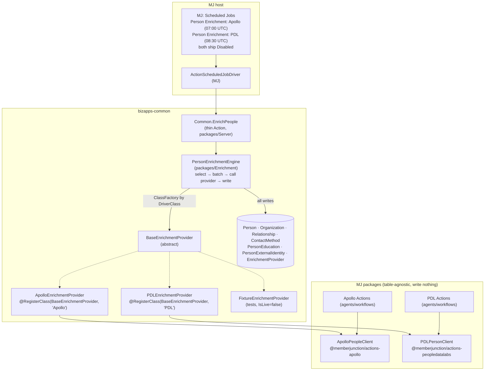

# Person Enrichment: education history, vendor identity, and a scheduled enrichment job

> **Status:** Plan, ready for implementation. No code in this PR.
> **Drafted:** 2026-10-08. The decisions in §2 were agreed with the requester on that date.
> **Revised:** 2026-10-10. People Data Labs now ships in the first release alongside Apollo (D13),
> instead of in later phases.
> **Repos touched:** `MemberJunction/MJ` (Phases 0 and 1) and `MemberJunction/bizapps-common`
> (Phases 2, 3 and 4).
> **Read first:** §1, §2 and §3. The phases are written to be picked up one at a time.

---

## Contents

0. [Summary](#0-summary)
1. [Why, goals and non-goals](#1-why-goals-and-non-goals)
2. [Decisions](#2-decisions)
3. [Architecture](#3-architecture)
4. [Phase 0: Apollo and PDL live spike](#4-phase-0-apollo-and-pdl-live-spike)
5. [Phase 1 (MJ): vendor clients, Apollo action bug fixes, integration rows, scheduler fix](#5-phase-1-mj-vendor-clients-apollo-action-bug-fixes-integration-rows-scheduler-fix)
6. [Phase 2 (common): schema migration](#6-phase-2-common-schema-migration)
7. [Phase 3 (common): enrichment engine, action and fixture provider](#7-phase-3-common-enrichment-engine-action-and-fixture-provider)
8. [Phase 4 (common): Apollo and PDL providers and the scheduled jobs](#8-phase-4-common-apollo-and-pdl-providers-and-the-scheduled-jobs)
9. [People Data Labs reference](#9-people-data-labs-reference)
10. [Testing strategy](#10-testing-strategy)
11. [Privacy, security and cost](#11-privacy-security-and-cost)
12. [Release and rollout](#12-release-and-rollout)
13. [Out of scope and follow-ups](#13-out-of-scope-and-follow-ups)
14. [Risks](#14-risks)
15. [Open questions](#15-open-questions)
- [Appendix A: Apollo action bug inventory](#appendix-a-apollo-action-bug-inventory)
- [Appendix B: Where the facts in this plan come from](#appendix-b-where-the-facts-in-this-plan-come-from)
- [Appendix C: Notes on the People Data Labs brief](#appendix-c-notes-on-the-people-data-labs-brief)

---

## 0. Summary

We want to know where the people in our database went to school, and keep that current, so apps
can answer questions like "which of our members are Harvard Kennedy School graduates?"

The work:

1. **Common gets three new tables:**
   - `PersonEducation`: a person's schools and degrees.
   - `PersonExternalIdentity`: the person's ID at each data vendor, and whether the vendor matched
     them.
   - `EnrichmentProvider`: a registry of vendor plugins, the same pattern as
     `ActivitySyncProviderType`.

   Common's `Relationship` table also gains two provenance columns, so the engine can tell the
   employment rows it wrote from the ones a person entered.
2. **Common gets an enrichment engine.** It picks People who already exist, asks a provider about
   them in batches, and writes the answers into common's own tables. A thin `Common.EnrichPeople`
   action wraps it. Two scheduled jobs run the action, one per provider, and both ship **Disabled**.
3. **Each vendor is a provider subclass of `BaseEnrichmentProvider`. Apollo and People Data Labs
   (PDL) both ship in the first release.** Each provider wraps a **table-agnostic client class in
   MJ**. It does not wrap MJ's Actions: MJ's rule is that code never calls code through an Action.
   PDL is the stronger source for education (it stores schools, degrees and majors as structured
   fields); Apollo is the stronger source for current employment.
4. **MJ gets the two client classes:** an `ApolloPeopleClient` in the existing Apollo package and a
   `PDLPersonClient` in a new `@memberjunction/actions-peopledatalabs` package. MJ also gets fixes
   for 12 bugs in the Apollo enrichment actions, `Apollo` and `People Data Labs` rows in
   `MJ: Integrations`, and a scheduler fix.

Common never creates People. Downstream apps create the People they care about, and this job enriches
the rows that are already there. Building a cohort of strangers from a vendor search (for example
"every HKS alumnus") is a separate feature that belongs above common (§13).

---

## 1. Why, goals and non-goals

### Why now

- **No education data exists.** The only education data in the BizApps family today is a single
  `School` / `Degree` / `GPA` / `GraduationDate` set on ATS's `Applicant`
  (`bizapps-ats/migrations/V202608081816__v0.1.x__ATS_Core_Schema.sql:226-248`). Nothing stores
  more than one school per person, and nothing pulls education from outside.
- **Our Apollo integration already reads education but has nowhere sensible to put it.** MJ's
  `Apollo Enrichment - Contacts` action extracts schools and degrees from Apollo's response
  (`MJ/packages/Actions/ApolloEnrichment/src/contacts.ts:788-839`), but only into flat columns the
  caller names. It also has the bugs listed in Appendix A.
- **Several apps need the same data.** Education is a fact about who a person is, like employment,
  which common already holds as an `Employee` relationship. ATS, the planned credentialing app and
  association apps such as more-cheese all have a use for it.

### Goals

1. A person can have any number of education records, entered by hand, imported, or written by an
   enrichment provider. Every row records where it came from.
2. An admin can switch on a nightly job that enriches existing People through a chosen vendor. It
   respects rate limits and a per-run cap, and never pays twice for the same person within a refresh
   window.
3. Adding a vendor means adding a provider subclass and a seed row, not changing the engine or the
   schema.
4. Enrichment never overwrites data a person entered, and never creates People.
5. The MJ Apollo actions work correctly with UUID keys, per-company credentials and header
   authentication.

### Non-goals (this plan)

- **Creating People from a vendor search.** Cohort ingestion, alumni prospecting and list building
  belong above common (§13).
- **A school-alias system.** Mapping "HKS", "Harvard Kennedy School" and "John F. Kennedy School of
  Government" to one Organization is a follow-up (§13). v1 keeps the raw institution name on every row
  and links an Organization only on an exact name match.
- **Enriching Organizations.** MJ's `Apollo Enrichment - Accounts` action keeps doing this for
  whoever uses it today. Common gets no organization enrichment in this plan.
- **A custom UI.** The CodeGen-generated forms show the new tables on the Person form as related
  lists. A dedicated UI is a follow-up.
- **PostgreSQL migrations.** The release engineer converts them (§12).

---

## 2. Decisions

Each decision records the option we turned down, so nobody has to re-argue it.

| # | Decision | Rejected alternative, and why |
|---|---|---|
| D1 | **The education table and the enrichment job live in bizapps-common.** | *A higher BizApps app.* Education is identity data that several apps read. Sales draws the same line from the other side: it keeps outreach consent on its own `SalesContact` table because "consent is a sales-outreach fact, not an identity fact" (`bizapps-sales/migrations/V202608042101__v0.1.x__Tables_and_Objects.sql:445-449`). The new tables reference only Person and Organization, so common's consumer-blindness rule (`CLAUDE.md`, "Consumer blindness") holds. |
| D2 | **Finding new people from a vendor search does NOT live in common.** | *Ship prospecting in common.* Pulling strangers into Person is an outreach decision with cost and consent attached. Every host installs common, so it must not come bundled. |
| D3 | **Education gets its own table, `PersonEducation`.** | *A new "Alumnus" `RelationshipType` on `Relationship`.* (a) Relationship has no degree, field-of-study or graduation columns. (b) `vwOrganizations.ActivePersonCount`, labelled "Active Staff Count" on the form, counts every Active PersonToOrganization row (`migrations/V202609290300…:210-218`), so alumni would count as staff. (c) Common's entity action logs a timeline Activity on every Relationship create (`metadata/entity-actions/.common-entity-actions.json`), so an import would flood timelines. |
| D4 | **Employment stays on `Relationship` with type `Employee`.** Enrichment writes employment there too. | *A separate employment table.* `vwPeople` already derives `CurrentOrganization*` and `CurrentJobTitle` from Employee relationships (`migrations/V202609290300…:92-95, 141-161`), and more-cheese's data uses them heavily. A second model would split the truth. |
| D5 | **`Relationship` gains `Source` and `SourceSystem` columns.** | *Leave Relationship alone.* Without them the engine cannot tell the rows it wrote from rows a person entered, so it could not update or end its own rows safely. `PersonJobFunction.Source` is the precedent (`migrations/V202609211200…:54-72`). Risk and mitigation: §14 R1. |
| D6 | **Vendor plugins are registered through an `EnrichmentProvider` table plus a `BaseEnrichmentProvider` class, resolved by `DriverClass`.** | *A hard-coded switch on vendor name.* The registry is the pattern common uses for Activity Sync (`ActivitySyncProviderType` and `BaseActivitySyncProvider`) and MJ uses for scheduled job drivers. |
| D7 | **Providers wrap a table-agnostic MJ client class, not an MJ Action.** | *Wrap the existing Apollo Actions.* `MJ/packages/Actions/CLAUDE.md` says "Code-to-code calls should NEVER go through Actions". The existing Apollo actions also have the wrong shape: they write into columns you name, while common needs something that fetches and returns data and writes nothing. |
| D8 | **Providers never write. The engine owns every write.** | *Each provider writes its own rows.* Write rules such as "never overwrite manual data" and "end only rows we own" must be identical for every vendor, so they live once, in the engine. |
| D9 | **The engine never creates People. It only enriches rows that already exist.** | *Upsert People from vendor matches.* That is the prospecting feature in D2. |
| D10 | **Both scheduled jobs ship `Status: Disabled`.** An admin turns each on in MJ's Scheduling app. | *Ship them Active and guard inside the action.* An Active job does nothing on a host without credentials, but a host that has an Apollo or PDL key for another purpose would start spending credits on install. Precedent for shipping Disabled: `bizapps-caliber/metadata/scheduled-jobs/caliber-sweeps.json`. |
| D11 | **PDL's client lives in MJ, in a new `packages/Actions/PeopleDataLabs` package next to Apollo's.** | *The separate Integrations repo.* That repo holds Integration-framework sync connectors. This is a client plus thin Actions, the same shape as the Apollo package. Revisit if MJ moves all vendor action packages out of core. |
| D12 | **First-time enrichment of a person writes its history rows with `SkipEntityActions: true`. Later changes save normally.** | *Always fire entity actions.* That floods timelines with years of past jobs. *Never fire them.* That hides real signals such as "this person changed jobs", which downstream apps may bind to. |
| D13 | **Apollo and PDL both ship in the first release, each with its own Disabled scheduled job.** The jobs run at staggered times so they never overlap. An admin enables whichever vendor they have a contract and credential for, or both. | *Ship Apollo first and PDL later* (this plan's first draft). Education is the reason for the feature, and PDL is the vendor that indexes it as structured data. If Phase 0 finds Apollo no longer returns education, an Apollo-only first release would ship without the feature's main purpose. Building both at once also proves the provider seam with two real implementations rather than one. *One job whose `ProviderCode` the admin edits.* Two jobs are clearer in the Scheduling app, keep separate run histories, and let a host run both. |

---

## 3. Architecture

### 3.1 Layers



### 3.2 One run, end to end

1. The scheduler fires the job. `ActionScheduledJobDriver` runs `Common.EnrichPeople` with the
   job's static params, for example `ProviderCode=Apollo` and `MaxPeople=500`.
2. The action validates params and calls `PersonEnrichmentEngine.Run(options)`.
3. The engine loads the `EnrichmentProvider` row by `Code` and refuses if it is missing or inactive.
   It creates the provider instance through the ClassFactory using `DriverClass`, then asks the
   provider to resolve credentials.
4. The engine builds the eligibility filter (§7.5) and iterates eligible People by primary key in
   batches of `provider.MaxBatchSize` (Apollo 10, PDL 100).
5. For each batch:
   1. Load everything the batch needs in **one** `RunViews` call (§7.6).
   2. Build one request per person.
   3. Call `provider.EnrichPeople(requests, context)` and get one result per person.
   4. Write each person's results in its own entity transaction (§7.7).
6. The engine stops when the eligible set is exhausted, `MaxPeople` is reached, the time budget runs
   out, the vendor returns a rate-limit error, or the error-rate circuit breaker trips. It returns
   counts and a `StoppedReason`.
7. The action copies the counts into output params. The job run row stores them in `Details`.

A person whose results were written has a fresh `PersonExternalIdentity.LastCheckedAt`, so they drop
out of the eligible set. A run that stops early simply leaves the rest for the next run. There is no
cursor to resume from.

---

## 4. Phase 0: Apollo and PDL live spike

**Do this before Phase 1. It takes about two hours and needs a real Apollo API key and a real PDL API
key.** The sandbox the plan was written in could not reach either vendor's API or full docs, so these
points are unverified, and they decide part of Phase 1.

Use the same 5 to 10 known people for both vendors, including at least one person known to have an
HKS degree. That gives a direct comparison of what each vendor returns for the same person, which is
worth recording for the team.

### 4.1 Apollo

Call `people/bulk_match` for the test people. Save one redacted response as a test fixture:
`MJ/packages/Actions/ApolloEnrichment/src/__tests__/fixtures/bulk-match.redacted.json`. Strip emails,
phone numbers and photo URLs, and replace names with placeholders.

Answer each question in the Phase 1 PR description:

| # | Question | Why it matters |
|---|---|---|
| S1 | Which base path serves `people/bulk_match` with **header** auth (`X-Api-Key`): `https://api.apollo.io/v1` (today's `ApolloAPIEndpoint`) or `https://api.apollo.io/api/v1` (`ApolloRESTEndpoint`)? | The client must use one. Today's actions send `api_key` in the body or query string. |
| S2 | Does the response still include education, and in what shape: entries in `employment_history` that carry a `degree` (what the current code assumes), a separate field, or not at all? Is there a major or field-of-study key? | **If Apollo returns no education, the Apollo provider supplies employment and LinkedIn only, and education comes from PDL (§8.3).** Record the outcome in this plan. |
| S3 | Is `matches[]` positionally aligned with `details[]`, with `null` for misses? | The client maps results back to people by position. A misalignment would attach one person's data to another (§5.2). |
| S4 | What does `credits_consumed` report per call, and is a miss free? | Cost reporting and the defaults in §11. |
| S5 | What does a 429 look like (status, headers, body) for per-minute and per-hour limits? Is there a `Retry-After` or `x-rate-limit-*` header? | Typed rate-limit errors (§5.2). |
| S6 | Does `mixed_people/search` (used by the Accounts action) still work, and does it still return emails? | Decides fix A-13 (Appendix A). |

### 4.2 People Data Labs

Call `POST https://api.peopledatalabs.com/v5/person/bulk` for the same people, once with
`min_likelihood` 6 and once with 8. Save one redacted response as
`MJ/packages/Actions/PeopleDataLabs/src/__tests__/fixtures/person-bulk.redacted.json`, with the same
redaction rules. §9 lists what the plan already confirmed about this API and what it did not.

Answer each question in the Phase 1 PR description:

| # | Question | Why it matters |
|---|---|---|
| P1 | Does each `requests[i].params` accept `min_likelihood`? Does the response echo `requests[i].metadata` back on the matching result? | The client uses `metadata` to carry the Person ID and checks it against position (§5.7). `min_likelihood` is our false-positive control. |
| P2 | What exactly is in `data.education[]` for the HKS graduate: the field names for the school's name and ID, degrees, majors, and start and end dates, and the date formats? | The education mapping (§9.3). Confirm against PDL's current Person Schema page too. |
| P3 | Same for `data.experience[]`: company name, website or domain, title, dates, and the current-job flag. | The employment mapping (§9.3). |
| P4 | Is the person `id` in `data` stable across calls, and can it be sent back as a param (`pdl_id`, or whatever the docs name it) to re-enrich exactly? | `PersonExternalIdentity.ExternalID` and the cheapest re-match. |
| P5 | Is a `required` or `data_include` parameter available on our plan? `required: "education"` would return (and bill) only matches that have education; `data_include` would cut the response to the fields we keep. | Cost and data minimization (§11). Optional provider `Configuration` keys if they work. |
| P6 | What do an out-of-credits response and a rate-limit response look like (status, headers, body)? Which response headers report credits used and limits remaining? | Typed errors (§5.7) and `CreditsConsumed` reporting. |
| P7 | Does our PDL plan include the education fields, or are they in a premium field bundle? | If education isn't in our bundle, PDL can't deliver the feature's main purpose until the contract changes. Raise it before building. |

---

## 5. Phase 1 (MJ): vendor clients, Apollo action bug fixes, integration rows, scheduler fix

**Repo:** `MemberJunction/MJ`. **Branch** from `origin/next`, tracking a same-named remote, for
example `fix/apollo-enrichment-client` and `feat/pdl-person-client`.

**Recommended PRs:**
- **1a:** Apollo client and action fixes (§5.1 to §5.4).
- **1b:** scheduler fix (§5.5).
- **1c:** `ProcessBatch` backport (§5.6).
- **1d:** the new PDL package (§5.7).

They touch different packages and can be reviewed separately. 1a and 1d can be built in parallel by
different people. Common needs **all four** in the same 6.1.x release before Phase 4.

**Every Phase 1 PR needs the `backport lts/6.1` label.** Common pins MJ `~6.1.5`
(`mj-app.json` `mjVersionRange >=6.1.5 <7.0.0`). Nothing reaches common until it ships in a 6.1.x
release. If a fix cannot be isolated, hand-port it with a PR against `lts/6.1`. Never patch
MemberJunction from a consuming repo.

### 5.1 Refactor first, as its own commit

Extract the HTTP plumbing from `ApolloRESTClient.request()` (`src/lists/ApolloRESTClient.ts:211` onward)
into `src/http/ApolloHttp.ts`. It covers the `X-Api-Key` header, JSON handling, rewriting 403s into a
message about master keys, and parsing errors. `ApolloRESTClient` then calls the shared helper, with
no behaviour change, and the existing `apollo-lists.test.ts` must stay green. Commit this before any
behaviour change.

### 5.2 New `ApolloPeopleClient`

**File:** `src/people/ApolloPeopleClient.ts`. Export it from `src/index.ts`.

**Responsibilities:**
- Call Apollo's people and organization endpoints and return normalized data.
- **Write nothing.**
- Throw typed errors.
- Do no long sleeping.

**Public surface** (MJ naming: PascalCase public members; vendor payload types keep vendor casing):

```typescript
export interface ApolloPersonMatchInput {
    /** Caller's correlation key (common passes the Person ID). Echoed back on the result. */
    Key: string;
    ApolloPersonID?: string;     // when we already know it: the cheapest, most exact match
    Email?: string;
    LinkedInURL?: string;
    FirstName?: string;
    LastName?: string;
    OrganizationDomain?: string;
    OrganizationName?: string;
}

export interface ApolloEmploymentEntry {
    OrganizationName: string;
    ApolloOrganizationID: string | null;
    OrganizationDomain: string | null;   // when Apollo includes it
    Title: string | null;
    StartDate: string | null;            // 'YYYY-MM-DD', normalized; null when Apollo's value won't parse
    EndDate: string | null;
    IsCurrent: boolean;
}

export interface ApolloEducationEntry {
    InstitutionName: string;
    ApolloOrganizationID: string | null;
    Degree: string | null;
    FieldOfStudy: string | null;         // only if S2 finds a key for it
    StartDate: string | null;
    EndDate: string | null;
}

export interface ApolloPersonMatch {
    Key: string;
    Matched: boolean;
    ApolloPersonID: string | null;
    Title: string | null;
    LinkedInURL: string | null;
    PhotoURL: string | null;
    Organization: { ApolloOrganizationID: string | null; Name: string | null; Domain: string | null } | null;
    Employment: ApolloEmploymentEntry[];
    Education: ApolloEducationEntry[];
    /** Raw `matches[i]` element. Only populated when IncludeRaw is set. Never persist it. */
    Raw?: Record<string, unknown>;
}

export interface ApolloBulkMatchOptions {
    RevealPersonalEmails?: boolean;   // default FALSE. The legacy Contacts action passes true to keep today's behaviour.
    IncludeRaw?: boolean;             // default false
}

export interface ApolloBulkMatchResult {
    Matches: ApolloPersonMatch[];     // same length and order as the input
    CreditsConsumed: number;
}

export class ApolloPeopleClient {
    public static readonly MaxBatchSize = 10;
    public constructor(apiKey: string, options?: { FetchImpl?: typeof fetch; BaseURL?: string });

    /** Resolve the key through the existing credentials path, then construct a client. */
    public static async ForCompany(companyID: string | null, contextUser: UserInfo):
        Promise<{ Client: ApolloPeopleClient; KeySource: 'credential' | 'environment' }>;

    public BulkMatch(inputs: ApolloPersonMatchInput[], options?: ApolloBulkMatchOptions): Promise<ApolloBulkMatchResult>;

    /** Used by the Accounts action (fix A-9). */
    public EnrichOrganization(domain: string): Promise<OrganizationEnrichmentResponse>;
}

export class ApolloRateLimitError extends Error { RetryAfterSeconds: number | null; Window: 'minute' | 'hour' | 'day' | 'unknown'; }
export class ApolloAuthError extends Error { Status: 401 | 403; }
export class ApolloRequestError extends Error { Status: number; Body: string; }
```

**Rules:**
- **Input size.** Reject more than 10 inputs with an `Error` before any HTTP call. Reject inputs that
  have no identifying field (none of `ApolloPersonID`, `Email`, `LinkedInURL`, or a first name, last
  name and organization).
- **Auth.** Use the `X-Api-Key` header only. Never put the key in the body or query string. Use the
  base path S1 settled.
- **Correlation.** If `matches.length !== inputs.length`, **throw** `ApolloRequestError`. Never guess an
  alignment: a shifted index writes one person's degrees onto another person.
- **Education split.** Follow what S2 found. If education arrives inside `employment_history`, an entry
  with a non-empty `degree` (or whatever marker S2 finds) goes to `Education` and **not** to
  `Employment`. That fixes A-7.
- **Dates.** Normalize to `YYYY-MM-DD`. Apollo sometimes sends `YYYY-MM` or `YYYY`; map those to the
  first day of the month or year, and to `null` when they won't parse.
- **Rate limits.**
  - Per-minute 429: wait at most 60 s, retry **once**, then throw `ApolloRateLimitError`.
  - Hourly or daily 429: throw immediately. Never sleep for an hour inside a call. That fixes A-10:
    an hour-long sleep holds a scheduled job's lock past its runtime limit.
- **Credentials.** `ForCompany` reuses `ResolveApolloAPIKey` from `src/lists/credentials.ts`: company
  credential first, then the environment variable, and never `CompanyIntegration.APIKey`.

### 5.3 Rewire the two enrichment actions onto the client and fix the bugs

Rewire `ApolloEnrichmentContactsAction` (`src/contacts.ts`) and `ApolloEnrichmentAccountsAction`
(`src/accounts.ts`) to call the client. Both keep their column-mapping write behaviour for existing
users. Fix every item in **Appendix A**; each row there says what to change and what test proves it.

Also in this PR:
- Add an optional **`CompanyID`** input param to both actions in `metadata/actions/.actions.json`.
  Copy the param shape from `.apollo-lists.json` and route it to `ApolloPeopleClient.ForCompany`.
  Keep the environment-variable fallback so existing single-tenant deployments still work.
- Fix the README's history-mapping documentation (A-12).
- Delete `UpsertContactEmploymentAndEducationHistoryByOrganizationID` (`contacts.ts:623`). Nothing
  calls it, and it holds an unescaped filter (A-11).
- Replace every hand-written `EscapeSingleQuotes` used to build a filter with `EscapeSQLString` from
  `@memberjunction/global`. **Check it is exported by the 6.1.x version you backport to.**
  bizapps-orders found it unexported on a published 6.1 build and uses a local copy
  (`bizapps-orders` CLAUDE.md, "SQL Safety"). If it isn't exported there, add a package-local helper
  for the backport.
- Build key filters from entity metadata (`CompositeKey`, `EntityInfo.FirstPrimaryKey` with a
  `// first-pk-ok:` note where single-column is by design). Never interpolate a raw ID. That fixes
  A-1 and A-2 and follows MJ's primary-key rule (`MJ/.claude/rules/data-access.md`).

### 5.4 Seed the `Apollo` row in `MJ: Integrations`

`src/lists/credentials.ts` already looks for a Company Integration whose Integration is named
`Apollo`, but **no such Integration row exists anywhere**. A search of MJ `metadata/` and the
migrations found none, so the per-company path cannot work today. Common's `EnrichmentProvider` also
points at this row (§6.2).

- Add `metadata/integrations/.mj-sync.json` (entity `MJ: Integrations`) and
  `metadata/integrations/.apollo-integration.json` with:
  - `Name: "Apollo"`
  - `Description`
  - `NavigationBaseURL: "https://app.apollo.io"`
  - `ClassName: null` (no sync connector)
  - `BatchMaxRequestCount: 10`
  - `BatchRequestWaitTime: 0`
  - `CredentialTypeID: "@lookup:MJ: Credential Types.Name=API Key"`
  - `Icon`
  - a `primaryKey` UUID from `uuidgen`
  - **no `sync` block**
- Add `integrations` to MJ `metadata/.mj-sync.json` `directoryOrder`, after `credential-types`.
- **Check first** that nothing iterates `MJ: Integrations` assuming `ClassName` is non-null, such as
  integration discovery or the sync driver. Grep for consumers of `Integration.ClassName`. If
  something does, set the class name to a sentinel that the integration engine skips, and note it.
  The same check covers the `People Data Labs` row, which goes in the same folder (§5.7).
- Changeset: **minor**, because this is a metadata change (`MJ/.claude/rules/changesets.md`).

### 5.5 Scheduler fix (PR 1b): activating a Disabled job doesn't fire until restart

**Bug.** `ScheduledJobEngine.isJobDue` returns false when `NextRunAt` is null (`MJ/packages/Scheduling/engine/src/ScheduledJobEngine.ts:872-874`). `NextRunAt` is only seeded in `initializeNextRunTimes`, and that runs only inside `StartPolling` (`:1738-1761`). Polling is normally already running, because core ships Active jobs. So a job an admin switches from Disabled to Active at runtime never fires until the server restarts. Our job ships Disabled (D10), so this bug would make "turn it on" silently do nothing.

**Fix.** In `onBaseJobsChanged` (`:505` on both `next` and `lts/6.1`), after `UpdatePollingInterval()`:
- For each Active job whose `NextRunAt` is null, compute `NextRunAt` the same way
  `initializeNextRunTimes` does, honouring `RunImmediatelyIfNeverRun`.
- Persist it with a **targeted update, not a full `Save()`**. The comment in `initializeNextRunTimes`
  explains why: once polling is live, a full entity save can overwrite lock columns.
  - If no existing sproc sets only `NextRunAt`, add `spSetScheduledJobNextRunAt` in a migration, in
    the latest `migrations/vN/` folder that matches the filename's major version.
  - That makes PR 1b **minor**.

**Test.** Add a case next to `SchedulingEngine.test.ts:594`: "job activated while polling gets a
NextRunAt and becomes due".

### 5.6 `ProcessBatch` backport (PR 1c)

Common's engine wants MJ's record-set processor (`@memberjunction/record-set-processor`), which gives
it Process Run audit rows, the error-rate circuit breaker, `maxRecords`, `rateLimit` and
`onAfterBatch`. **All of that exists on `lts/6.1`.**

What does not exist there is the batch hook,
`IRecordProcessor.ProcessBatch?(records, context)`. It is on `next`
(`RecordSetProcessor/base/src/interfaces.ts:93`, used at `engine/src/RecordSetProcessor.ts:245-249`)
but not on `lts/6.1`, where `IRecordProcessor` has only `ProcessRecord`. Apollo's bulk endpoint
takes 10 people per call, and PDL's takes up to 100.

- **Preferred:** backport the change that added `ProcessBatch` to `lts/6.1`. Find it in a full clone
  with `git log -S'ProcessBatch?(' origin/next -- packages/RecordSetProcessor`. It is additive: an
  optional interface method plus one engine branch.
- **Fallback if the backport is refused:** the engine runs its own loop (§7.4, "fallback loop"). The
  engine is written against a small internal seam, so the switch is local to one file.

### 5.7 New PDL package (PR 1d): `packages/Actions/PeopleDataLabs` → `@memberjunction/actions-peopledatalabs`

Same shape as the Apollo package: a table-agnostic client, a credentials resolver, one thin Action
for agents and workflows, tests and a README. §9 holds the PDL API facts this section relies on, and
which of them Phase 0 still has to confirm.

**Scaffold.**
- Copy `packages/Actions/ApolloEnrichment/package.json`, `tsconfig.json`, `vitest.config.ts` and
  `typedoc.json`, then rename. Dependencies: `@memberjunction/actions`, `actions-base`, `core`,
  `core-entities`, `credentials`, `global` and `network-utils`, pinned the way the Apollo package pins
  them on the target branch.
- **Register it in the server bootstrap**, or its Action class gets tree-shaken out. Add it to
  `packages/ServerBootstrap/package.json` and `packages/ServerBootstrapLite/package.json` (both list
  the Apollo package today), then regenerate the pre-built manifest with
  `npm run mj:manifest:server-bootstrap`. Check that `mj-class-registrations.ts` now lists the new
  action class.

**Files:**

```
packages/Actions/PeopleDataLabs/src/
  index.ts
  config.ts                     PDLAPIEndpoint = 'https://api.peopledatalabs.com/v5', PDL_API_KEY env fallback
  credentials.ts                ResolvePDLAPIKey(): same two paths and rules as Apollo's resolver
  PDLPersonClient.ts            the client (below)
  pdl.types.ts                  vendor payload types (vendor casing, with the case-violation marker)
  PDLEnrichPeopleAction.ts      thin Action, returns data, writes nothing
  __tests__/
    fixtures/person-bulk.redacted.json    from Phase 0
    pdl-person-client.test.ts
    pdl-enrich-people-action.test.ts
```

**Client surface:**

```typescript
export interface PDLPersonInput {
    Key: string;                  // correlation key; common passes the Person ID
    PDLID?: string;               // exact re-match, when known (param name per P4)
    Email?: string;
    LinkedInURL?: string;         // sent as PDL's `profile` param
    FirstName?: string;
    LastName?: string;
    Company?: string;             // employer name or domain
}

export interface PDLEducationEntry {
    SchoolName: string;
    SchoolID: string | null;
    Degrees: string[];
    Majors: string[];
    StartDate: string | null;     // normalized 'YYYY-MM-DD'
    EndDate: string | null;
}

export interface PDLExperienceEntry {
    CompanyName: string;
    CompanyDomain: string | null; // host of company.website, normalized
    Title: string | null;
    StartDate: string | null;
    EndDate: string | null;
    IsCurrent: boolean;           // from the field P3 identifies
}

export interface PDLPersonMatch {
    Key: string;
    Matched: boolean;
    PDLID: string | null;
    Likelihood: number | null;    // 1..10
    LinkedInURL: string | null;
    Education: PDLEducationEntry[];
    Experience: PDLExperienceEntry[];
    ErrorMessage: string | null;  // set when this one item failed (non-200, non-404)
    Raw?: Record<string, unknown>;// only with IncludeRaw; never persist
}

export interface PDLBulkOptions {
    MinLikelihood?: number;       // default 6, PDL's recommended default
    Required?: string;            // e.g. 'education', only if P5 confirms it
    DataInclude?: string[];       // only if P5 confirms it
    IncludeRaw?: boolean;
}

export interface PDLBulkResult {
    Matches: PDLPersonMatch[];    // same length and order as the input
    CreditsConsumed: number;      // count of per-item 200s; PDL bills per match
}

export class PDLPersonClient {
    public static readonly MaxBatchSize = 100;
    public constructor(apiKey: string, options?: { FetchImpl?: typeof fetch; BaseURL?: string });
    public static async ForCompany(companyID: string | null, contextUser: UserInfo):
        Promise<{ Client: PDLPersonClient; KeySource: 'credential' | 'environment' }>;
    public BulkEnrich(inputs: PDLPersonInput[], options?: PDLBulkOptions): Promise<PDLBulkResult>;
}

export class PDLRateLimitError extends Error { RetryAfterSeconds: number | null; }
export class PDLCreditsExhaustedError extends Error {}
export class PDLAuthError extends Error { Status: number; }
export class PDLRequestError extends Error { Status: number; Body: string; }
```

**Client rules:**
- **Input size.** Reject more than 100 inputs, or an input with no identifying field, before any
  HTTP call.
- **Auth.** `X-Api-Key` header only. Never put the key in the query string, even though PDL accepts it
  there; query strings end up in logs.
- **Request.** `POST {PDLAPIEndpoint}/person/bulk` with
  `{ "requests": [ { "params": {…, "min_likelihood": n}, "metadata": { "key": "<Key>" } } ] }`.
- **Correlation.** PDL returns results in request order. The client **also** checks each result's
  echoed `metadata.key` against the input at that position. On any mismatch, or a length mismatch,
  **throw** `PDLRequestError`. Never attach a result to the wrong person.
- **Per-item status.** 200 = matched. 404 = not matched, which is not an error and not billed. Any
  other per-item status sets `ErrorMessage` on that item only; the rest of the batch still counts.
- **Top-level status.** Map the out-of-credits response to `PDLCreditsExhaustedError`, the
  rate-limit response to `PDLRateLimitError`, and 401/403 to `PDLAuthError`. The exact codes come from
  P6. No sleeping inside the client.
- **Minimization.** Map only the fields above. The normalized result never contains emails, phone
  numbers, addresses or anything else PDL returns. `Raw` exists for debugging and is off by default.
- **Dates.** PDL dates can be `YYYY`, `YYYY-MM` or `YYYY-MM-DD`. Normalize to the first day of the
  year or month, and to `null` when they won't parse.

**Credentials.** `credentials.ts` copies Apollo's resolver (`ApolloEnrichment/src/lists/credentials.ts`)
with Integration name `People Data Labs` and environment variable `PDL_API_KEY`. The same rules
apply: `MJ: Credentials` only, never `CompanyIntegration.APIKey`, and a present-but-broken credential
fails rather than falling back to the environment.

**Integration row.** Add `metadata/integrations/.pdl-integration.json`, next to the Apollo row from
§5.4:
- `Name: "People Data Labs"`
- `Description`
- `NavigationBaseURL: "https://dashboard.peopledatalabs.com"`
- `ClassName: null`
- `BatchMaxRequestCount: 100`
- `BatchRequestWaitTime: 0`
- `CredentialTypeID: "@lookup:MJ: Credential Types.Name=API Key"`
- `Icon`
- a `primaryKey` from `uuidgen`, and no `sync` block

**Action.** `People Data Labs - Enrich People`, in a new `metadata/actions/.peopledatalabs-actions.json`.
Use category `Data Enrichment`, the same as the Apollo actions.

| Param | Type | Notes |
|---|---|---|
| People | Input, required | JSON array of `{ Email, LinkedInURL, FirstName, LastName, Company }`, at most 100. Accepts an array or a JSON string, like the Apollo list actions' params. |
| MinLikelihood | Input | Default 6. |
| CompanyID | Input | Per-company credential, as for Apollo. |
| Matches | Output | The normalized `PDLPersonMatch[]`. |
| MatchedCount, CreditsConsumed, KeySource | Output | |

Result codes: `SUCCESS`, `NO_MATCHES` (success), `RATE_LIMITED`, `CREDITS_EXHAUSTED`,
`CREDENTIALS_NOT_FOUND`, `VALIDATION_ERROR`, `ERROR`. The action writes nothing to the database.

**Tests.** Use a fake `FetchImpl` and the Phase 0 fixture. Never call PDL from a test. Cover:
- the header is sent and no key appears in the URL;
- more than 100 inputs is rejected;
- a correlation mismatch throws;
- per-item 404 gives `Matched: false`, and per-item 500 gives `ErrorMessage` without failing the batch;
- likelihood passes through and `CreditsConsumed` counts the 200s;
- no email or phone appears in the normalized output;
- dates are normalized;
- each typed error.

**This adds a new package to the 6.1 line.** Confirm with the MJ maintainers that an additive package
is acceptable as a backport (Q6). If it isn't, see R13 for the fallback.

Changeset: **minor** (the Integration row and the action are metadata). Label `backport lts/6.1`.

**Phase 1 is done when:**
- Every item in Appendix A is fixed and tested.
- Both clients exist and are unit-tested against their Phase 0 fixtures.
- The `Apollo` and `People Data Labs` Integration row JSON has merged.
- The PDL package is registered in both server bootstrap manifests.
- The scheduler fix has merged.
- The backport has merged, or been refused.
- A 6.1.x release containing all of the above is published.

`pnpm test` must be green in `packages/Actions/ApolloEnrichment`, `packages/Actions/PeopleDataLabs`
and the Scheduling packages. Report pass, fail and skip counts in each PR.

---

## 6. Phase 2 (common): schema migration

**Repo:** `bizapps-common`. **Branch** from `origin/next`, for example `feat/person-enrichment-schema`.
**One migration:** `migrations/V<YYYYMMDDHHMM>__v5.52.x__Person_Enrichment.sql`.

- **The stamp must sort after every migration on `next` at merge time.** `changes.yml` rejects one that
  doesn't. Today the last is `V202610062323__v5.51.x__Metadata_Sync.sql`.
- **The `v5.52.x` label is descriptive only**, per `migrations/README.md`.

### 6.1 Rules that apply to this file

Read `MJ/migrations/CLAUDE.md` and this repo's `migrations/README.md` first. In short:

- **Placeholders.** Use `[${flyway:defaultSchema}]` for common's objects and `[${mjSchema}]` for core.
  Copy the guarded style of `V202609211200__v5.45.x__Job_Function_Seniority.sql`
  (`IF OBJECT_ID(...) IS NULL`).
- **No timestamp columns.** Do **not** add `__mj_CreatedAt` / `__mj_UpdatedAt`; CodeGen adds them.
  The 5.45 migration does add them. Don't copy that part.
- **No FK indexes.** Do **not** create indexes on foreign key columns; CodeGen does that. The filtered
  unique index and the name index below are not FK indexes, so they stay.
- **Descriptions.** Add `sp_addextendedproperty` `MS_Description` for every column except the PK and
  FKs. The descriptions are in the tables below.
- **Layout.**
  1. Hand-written DDL at the top.
  2. **At least 50 blank lines.**
  3. The standard CodeGen comment block.
  4. The CodeGen output appended below it.
- **Sequence.** A CodeGen `EntityField` INSERT **must not carry a literal `Sequence`**. Use an
  apply-time `MAX(Sequence)+1` (`MJ/migrations/CLAUDE.md`). Check the appended output.
- **No PostgreSQL twin in this PR** (§12).

### 6.2 DDL

```sql
---------------------------------------------------------------------------
-- EnrichmentProvider: registry of enrichment vendor plugins.
-- Same pattern as ActivitySyncProviderType: a row names a ClassFactory
-- key (DriverClass) registered under BaseEnrichmentProvider.
---------------------------------------------------------------------------
IF OBJECT_ID(N'[${flyway:defaultSchema}].[EnrichmentProvider]', N'U') IS NULL
BEGIN
    CREATE TABLE [${flyway:defaultSchema}].[EnrichmentProvider] (
        ID UNIQUEIDENTIFIER NOT NULL DEFAULT NEWSEQUENTIALID(),
        Code NVARCHAR(60) NOT NULL,
        Name NVARCHAR(100) NOT NULL,
        Description NVARCHAR(MAX) NULL,
        DriverClass NVARCHAR(200) NOT NULL,
        IntegrationID UNIQUEIDENTIFIER NULL,
        MaxBatchSize INT NOT NULL DEFAULT 10,
        RequestsPerMinute INT NULL,
        Configuration NVARCHAR(MAX) NULL,
        Sequence INT NOT NULL DEFAULT 0,
        IsActive BIT NOT NULL DEFAULT 1,
        CONSTRAINT PK_EnrichmentProvider PRIMARY KEY (ID),
        CONSTRAINT UQ_EnrichmentProvider_Code UNIQUE (Code),
        CONSTRAINT UQ_EnrichmentProvider_Name UNIQUE (Name),
        CONSTRAINT FK_EnrichmentProvider_Integration FOREIGN KEY (IntegrationID)
            REFERENCES [${mjSchema}].[Integration](ID),
        CONSTRAINT CK_EnrichmentProvider_MaxBatchSize CHECK (MaxBatchSize > 0),
        CONSTRAINT CK_EnrichmentProvider_RequestsPerMinute CHECK (RequestsPerMinute IS NULL OR RequestsPerMinute > 0)
    );
END
GO

---------------------------------------------------------------------------
-- PersonEducation: a person's schools and degrees, any number per person.
---------------------------------------------------------------------------
IF OBJECT_ID(N'[${flyway:defaultSchema}].[PersonEducation]', N'U') IS NULL
BEGIN
    CREATE TABLE [${flyway:defaultSchema}].[PersonEducation] (
        ID UNIQUEIDENTIFIER NOT NULL DEFAULT NEWSEQUENTIALID(),
        PersonID UNIQUEIDENTIFIER NOT NULL,
        OrganizationID UNIQUEIDENTIFIER NULL,
        InstitutionName NVARCHAR(255) NOT NULL,
        Degree NVARCHAR(200) NULL,
        FieldOfStudy NVARCHAR(200) NULL,
        StartDate DATE NULL,
        EndDate DATE NULL,
        Source NVARCHAR(20) NOT NULL DEFAULT N'Manual',
        SourceSystem NVARCHAR(80) NULL,
        LastVerifiedAt DATETIMEOFFSET NULL,
        Notes NVARCHAR(MAX) NULL,
        CONSTRAINT PK_PersonEducation PRIMARY KEY (ID),
        CONSTRAINT FK_PersonEducation_Person FOREIGN KEY (PersonID)
            REFERENCES [${flyway:defaultSchema}].[Person](ID)
            ON DELETE CASCADE,
        CONSTRAINT FK_PersonEducation_Organization FOREIGN KEY (OrganizationID)
            REFERENCES [${flyway:defaultSchema}].[Organization](ID),
        CONSTRAINT CK_PersonEducation_Source CHECK (Source IN (N'Manual', N'Import', N'Enrichment')),
        CONSTRAINT CK_PersonEducation_SourceSystem CHECK (Source = N'Manual' OR SourceSystem IS NOT NULL),
        CONSTRAINT CK_PersonEducation_Dates CHECK (StartDate IS NULL OR EndDate IS NULL OR EndDate >= StartDate)
    );
END
GO

IF NOT EXISTS (SELECT 1 FROM sys.indexes WHERE name = N'IX_PersonEducation_InstitutionName'
               AND object_id = OBJECT_ID(N'[${flyway:defaultSchema}].[PersonEducation]'))
BEGIN
    -- "Who went to <school>?" searches on the raw name until schools are linked to Organizations.
    CREATE NONCLUSTERED INDEX IX_PersonEducation_InstitutionName
        ON [${flyway:defaultSchema}].[PersonEducation] (InstitutionName);
END
GO

---------------------------------------------------------------------------
-- PersonExternalIdentity: a person's ID at an external system (Apollo, PDL,
-- an import source) and whether that system could match them.
-- One row per (person, system). The filtered unique index stops two People
-- claiming the same external person.
---------------------------------------------------------------------------
IF OBJECT_ID(N'[${flyway:defaultSchema}].[PersonExternalIdentity]', N'U') IS NULL
BEGIN
    CREATE TABLE [${flyway:defaultSchema}].[PersonExternalIdentity] (
        ID UNIQUEIDENTIFIER NOT NULL DEFAULT NEWSEQUENTIALID(),
        PersonID UNIQUEIDENTIFIER NOT NULL,
        SourceSystem NVARCHAR(80) NOT NULL,
        ExternalID NVARCHAR(400) NULL,
        MatchStatus NVARCHAR(20) NOT NULL DEFAULT N'Matched',
        MatchedBy NVARCHAR(20) NULL,
        MatchConfidence DECIMAL(5, 4) NULL,
        LastCheckedAt DATETIMEOFFSET NOT NULL,
        LastMatchedAt DATETIMEOFFSET NULL,
        CONSTRAINT PK_PersonExternalIdentity PRIMARY KEY (ID),
        CONSTRAINT FK_PersonExternalIdentity_Person FOREIGN KEY (PersonID)
            REFERENCES [${flyway:defaultSchema}].[Person](ID)
            ON DELETE CASCADE,
        CONSTRAINT UQ_PersonExternalIdentity_Person_SourceSystem UNIQUE (PersonID, SourceSystem),
        CONSTRAINT CK_PersonExternalIdentity_MatchStatus CHECK (MatchStatus IN (N'Matched', N'NotFound', N'Ambiguous')),
        CONSTRAINT CK_PersonExternalIdentity_MatchedBy CHECK (
            MatchedBy IS NULL OR MatchedBy IN (N'ExternalID', N'Email', N'LinkedIn', N'NameAndDomain', N'Manual')
        ),
        CONSTRAINT CK_PersonExternalIdentity_MatchedHasID CHECK (MatchStatus <> N'Matched' OR ExternalID IS NOT NULL),
        CONSTRAINT CK_PersonExternalIdentity_Confidence CHECK (
            MatchConfidence IS NULL OR (MatchConfidence >= 0.0 AND MatchConfidence <= 1.0)
        )
    );
END
GO

IF NOT EXISTS (SELECT 1 FROM sys.indexes WHERE name = N'UQ_PersonExternalIdentity_SourceSystem_ExternalID'
               AND object_id = OBJECT_ID(N'[${flyway:defaultSchema}].[PersonExternalIdentity]'))
BEGIN
    CREATE UNIQUE NONCLUSTERED INDEX UQ_PersonExternalIdentity_SourceSystem_ExternalID
        ON [${flyway:defaultSchema}].[PersonExternalIdentity] (SourceSystem, ExternalID)
        WHERE ExternalID IS NOT NULL;
END
GO

IF NOT EXISTS (SELECT 1 FROM sys.indexes WHERE name = N'IX_PersonExternalIdentity_SourceSystem_LastCheckedAt'
               AND object_id = OBJECT_ID(N'[${flyway:defaultSchema}].[PersonExternalIdentity]'))
BEGIN
    -- The eligibility filter (plan §7.5) asks "checked by <system> since <cutoff>?" for every candidate.
    CREATE NONCLUSTERED INDEX IX_PersonExternalIdentity_SourceSystem_LastCheckedAt
        ON [${flyway:defaultSchema}].[PersonExternalIdentity] (SourceSystem, LastCheckedAt)
        INCLUDE (PersonID, MatchStatus);
END
GO

---------------------------------------------------------------------------
-- Relationship: provenance (decision D5). Existing rows become 'Manual'.
---------------------------------------------------------------------------
IF COL_LENGTH(N'[${flyway:defaultSchema}].[Relationship]', N'Source') IS NULL
BEGIN
    ALTER TABLE [${flyway:defaultSchema}].[Relationship] ADD
        Source NVARCHAR(20) NOT NULL CONSTRAINT DF_Relationship_Source DEFAULT N'Manual',
        SourceSystem NVARCHAR(80) NULL;
END
GO

IF NOT EXISTS (SELECT 1 FROM sys.check_constraints WHERE name = N'CK_Relationship_Source')
    ALTER TABLE [${flyway:defaultSchema}].[Relationship]
        ADD CONSTRAINT CK_Relationship_Source CHECK (Source IN (N'Manual', N'Import', N'Enrichment'));
GO

IF NOT EXISTS (SELECT 1 FROM sys.check_constraints WHERE name = N'CK_Relationship_SourceSystem')
    ALTER TABLE [${flyway:defaultSchema}].[Relationship]
        ADD CONSTRAINT CK_Relationship_SourceSystem CHECK (Source = N'Manual' OR SourceSystem IS NOT NULL);
GO
```

**Notes on the DDL:**
- **`ON DELETE CASCADE` on both Person FKs** copies `PersonJobFunction`
  (`V202609211200…:65-67`). Deleting a Person must remove their education and vendor IDs, which also
  serves privacy (§11). This is a cascade inside common's own schema, so it doesn't conflict with the
  "Shipped entities have `CascadeDeletes = false`" rule. That rule is about MJ's generated
  cross-entity cascade SQL. Leave the MJ `Entity.CascadeDeletes` flag at its default (false) for all
  three new entities.
- **`Source` values are a CHECK list, not a lookup table**, which matches `PersonJobFunction.Source`.
  There are three structural provenance values, not domain vocabulary.
- **`SourceSystem` is free text, not an FK to `EnrichmentProvider`.** Identities and imported rows can
  come from systems that are not enrichment providers (a CRM import, a PDL bulk extract). For rows
  the engine writes, it equals `EnrichmentProvider.Code`.
- **`Ambiguous`** means the vendor returned an `ExternalID` that another Person already holds. That is
  a duplicate-person candidate, and a human must resolve it (§7.7).
- **Not every person has an `ExternalID`.** A `NotFound` or `Ambiguous` row may have none. The CHECK
  requires it only for `Matched`.

### 6.3 Column descriptions (`MS_Description`)

Write each as:

```sql
EXEC sp_addextendedproperty @name = N'MS_Description', @value = N'<text>',
    @level0type = N'SCHEMA', @level0name = N'${flyway:defaultSchema}',
    @level1type = N'TABLE',  @level1name = N'<Table>',
    @level2type = N'COLUMN', @level2name = N'<Column>';
```

Also add a table-level description for each new table (omit `@level2*`).

| Table.Column | Description |
|---|---|
| EnrichmentProvider (table) | Registry of person-enrichment vendor plugins. Each row names a class registered under BaseEnrichmentProvider. |
| EnrichmentProvider.Code | Stable short code, e.g. Apollo or PDL. Also written as SourceSystem on every row this provider produces. Never rename. |
| EnrichmentProvider.Name | Display name. |
| EnrichmentProvider.Description | What the provider supplies and any caveats. |
| EnrichmentProvider.DriverClass | ClassFactory key of the BaseEnrichmentProvider subclass that implements this provider. |
| EnrichmentProvider.MaxBatchSize | Most people the vendor accepts in one request (Apollo 10, PDL 100). The engine batches to this size. |
| EnrichmentProvider.RequestsPerMinute | Optional client-side request ceiling. NULL means rely on the vendor's 429 responses. |
| EnrichmentProvider.Configuration | Provider-specific JSON options, e.g. a PDL minimum likelihood. Engine-wide policy lives on the action params, not here. |
| EnrichmentProvider.Sequence | Display and preference order when several providers are active. |
| EnrichmentProvider.IsActive | Inactive providers are refused by the engine. |
| PersonEducation (table) | Schools and degrees a person has attended or earned. Any number per person, from any source. |
| PersonEducation.InstitutionName | The school name exactly as the source gave it. Kept even when OrganizationID is set, so unmatched names are never lost. |
| PersonEducation.Degree | Degree as the source gave it, e.g. "Master of Public Administration" or "MPP". |
| PersonEducation.FieldOfStudy | Major or field of study, when known. |
| PersonEducation.StartDate | Date study began, when known. |
| PersonEducation.EndDate | Graduation or end date, when known. |
| PersonEducation.Source | Manual (entered by a person), Import (bulk load) or Enrichment (written by an enrichment provider). Enrichment never edits Manual rows. |
| PersonEducation.SourceSystem | Which system supplied a non-manual row. Equals EnrichmentProvider.Code for enrichment rows. |
| PersonEducation.LastVerifiedAt | When the source last confirmed this row. |
| PersonEducation.Notes | Free text. |
| PersonExternalIdentity (table) | A person's identifier in an external system and the outcome of the last match attempt. One row per person per system. |
| PersonExternalIdentity.SourceSystem | The external system, e.g. Apollo or PDL. |
| PersonExternalIdentity.ExternalID | The person's ID in that system. Unique per system. Required when MatchStatus is Matched. |
| PersonExternalIdentity.MatchStatus | Matched; NotFound (the system had no match, retried after a cooling-off period); Ambiguous (the system's ID already belongs to another Person, so a human must resolve the possible duplicate). |
| PersonExternalIdentity.MatchedBy | Which identifier produced the match: ExternalID, Email, LinkedIn, NameAndDomain or Manual. |
| PersonExternalIdentity.MatchConfidence | Vendor match confidence from 0 to 1, when the vendor reports one. |
| PersonExternalIdentity.LastCheckedAt | When this person was last sent to this system. Drives re-enrichment eligibility. |
| PersonExternalIdentity.LastMatchedAt | When the system last returned a match. |
| Relationship.Source | Manual, Import or Enrichment. Enrichment only updates or ends relationships it created. |
| Relationship.SourceSystem | Which system supplied a non-manual relationship. |

### 6.4 CodeGen

You need a SQL Server database built **from migrations**:
1. MJ core at the floor of `mj-app.json`'s `mjVersionRange`.
2. This repo's chain.
3. Your migration.

Set an AI key in the gitignored `.env`: `AI_VENDOR_API_KEY__GeminiLLM` or
`AI_VENDOR_API_KEY__OpenRouterLLM`. Without one, CodeGen silently drops validators, display names and
form layouts (this repo's CLAUDE.md, "CodeGen output must be reproducible").

**Confirm no other agent or session is using that database before you run anything.**

1. `pnpm run mj:migrate`
2. `pnpm run mj:codegen`.
   - Expected entity names, from `newEntityDefaults` in `mj.config.cjs`:
     - `MJ_BizApps_Common: Enrichment Providers`
     - `MJ_BizApps_Common: Person Educations`
     - `MJ_BizApps_Common: Person External Identities`
   - Record the actual names in the PR. Settle on the names now: renaming an entity after release is
     a breaking change. If "Person Educations" reads badly, set a `DisplayName` (e.g. "Education")
     through `metadata/entities/` rather than renaming the table.
3. Append the CodeGen SQL from `migrations/codegen/` below the 50 blank lines, then delete the
   staging files.
4. **Verify the Relationship objects were regenerated with the new columns.**
   - `spCreateRelationship` and `spUpdateRelationship` must have `@Source` and `@SourceSystem`, and
     both params must be **optional**: `= NULL`, falling back to the column default.
   - Why: more-cheese's shipped seed calls `spCreateRelationship` with named params about 2,800 times
     and passes neither (`more-cheese/migrations/V202609182027__v1.2.x__Metadata_Sync_Part3of5.sql`).
     A required param would break that replay.
   - Check that `vwRelationships`, and any layered view built on it, exposes the columns. The repair
     migration `V202610031700__v5.50.x__Repair_Relationship_Objects.sql` shows those objects have
     been damaged before.
5. Run CodeGen **until it reports `success: true` and the field count matches the view column count
   for every entity in the schema** (bizapps-sales CLAUDE.md documents the one-pass lag on new virtual
   columns):

   ```sql
   SELECT e.Name, e.BaseView,
     (SELECT COUNT(*) FROM __mj.EntityField f WHERE f.EntityID = e.ID) AS Fields,
     (SELECT COUNT(*) FROM INFORMATION_SCHEMA.COLUMNS c
       WHERE c.TABLE_SCHEMA = e.SchemaName AND c.TABLE_NAME = e.BaseView) AS ViewCols
   FROM __mj.Entity e WHERE e.SchemaName = '__mj_BizAppsCommon';
   ```

6. `pnpm run lint:entityfield-drift`
7. Build every generated package (`pnpm run build`) and commit the generated output with the
   migration.
8. Review whatever CodeGen's AI wrote: validators, display names, descriptions.

**Entity permissions.** Copy whatever rows CodeGen and `metadata/` produce for `PersonJobFunction`.
- `PersonEducation`: same read and edit audience as People.
- `PersonExternalIdentity`: readable by People editors; editable by admins only. The engine runs as
  the job's system user.
- `EnrichmentProvider`: admin-edit only.

If a permission needs a metadata row, add it under `metadata/` (JSON only).

**Phase 2 is done when:**
- The migration replays on an **empty** database (see "Prove it" in `migrations/README.md`, step 5;
  `clean-room-gate.yml` runs the same install on the PR).
- `lint:entityfield-drift` passes.
- The generated packages build.
- The Person form in Explorer shows the related Education and External Identity lists.
- A **minor** changeset is included; `changes.yml` requires one for a migration.

---

## 7. Phase 3 (common): enrichment engine, action and fixture provider

**Branch:** `feat/person-enrichment-engine`, after Phase 2 merges.

This phase ships no vendor provider and no scheduled job. Both arrive in Phase 4, so this phase does
not wait on the MJ release.

### 7.1 New package `packages/Enrichment` → `@mj-biz-apps/common-enrichment`

Model it on `packages/ActivitySync`: `"type": "module"`, `tsc && tsc-alias -f`, vitest, a typecheck
tsconfig, `files: ["/dist"]` and `publishConfig.access: public`.

**Dependencies:**
- `@mj-biz-apps/common-entities`, at the exact workspace version.
- Peers: `@memberjunction/core`, `@memberjunction/global`, `@memberjunction/credentials`, and
  `@memberjunction/record-set-processor` plus `-base`, all at `~6.1.N`. Add exact devDependency
  anchors per this repo's pinning rules.

**Wiring:**
- The root `package.json` workspaces glob (`packages/*`) already covers the new folder. Confirm
  `pnpm-workspace.yaml` uses the same glob; the comment there says to keep the two lists in sync.
- **`mj-app.json` needs no change.** The package rides along as a dependency of `common-server`, the
  same way `common-activity-sync` does.
- If `.github/workflows/mutants.yml` expects every package to have a mutation harness, copy
  `ActivitySync/test-harnesses/`.

**Layout.** Keep each function to about 40 lines.

```
packages/Enrichment/src/
  index.ts                         public exports only (no re-exports from other packages)
  load.ts                          LoadCommonEnrichment(): tree-shaking anchor
  types.ts                         request/result/options/result-counts types (§7.2)
  BaseEnrichmentProvider.ts        abstract base (§7.3)
  errors.ts                        EnrichmentRateLimitError, EnrichmentQuotaExhaustedError, EnrichmentConfigurationError
  PersonEnrichmentEngine.ts        orchestration only (§7.4)
  selection.ts                     BuildEligibilityFilter() (pure, §7.5)
  batch-context.ts                 LoadBatchContext(): one RunViews per batch (§7.6)
  request-builder.ts               BuildRequests(): identity priority (pure)
  normalize.ts                     name/degree/domain keys (pure)
  organization-resolver.ts         ResolveOrganizations() (batch, §7.8)
  writers/
    identity-writer.ts             PlanIdentity() pure + ApplyIdentity()
    education-writer.ts            PlanEducation() pure + ApplyEducation()
    employment-writer.ts           PlanEmployment() pure + ApplyEmployment()
    linkedin-writer.ts             PlanLinkedIn() pure + ApplyLinkedIn()
  providers/
    FixtureEnrichmentProvider.ts   @RegisterClass(BaseEnrichmentProvider, 'Fixture'), IsLive = false
  __tests__/…
```

**Each writer has a pure `Plan*` function and an `Apply*` function.**
- `Plan*` takes the existing rows and the provider's result, and returns the intended inserts and
  updates. Almost all the logic is testable without a database.
- `Apply*` only saves what the plan says. It checks every `Save()` boolean and reports
  `LatestResult?.CompleteMessage` on failure.

### 7.2 Types

```typescript
/** What the engine can ask a provider for. A provider declares the subset it supports. */
export type EnrichmentFacet = 'Education' | 'Employment' | 'LinkedIn';

export interface PersonEnrichmentRequest {
    PersonID: string;
    FirstName: string;
    LastName: string;
    Emails: string[];             // Person.Email first, then ContactMethod emails; de-duplicated, lower-cased
    LinkedInURL: string | null;
    OrganizationDomain: string | null;   // from the current Employee relationship's Organization.Website
    OrganizationName: string | null;
    ExternalID: string | null;    // from PersonExternalIdentity for this provider, when Matched
}

export interface EnrichedEducation {
    InstitutionName: string;
    InstitutionExternalID: string | null;  // vendor's school ID (PDL school.id) for the future alias work
    Degree: string | null;
    FieldOfStudy: string | null;
    StartDate: string | null;              // 'YYYY-MM-DD'
    EndDate: string | null;
}

export interface EnrichedEmployment {
    OrganizationName: string;
    OrganizationDomain: string | null;
    Title: string | null;
    StartDate: string | null;
    EndDate: string | null;
    IsCurrent: boolean;
}

export type PersonMatchStatus = 'Matched' | 'NotFound' | 'Error';

export interface PersonEnrichmentResult {
    PersonID: string;
    Status: PersonMatchStatus;
    ExternalID: string | null;
    MatchedBy: 'ExternalID' | 'Email' | 'LinkedIn' | 'NameAndDomain' | null;
    MatchConfidence: number | null;        // 0..1
    LinkedInURL: string | null;
    Education: EnrichedEducation[];
    Employment: EnrichedEmployment[];
    ErrorMessage: string | null;           // Status === 'Error' only. Never persisted to PersonExternalIdentity.
}

export interface EnrichmentContext {
    ContextUser: UserInfo;
    MetadataProvider: IMetadataProvider;   // the request's provider, never `new Metadata()`
    ProviderRow: mjBizAppsCommonEnrichmentProviderEntity;   // exact generated class name from Phase 2
    CompanyID: string | null;
    Facets: EnrichmentFacet[];
}
```

### 7.3 `BaseEnrichmentProvider`

```typescript
export abstract class BaseEnrichmentProvider {
    /** Must equal the EnrichmentProvider.Code this class is registered for. */
    public abstract get Code(): string;

    /** False for fixtures. The engine refuses to write Source='Enrichment' rows from a non-live provider unless told to. */
    public abstract get IsLive(): boolean;

    /** What this provider can supply. The engine drops requested facets the provider lacks. */
    public abstract get SupportedFacets(): EnrichmentFacet[];

    /** Called once per run before the first batch. Resolve credentials here; throw EnrichmentConfigurationError if none. */
    public abstract Initialize(context: EnrichmentContext): Promise<void>;

    /**
     * Look up a batch of people. MUST NOT write anything.
     * Returns exactly one result per request, matched by PersonID, in any order.
     * Throws EnrichmentRateLimitError when the vendor rate-limits; the engine stops the run cleanly.
     */
    public abstract EnrichPeople(requests: PersonEnrichmentRequest[], context: EnrichmentContext): Promise<PersonEnrichmentResult[]>;
}
```

- **Batch size comes from the row, not the class.** The engine reads `ProviderRow.MaxBatchSize`, so
  an admin can lower it without a code change. A provider may also expose a hard ceiling (Apollo 10)
  that the engine applies with `Math.min`.
- **Resolve the provider through the ClassFactory.** Use
  `MJGlobal.Instance.ClassFactory.CreateInstance<BaseEnrichmentProvider>(BaseEnrichmentProvider, row.DriverClass)`.
  If it returns nothing usable, fail with `PROVIDER_NOT_FOUND` naming the `DriverClass`. Copy the
  null handling in `ActivitySyncEngine.resolvePlugin`.

### 7.4 `PersonEnrichmentEngine`

A plain class, instantiated per run, so there is no singleton.

```typescript
export interface PersonEnrichmentRunOptions {
    ProviderCode: string;
    PersonFilter: string | null;      // optional extra predicate on vwPeople, validated (§11)
    MaxPeople: number;                // default 500, max 5000
    Facets: EnrichmentFacet[];        // default all three
    Mode: 'Run' | 'Preview';          // Preview: count eligible people, call no vendor, write nothing
    CompanyID: string | null;
    RefreshMatchedDays: number;       // default 180
    RetryNotFoundDays: number;        // default 90
    CreateOrganizations: 'Never' | 'CurrentEmployerOnly' | 'AllEmployers';   // default CurrentEmployerOnly
    TimeBudgetMinutes: number;        // default 45. Must stay under the job's MaxRuntimeMinutes (60).
    AllowNonLiveProvider: boolean;    // default false; integration tests set true for the fixture
    ContextUser: UserInfo;
    MetadataProvider: IMetadataProvider;
}

export type EnrichmentStoppedReason = 'Completed' | 'MaxPeople' | 'TimeBudget' | 'RateLimited' | 'QuotaExhausted' | 'ErrorThreshold';

export interface PersonEnrichmentRunResult {
    ProcessRunID: string | null;
    Eligible: number | null;          // Preview only
    Processed: number; Matched: number; NotFound: number; Ambiguous: number; Errored: number;
    EducationCreated: number; EducationUpdated: number;
    RelationshipsCreated: number; RelationshipsUpdated: number; RelationshipsEnded: number;
    OrganizationsCreated: number; LinkedInAdded: number;
    CreditsConsumed: number | null;   // when the provider reports it
    StoppedReason: EnrichmentStoppedReason;
}
```

**Primary loop.** This needs `ProcessBatch` on 6.1 (§5.6). Call
`RecordSetProcessor.Instance.Process({...})` with:
- `source: new KeysetSource(peopleEntityName, eligibilityFilter)`. Keyset pages by primary key, so
  the eligible set shrinking as people are processed does not skip anyone.
- `processor: new EnrichmentBatchProcessor(...)`, implementing `ProcessBatch`.
- `batchSize: min(ProviderRow.MaxBatchSize, providerCeiling)`, `maxConcurrency: 1`.
- `maxRecords: MaxPeople`.
- `rateLimit: ProviderRow.RequestsPerMinute ? { requestsPerMinute } : undefined`.
- `errorThresholdPercent: 20`.
- `onAfterBatch`: returns `{ continue: false, reason }` when the time budget is spent or the batch
  hit a rate-limit error.
- `triggeredBy: 'Manual'`. The Action driver does not pass a scheduled-run ID; record that in the run
  `Configuration` snapshot.
- `contextUser`, `provider: MetadataProvider`.

**Fallback loop**, if the backport is refused. Same behaviour, written in `PersonEnrichmentEngine`:
1. Page IDs with `RunView` (`ResultType: 'simple'`, `Fields` = primary key, `ExtraFilter` = eligibility
   filter plus `ID > lastID`, `OrderBy` ID, `MaxRows` = batch size). Use `AfterKey` if it is available
   on the pinned 6.1.
2. Process each batch with the same `EnrichmentBatchProcessor.ProcessBatch`.
3. Record the run with `GenericProcessRunTracker` from `@memberjunction/record-set-processor`, which
   exists on 6.1.
4. Enforce `RequestsPerMinute` with a simple per-run limiter.

Keep both behind one internal seam so switching later is a one-file change.

**Rate limits and exhausted credits.** When `EnrichPeople` throws `EnrichmentRateLimitError` or
`EnrichmentQuotaExhaustedError`:
- Report every record in that batch as **Skipped**, not Failed, so they stay eligible and the circuit
  breaker isn't tripped by a vendor quota.
- Set a flag that `onAfterBatch` turns into `continue: false`.
- Report `StoppedReason: 'RateLimited'` or `'QuotaExhausted'`.

The two differ in what happens next. A rate limit clears by itself, so the next run continues
normally. Exhausted credits do not clear until someone buys more, so the action reports it as a
failure (§7.9) to make the job run show up as failed in the Scheduling app.

### 7.5 Eligibility filter (`selection.ts`, pure)

Builds the `ExtraFilter` on `MJ_BizApps_Common: People` (`vwPeople`).

**Rules:**
- Resolve schema and view names from `EntityByName(...).SchemaName` and `.BaseView`. Never write
  `__mj_BizAppsCommon` literally.
- Escape every interpolated value with `EscapeSQLString`. The same 6.1 export caveat as §5.3
  applies: use a package-local helper if the pinned version doesn't export it.

```
Status = 'Active'
AND (
      Email IS NOT NULL
   OR EXISTS (SELECT 1 FROM <schema>.<vwContactMethods> cm
              WHERE cm.PersonID = <vwPeople>.ID
                AND cm.ContactType IN ('Email','LinkedIn'))        -- confirm the view's type column name
)
AND NOT EXISTS (
   SELECT 1 FROM <schema>.<vwPersonExternalIdentities> pei
   WHERE pei.PersonID = <vwPeople>.ID
     AND pei.SourceSystem = '<ProviderCode>'
     AND (
          pei.MatchStatus = 'Ambiguous'                                     -- never auto-retry; needs a human
       OR (pei.MatchStatus = 'Matched'  AND pei.LastCheckedAt > '<now - RefreshMatchedDays>')
       OR (pei.MatchStatus = 'NotFound' AND pei.LastCheckedAt > '<now - RetryNotFoundDays>')
     )
)
AND (<PersonFilter>)                                                         -- only when supplied, after validation
```

- Compute the cutoff timestamps in TypeScript as UTC ISO strings. Do not use `DATEADD`/`GETUTCDATE`;
  keep the SQL dialect-neutral for the PostgreSQL conversion.
- **Unit tests:** every combination of status, cutoff and optional filter; the exact output string for
  a fixed clock; escaping of a provider code containing a quote.

### 7.6 Batch context (`batch-context.ts`)

**One `RunViews` call per batch. No `RunView` inside any loop.**

| # | Entity | Filter | ResultType |
|---|---|---|---|
| 1 | `MJ_BizApps_Common: People` | `ID IN (<batch ids>)` | `entity_object` (needed only if a later facet writes Person; v1 doesn't, so `simple` with `Fields` is fine) |
| 2 | `MJ_BizApps_Common: Contact Methods` | `PersonID IN (…)` | `entity_object` (the LinkedIn writer may add rows) |
| 3 | `MJ_BizApps_Common: Relationships` | `FromPersonID IN (…) AND RelationshipType = 'Employee'` | `entity_object` |
| 4 | `MJ_BizApps_Common: Person Educations` | `PersonID IN (…)` | `entity_object` |
| 5 | `MJ_BizApps_Common: Person External Identities` | `PersonID IN (…) AND SourceSystem = '<code>'` | `entity_object` |
| 6 | `MJ_BizApps_Common: Person External Identities` | `SourceSystem = '<code>' AND ExternalID IN (<IDs the provider returned>)` | `simple`, ID and PersonID only. Run this **after** the provider call, to detect `Ambiguous`. |

- Organizations referenced by the current Employee rows come through the relationship view's
  denormalized fields. If the domain isn't on the view, add query 7 for those Organization IDs.
- The `Employee` RelationshipType ID is looked up once per run, by `Name = 'Employee'`, matching how
  `vwPeople` identifies it.

**Request building (`request-builder.ts`, pure).** The priority order sets `MatchedBy` when the
provider doesn't report it:
1. `ExternalID`, when a Matched identity row exists.
2. Emails.
3. LinkedIn URL.
4. First name and last name plus the current employer's domain or name.

A person with none of these is skipped (and should not have passed the eligibility filter).

### 7.7 Write rules (`writers/*`)

**Per person**, wrap the writes in `RunInEntityTransaction(contextProvider, work)`. It is on lts/6.1:
`MJCore/src/generic/entityTransactionScope.ts:130`, and it degrades to plain execution on providers
that cannot transact. **Write the identity row last.** If anything fails partway, the person stays
eligible and the next run redoes them. Every writer is idempotent, so that is safe.

#### Identity (`PersonExternalIdentity`)

| Provider result | Existing rows | Action |
|---|---|---|
| `Matched`, ExternalID X | X is held by a **different** Person (batch context query 6) | Upsert this person's row with `MatchStatus='Ambiguous'`, `ExternalID=NULL`, `LastCheckedAt=now`. **Write nothing else for this person.** Count it, and log both Person IDs. |
| `Matched`, ExternalID X | none, or this person's own row | Upsert `Matched`, `ExternalID=X`, `MatchedBy`, `MatchConfidence`, `LastCheckedAt=now`, `LastMatchedAt=now`. |
| `NotFound` | any | Upsert `NotFound`, `LastCheckedAt=now`. **Keep any previous ExternalID**: a NotFound on a later run does not erase a known identity. |
| `Error` | any | **Write nothing.** Count it as errored in the Process Run, so it is retried next run. |

#### Education (`PersonEducation`)

- **Dedupe key:** `PersonID` + `normalize(InstitutionName)` + `normalize(Degree ?? '')` + the year of
  `EndDate` (or `''`).
- `normalize`: lower-case, trim, collapse whitespace, strip punctuation, drop a leading "the ". It has
  its own unit tests.

| Existing row with the same key | Action |
|---|---|
| none | Insert with `Source='Enrichment'`, `SourceSystem=<code>`, `LastVerifiedAt=now`, `InstitutionName` exactly as returned, and `OrganizationID` from §7.8 (may be NULL). |
| `Source='Manual'` | **Skip.** Never edit a row a person entered. |
| `Source='Enrichment'`, same `SourceSystem` | Update `FieldOfStudy`, `StartDate`, `EndDate` and `OrganizationID` (only when it is NULL), and set `LastVerifiedAt=now`. |
| `Source='Enrichment'` from another system, or `Source='Import'` | Leave the row alone and don't insert a duplicate. Count it as corroborated. When Apollo and PDL both run, this is what stops the same degree appearing twice. |

**Never delete education rows.** If a vendor stops returning a school, the row stays with an old
`LastVerifiedAt`. Document this in the action description.

#### Employment (`Relationship`, type `Employee`, From = Person, To = Organization)

- **Organization.** Resolve the Organization with §7.8. If none resolves and the create policy
  doesn't allow creating one, skip the entry and count it.
- **Match an existing row:** same Person, same Organization, same type, and either the same
  normalized `Title` or the same `StartDate`.

| Existing match | Action |
|---|---|
| none | Insert: `Title`, `StartDate`, `EndDate`, `Status = IsCurrent ? 'Active' : 'Ended'`, `Source='Enrichment'`, `SourceSystem=<code>`. |
| `Source='Manual'` (or Import) | **Skip.** |
| `Source='Enrichment'`, another system | **Skip.** The other vendor owns that row; don't duplicate it or edit it. |
| `Source='Enrichment'`, same system | Update dates, title and status. If the row is Active and the vendor now says not current, set `Status='Ended'` and `EndDate` to the vendor's end date or today. |

**Ending.** For every `Source='Enrichment'`, same-system, **Active** Employee row whose Organization is
not in the vendor's current employment, set it to Ended. Never end a Manual row or another vendor's
row. If Apollo and PDL disagree about a person's current employer, each keeps its own Active row, and
`vwPeople` shows the one with the later `StartDate`. R11 covers how to avoid that.

**Entity actions (D12).**
- If the person had **no** identity row before this run (first-time enrichment), save every
  relationship with `{ SkipEntityActions: true }`. `EntitySaveOptions.SkipEntityActions` is on lts/6.1
  (`MJCore/src/generic/interfaces.ts:311`). This is a backfill: no timeline Activity and no
  downstream triggers.
- Otherwise, save normally. A job change found on a later run is a real event, so common's
  `Common.LogActivity` binding logs it and downstream apps' bindings fire.

**Current employer side effect.** `vwPeople.CurrentOrganization*` picks the latest Active Employee row
by `StartDate`. An enrichment row can therefore become a person's displayed current employer. That is
intended. Mention it in the release notes.

#### LinkedIn (`ContactMethod`)

- If the person has **no** ContactMethod of type `LinkedIn`, insert one: `Value`=URL, `IsPrimary=1`.
- Never overwrite or add a second one.
- Compare URLs after normalizing (lower-case host, strip the trailing slash and query string).

#### Person

**v1 writes nothing to Person.** Not the photo, not the title, not the email. That keeps People save
bindings quiet and avoids overwriting curated data. A photo backfill can be added later behind a param.

### 7.8 Organization resolution (`organization-resolver.ts`)

Resolve per batch: collect every distinct name and domain in the batch's results, then make one
`RunViews` against `MJ_BizApps_Common: Organizations`.

**Matching order:**
1. **Domain** (employers only): `Website` normalized to a bare host
   (`https://www.Acme.com/about` → `acme.com`) equals the vendor domain.
2. **Exact normalized name:** `Name` or `LegalName` normalized equals the vendor name.

If **more than one** Organization matches, treat it as **unresolved** and count it as ambiguous.
Never pick one at random.

**Creating Organizations:**

| Kind | Policy `Never` | `CurrentEmployerOnly` (default) | `AllEmployers` |
|---|---|---|---|
| School | never | never | never |
| Current employer | skip the entry | create it | create it |
| Past employer | skip the entry | skip the entry | create it |

- A created Organization gets: `Name` = the vendor name, `Website` = `https://<domain>` when known,
  `Status='Active'`, `OrganizationTypeID` NULL.
- Creating an Organization fires no common binding (Organizations bind only AfterUpdate on Status).

**Schools are never created in v1.** An unmatched school keeps `OrganizationID` NULL and its raw
`InstitutionName`. Linking them to Organizations is the alias follow-up (§13).

### 7.9 The `Common.EnrichPeople` action

**File:** `packages/Server/src/custom/enrich-people.action.ts`, registered with
`@RegisterClass(BaseAction, 'Common.EnrichPeople')`.

- Add `LoadEnrichPeopleAction()` and call it from `LoadBizAppsCommonServer()`
  (`packages/Server/src/index.ts`).
- Import `LoadCommonEnrichment()` there too, so the providers are registered.
- Add `@mj-biz-apps/common-enrichment` to `packages/Server/package.json` dependencies at the exact
  workspace version.

The action stays thin: parse and validate params, call `new PersonEnrichmentEngine().Run(options)`,
map the result to output params and a result code. Business logic does not go in the action.

**Metadata.** Add the action to `metadata/actions/.common-actions.json`. Match the shape of the
existing `Common.LogActivity` entry: `Name: "Common.EnrichPeople"`,
`DriverClass: "Common.EnrichPeople"`, `Type: "Custom"`, `Status: "Active"`, an `IconClass`, and a
`primaryKey` UUID from `uuidgen` for the action, every param and every result code. No `sync` blocks.

**Params** (Type, ValueType Scalar):

| Name | Type | Required | Default | Description |
|---|---|---|---|---|
| ProviderCode | Input | yes | | `EnrichmentProvider.Code`, e.g. Apollo. |
| PersonFilter | Input | no | | Extra SQL predicate on vwPeople, for example limiting to members. Validated (§11). Admin use only. |
| MaxPeople | Input | no | 500 | Most people sent to the vendor this run (1–5000). The main cost control. |
| Facets | Input | no | Education,Employment,LinkedIn | Comma-separated subset to write. |
| Mode | Input | no | Run | `Run` or `Preview`. Preview counts eligible people, makes no vendor calls and writes nothing. |
| CompanyID | Input | no | | Selects the company whose vendor credential to use. Without it, the provider falls back to its environment variable. |
| RefreshMatchedDays | Input | no | 180 | Re-check matched people after this many days. |
| RetryNotFoundDays | Input | no | 90 | Retry unmatched people after this many days. |
| CreateOrganizations | Input | no | CurrentEmployerOnly | `Never`, `CurrentEmployerOnly` or `AllEmployers`. |
| TimeBudgetMinutes | Input | no | 45 | Stop cleanly after this long. Keep below the job's `MaxRuntimeMinutes`. |
| ProcessRunID, Eligible, Processed, Matched, NotFound, Ambiguous, Errored, EducationCreated, EducationUpdated, RelationshipsCreated, RelationshipsUpdated, RelationshipsEnded, OrganizationsCreated, LinkedInAdded, CreditsConsumed, StoppedReason | Output | | | Copied from `PersonEnrichmentRunResult`. |

**Result codes:**

| Code | IsSuccess | When |
|---|---|---|
| SUCCESS | true | The run finished with `StoppedReason` Completed or MaxPeople. |
| PARTIAL | true | Stopped by TimeBudget or RateLimited. The rest continue next run. |
| QUOTA_EXHAUSTED | false | The vendor account is out of credits. Nothing more happens until someone tops it up. |
| ERROR_THRESHOLD | false | The circuit breaker tripped. |
| PROVIDER_NOT_FOUND | false | No provider row for the code, or no registered `DriverClass`. |
| PROVIDER_INACTIVE | false | The row exists but `IsActive = 0`. |
| CREDENTIALS_NOT_FOUND | false | The provider could not resolve a key. |
| VALIDATION_ERROR | false | A bad param, including a `PersonFilter` that fails validation. |
| ERROR | false | Anything unexpected, with the message. |

### 7.10 Fixture provider

`FixtureEnrichmentProvider` (`Code` 'Fixture', `IsLive` false) returns deterministic results keyed on
the person's email, for example `alum@fixture.test` gets an HKS MPP. It lets integration tests and
demo hosts run the whole engine without a vendor.

- **Do not seed an `EnrichmentProvider` row for it in `metadata/`.** Tests create the row inside their
  own transaction.

**Phase 3 is done when:**
- Unit tests for every pure module and the engine orchestration pass with a fake provider (§10).
- The integration checks pass against a live database (§10).
- `pnpm run build` and `pnpm test` are green for Enrichment and Server; report the counts.
- A **minor** changeset is included, because the action metadata is a metadata change.

---

## 8. Phase 4 (common): Apollo and PDL providers and the scheduled jobs

**Prerequisite:** the MJ 6.1.x release containing all of Phase 1 is published, including both
clients.

Both providers ship in this phase (D13). If two developers share the work, one can take §8.2 and the
other §8.3. They touch different files.

### 8.1 Raise the MJ floor

Follow this repo's CLAUDE.md, "Bumping to a new 6.1.N", exactly:
1. Update every `~6.1.N` floor and both `pnpm.overrides` pins.
2. Run `pnpm install`.
3. Confirm `pnpm why @memberjunction/core` shows one copy.
4. Run `node scripts/sync-app-version.mjs` and commit `mj-app.json`.
5. Rebuild a database from migrations and regenerate.
6. Run the full test suite.
7. Commit the lockfile.

Add `@memberjunction/actions-apollo` and `@memberjunction/actions-peopledatalabs` as **peers** of
`@mj-biz-apps/common-enrichment`, each with its exact devDependency anchor.

### 8.2 `ApolloEnrichmentProvider`

**File:** `packages/Enrichment/src/providers/ApolloEnrichmentProvider.ts`, registered with
`@RegisterClass(BaseEnrichmentProvider, 'Apollo')`.

- **Members:** `Code = 'Apollo'`, `IsLive = true`, and a hard batch ceiling of
  `ApolloPeopleClient.MaxBatchSize` (10).
- **`SupportedFacets`:** `['Education', 'Employment', 'LinkedIn']`. **Drop `'Education'` if Phase 0
  found Apollo returns none.**
- **`Initialize`:** `ApolloPeopleClient.ForCompany(context.CompanyID, context.ContextUser)`. If no key
  resolves, throw `EnrichmentConfigurationError`, which the action maps to `CREDENTIALS_NOT_FOUND`.
- **`EnrichPeople`:**
  1. Map requests to `ApolloPersonMatchInput`, with `Key` = PersonID and the first email.
  2. Call `BulkMatch(inputs, { RevealPersonalEmails: false })`.
  3. Map `ApolloPersonMatch` to `PersonEnrichmentResult`.
  4. Translate `ApolloRateLimitError` to `EnrichmentRateLimitError`.
  5. Translate `ApolloAuthError` to `EnrichmentConfigurationError`.
  6. Return `CreditsConsumed` so the engine can report it.
- **Unit tests** use the Phase 0 fixture through a fake `FetchImpl`. Never hit Apollo from a test.

### 8.3 `PDLEnrichmentProvider`

**File:** `packages/Enrichment/src/providers/PDLEnrichmentProvider.ts`, registered with
`@RegisterClass(BaseEnrichmentProvider, 'PDL')`.

- **Members:** `Code = 'PDL'`, `IsLive = true`, and a hard batch ceiling of
  `PDLPersonClient.MaxBatchSize` (100).
- **`SupportedFacets`:** `['Education', 'Employment', 'LinkedIn']`. Drop `'Education'` only if Phase 0
  P7 found our PDL plan doesn't include education fields, and raise that with the requester first: it
  removes the feature's main purpose.
- **`Initialize`:**
  1. `PDLPersonClient.ForCompany(context.CompanyID, context.ContextUser)`. If no key resolves, throw
     `EnrichmentConfigurationError`.
  2. Parse `ProviderRow.Configuration` into a typed `PDLProviderConfiguration`:
     `{ MinLikelihood?: number; Required?: string; DataInclude?: string[] }`. Validate it: likelihood
     must be an integer from 1 to 10, default 6. Throw `EnrichmentConfigurationError` on bad JSON
     rather than silently using defaults.
- **`EnrichPeople`:**
  1. Map each request to `PDLPersonInput`:
     - `Key` = PersonID
     - `PDLID` = `ExternalID` when present
     - `Email` = the first email
     - `LinkedInURL`, `FirstName`, `LastName`
     - `Company` = the domain if known, otherwise the organization name
  2. Call `BulkEnrich(inputs, { MinLikelihood, Required, DataInclude })`. Pass `Required` and
     `DataInclude` only if P5 confirmed them.
  3. Map each `PDLPersonMatch` to a `PersonEnrichmentResult` using the table in §9.3.
  4. Translate errors:
     - `PDLRateLimitError` → `EnrichmentRateLimitError`
     - `PDLCreditsExhaustedError` → `EnrichmentQuotaExhaustedError`
     - `PDLAuthError` → `EnrichmentConfigurationError`
  5. Return `CreditsConsumed`.
- **`MatchedBy`.** PDL doesn't say which identifier produced a match. Report the strongest identifier
  that was sent, in the §7.6 priority order, and say so in a code comment.
- **Unit tests** use the PDL Phase 0 fixture through a fake `FetchImpl`. Cover:
  - degrees and majors joined into one row per school;
  - `school.id` kept as `InstitutionExternalID`;
  - likelihood 8 becomes confidence 0.8;
  - a per-item error becomes `Status: 'Error'` without failing the batch;
  - bad `Configuration` JSON throws.

### 8.4 Seed rows (`metadata/`, JSON only)

**`metadata/enrichment-providers/`.** Add a `.mj-sync.json` (entity
`MJ_BizApps_Common: Enrichment Providers`) and `.enrichment-providers.json` with two rows:

| Field | Apollo | PDL |
|---|---|---|
| `Code` | `Apollo` | `PDL` |
| `Name` | `Apollo.io` | `People Data Labs` |
| `DriverClass` | `Apollo` | `PDL` |
| `IntegrationID` | `@lookup:MJ: Integrations.Name=Apollo` | `@lookup:MJ: Integrations.Name=People Data Labs` |
| `MaxBatchSize` | 10 | 100 |
| `RequestsPerMinute` | from S5, or null | from P6, or null |
| `Configuration` | null | `{"MinLikelihood": 6}` |
| `Sequence` | 10 | 20 |
| `IsActive` | true | true |
| `primaryKey` | from `uuidgen` | from `uuidgen` |

Add `enrichment-providers` to `metadata/.mj-sync.json` `directoryOrder` after
`activity-sync-provider-types` and before `actions`.

**Two scheduled jobs.** Add both to `metadata/scheduled-jobs/.common-scheduled-jobs.json`. Each one's
`_comments` block should explain its choices the way the existing hourly job's comments do. Here is
the Apollo job; the PDL job is identical except where the table below says otherwise.

```json
{
  "_comments": [
    "NIGHTLY PERSON ENRICHMENT — APOLLO. Ships DISABLED (plan D10): enabling it starts spending vendor credits.",
    "Turn on in the Scheduling app after an Apollo credential exists. Set the CompanyID param if the",
    "key lives on a Company Integration rather than APOLLO_API_KEY.",
    "Runs at 07:00 UTC; the PDL job runs at 08:30 UTC. With MaxRuntimeMinutes 60 the two can never",
    "overlap, so they never write the same person at the same time (plan R11).",
    "MissedRunPolicy Skip: a missed night needs no catch-up; the next run picks up everyone still eligible.",
    "MaxRuntimeMinutes 60 > the action's TimeBudgetMinutes 45, so the engine stops itself before the lease expires.",
    "The Action driver heartbeats once before the action starts, not during it."
  ],
  "fields": {
    "Name": "Common — Person Enrichment: Apollo (nightly)",
    "Description": "Enriches existing People with education, employment and LinkedIn data from Apollo.io. Never creates People. Disabled until an admin turns it on.",
    "JobTypeID": "@lookup:MJ: Scheduled Job Types.DriverClass=ActionScheduledJobDriver",
    "CronExpression": "0 0 7 * * *",
    "Timezone": "UTC",
    "Status": "Disabled",
    "ConcurrencyMode": "Skip",
    "MissedRunPolicy": "Skip",
    "RunImmediatelyIfNeverRun": false,
    "MaxRuntimeMinutes": 60,
    "NotifyOnSuccess": false,
    "NotifyOnFailure": false,
    "NotifyViaEmail": false,
    "NotifyViaInApp": false,
    "Configuration": {
      "ActionID": "@lookup:MJ: Actions.DriverClass=Common.EnrichPeople",
      "Params": [
        { "ActionParamID": "@lookup:MJ: Action Params.Name=ProviderCode&Action=Common.EnrichPeople", "ValueType": "Static", "Value": "Apollo" },
        { "ActionParamID": "@lookup:MJ: Action Params.Name=MaxPeople&Action=Common.EnrichPeople", "ValueType": "Static", "Value": "500" }
      ]
    }
  },
  "primaryKey": { "ID": "<uuidgen>" }
}
```

| Field | Apollo job | PDL job |
|---|---|---|
| `Name` | `Common — Person Enrichment: Apollo (nightly)` | `Common — Person Enrichment: People Data Labs (nightly)` |
| `Description` | "…from Apollo.io…" | "…from People Data Labs…" |
| `CronExpression` | `0 0 7 * * *` (07:00 UTC) | `0 30 8 * * *` (08:30 UTC) |
| `ProviderCode` param | `Apollo` | `PDL` |
| `MaxPeople` param | 500 | 500 |
| `_comments` | as above | name `PDL_API_KEY` and the `People Data Labs` Company Integration instead |
| `primaryKey` | its own `uuidgen` | its own `uuidgen` |

- Cron expressions are six fields with seconds first. Both times are early morning in US time zones.
- Owner and Notify users stay NULL, as in the existing job, so no deployment's staff are seeded into
  another's database.
- **Qualify the param lookups with `&Action=`.** The existing hourly job looks up
  `Name=Limit` unqualified; don't copy that. It only works while no other action has a `Limit` param.
- **Neither job sets `Facets`, so each writes everything its provider supports.** If a host enables
  both, the release notes recommend setting the Apollo job's `Facets` to `Employment,LinkedIn` and
  the PDL job's to `Education,LinkedIn`. That way each vendor supplies what it is strongest at, and
  the two never disagree about a person's current employer (R11).

**Phase 4 is done when:**
- Both providers' unit tests are green.
- A manual run of each provider against a real key in a dev host enriches the same 10 people
  correctly (§10.3).
- Both jobs appear Disabled in the Scheduling app. Each runs when switched to Active **without a
  server restart** (this depends on the §5.5 fix) and stops at `MaxPeople`.
- A **minor** changeset is included.

---

## 9. People Data Labs reference

What this plan established about PDL's API, what Phase 0 still has to confirm, and how PDL's data
maps onto common's tables. PDL's own docs (`docs.peopledatalabs.com`) could not be fetched from the
sandbox the plan was written in, so everything here came from search results quoting those docs.
Check it against the live docs while implementing.

### 9.1 Confirmed

| Fact | Source |
|---|---|
| Bulk enrichment is `POST https://api.peopledatalabs.com/v5/person/bulk`, with 1 to 100 records per request. | PDL, "Bulk Person Enrichment API" |
| The body is `{ "requests": [ { "params": { … } } ] }`. Per-record params are the same as the single Person Enrichment API's. | PDL, "Bulk Person Enrichment API" |
| The response is a JSON array **in the same order as `requests`**. Each element has `data`, `status`, `likelihood` and `metadata`. | PDL, "Bulk Person Enrichment API" |
| Each element has its own status: 200 for a match, 404 for no match. | PDL, "Bulk Person Enrichment API"; "Reference – Person Enrichment API" |
| Credits are charged per 200 response in a bulk request, as if each had been a single call. **Misses are free.** | PDL, "Bulk Person Enrichment API" |
| `min_likelihood` is a Person Enrichment param; PDL recommends 6. | PDL, "Examples – Person Enrichment API"; the Salesforce integration settings page |
| Auth is the `X-Api-Key` header. | PDL, "Usage Limits" |
| Rate limits are per API key and per endpoint, in fixed one-minute windows. The default for Person Enrichment is 100/min on free plans and 1,000/min on paid plans. Response headers report credits spent and limits remaining. | PDL, "Usage Limits"; "Reference – Person Retrieve API" |
| `education.end_date` can be a full date, a year-month or a year. `education.degrees` holds canonical values that PDL may change between releases. | PDL, "[Deprecated] Person Manual" |
| School IDs are stable in the short to medium term, not permanently. | PDL, "[Deprecated] Person Manual" |
| Not every field is in every plan. Field bundles decide which fields a customer receives. | PDL, "Person Data Overview" |

### 9.2 Still to confirm in Phase 0

- That `min_likelihood` is accepted inside each bulk `params` object, and that `metadata` is echoed
  back (P1).
- The exact field names under `education[]` and `experience[]` (P2, P3). §9.3 uses the names the
  first draft of this plan assumed.
- The parameter for re-enriching by PDL ID (P4).
- Whether `required` and `data_include` are available (P5).
- The out-of-credits and rate-limit responses (P6).
- Whether our plan's field bundle includes education (P7).

### 9.3 Mapping PDL to common

| PDL (assumed names, confirm in P2 and P3) | Client field | Common |
|---|---|---|
| `data.id` | `PDLID` | `PersonExternalIdentity.ExternalID` (`SourceSystem='PDL'`) |
| `likelihood` (1–10) | `Likelihood` | `PersonExternalIdentity.MatchConfidence` = likelihood ÷ 10 |
| `data.linkedin_url` | `LinkedInURL` | `ContactMethod` of type LinkedIn, only when none exists |
| `data.education[].school.name` | `SchoolName` | `PersonEducation.InstitutionName` |
| `data.education[].school.id` | `SchoolID` | `EnrichedEducation.InstitutionExternalID`. Not stored in v1; kept for the alias work (§13.2). |
| `data.education[].degrees[]` | `Degrees` | `PersonEducation.Degree` = values joined with "; ", or NULL |
| `data.education[].majors[]` | `Majors` | `PersonEducation.FieldOfStudy` = values joined with "; ", or NULL |
| `data.education[].start_date` / `end_date` | `StartDate` / `EndDate` | `PersonEducation.StartDate` / `EndDate`, normalized |
| `data.experience[].company.name` | `CompanyName` | Organization resolution by name (§7.8) |
| `data.experience[].company.website` | `CompanyDomain` | Organization resolution by domain (§7.8) |
| `data.experience[].title.name` | `Title` | `Relationship.Title` |
| `data.experience[].start_date` / `end_date` | `StartDate` / `EndDate` | `Relationship.StartDate` / `EndDate` |
| `data.experience[].is_primary` (or the field P3 finds) | `IsCurrent` | `Relationship.Status` = Active or Ended |
| everything else in `data` (emails, phones, addresses, social handles other than LinkedIn, skills) | not mapped | **never stored** (§11) |

One PDL education entry becomes one `PersonEducation` row, even when it lists several degrees. The
dedupe key (§7.7) includes the joined degree string, so a later run that returns the same entry
updates the same row.

---

## 10. Testing strategy

### 10.1 Unit tests (vitest, no database)

| Package | Must cover |
|---|---|
| MJ Apollo client | header auth and no key in body or query; input validation; positional correlation and the throw on length mismatch; education split; date normalization; per-minute retry once then a typed error; hourly limit throws immediately; 403 rewritten; `ForCompany` key-source reporting. Use the Phase 0 fixture. |
| MJ Apollo actions | one test per Appendix A item that fails before the fix and passes after. |
| MJ PDL client and action | the list at the end of §5.7. Use the PDL Phase 0 fixture. |
| MJ Scheduling | a job activated while polling gets `NextRunAt` and becomes due. |
| common `normalize.ts` | institution and degree keys; domain from website. |
| common `selection.ts` | exact filter strings for a fixed clock; escaping; optional filter. |
| common `request-builder.ts` | identity priority; email de-duplication; skipping when nothing identifies the person. |
| common writers (`Plan*`) | every row of every table in §7.7, including Manual-row protection, Ambiguous, NotFound keeping a known ID, and ending only Enrichment rows. |
| common `organization-resolver.ts` | domain match, name match, multiple matches leave it unresolved, and the create-policy matrix. |
| common engine | with a fake provider and a fake data layer: stops at MaxPeople, TimeBudget, RateLimited and QuotaExhausted; rate-limited and quota-stopped records are skipped, not failed; Preview makes no provider calls; a non-live provider is refused without `AllowNonLiveProvider`. |
| common providers | the lists in §8.2 (Apollo) and §8.3 (PDL). |
| common action | param parsing and defaults; mapping every result code. |

### 10.2 Integration checks (live database, rolled back)

Add `packages/IntegrationTests/src/checks/person-enrichment.checks.ts`, modelled on
`relationships.checks.ts`. Inside the check's transaction, create a `Fixture` provider row and run the
engine with `AllowNonLiveProvider: true` against the test world's people. Assert:

1. The first run writes the expected education, employment, identity and LinkedIn rows, and the
   first-time relationships produce **no** Activity rows.
2. A second run immediately afterwards selects nobody: the refresh window works.
3. A Manual education row and a Manual Employee relationship with the same keys are untouched.
4. The fixture returning an ExternalID already held by another person produces `Ambiguous`, and
   nothing else is written for that person.
5. A later run where the fixture says the person changed employer ends the old Enrichment row and
   creates the new one, and **does** log a timeline Activity.
6. Deleting a Person removes their education and identity rows (the cascade).
7. Two fixture providers with different codes, run one after the other on the same person, both
   returning the same school and degree: there is **one** education row (the second run counts it as
   corroborated), there are two identity rows, and neither run edits the other's Employee row.

Run them with this repo's integration-test command, against a database you are sure no other session
is using.

### 10.3 Manual verification before Phase 4 merges

On a dev host with a real Apollo key, a real PDL key, and the same 10 or so test People used in
Phase 0 (at least one known HKS graduate):

1. For each provider, run the action in `Mode=Preview`, then `Mode=Run` with `MaxPeople=10`.
2. Check the rows in Explorer and each run's `CreditsConsumed`.
3. Compare what the two vendors returned for the same people: how many matched, how many had
   education, and whether they agreed on the current employer. Put the comparison in the Phase 4 PR.
   It is the evidence for the `Facets` recommendation in §8.4.
4. Switch each job from Disabled to Active **without restarting** and confirm it fires at its next
   cron tick.
5. Query "who has a Kennedy School degree":

   ```sql
   SELECT p.DisplayName, e.InstitutionName, e.Degree, e.EndDate
   FROM __mj_BizAppsCommon.vwPersonEducations e
   JOIN __mj_BizAppsCommon.vwPeople p ON p.ID = e.PersonID
   WHERE e.InstitutionName LIKE '%Kennedy School%';
   ```

---

## 11. Privacy, security and cost

- **Data minimization.** v1 stores schools, degrees, employment, a LinkedIn URL and the vendor ID.
  - Common's Apollo provider asks Apollo **not** to reveal personal emails or phone numbers.
  - PDL returns whatever is in our plan's field bundle, which can include emails, phone numbers and
    addresses. The PDL client never maps those fields, so they never reach common. Use
    `data_include` to stop PDL sending them at all, if P5 confirms it is available.
  - Raw vendor payloads are never persisted.
- **Legal review before a host enables either job.** Once enriched data is stored, the host is the data
  controller. For EU or UK data subjects that means a lawful basis and, because the data was not
  collected from the person, a notice obligation (GDPR Art. 14). A vendor's own compliance statement
  does not cover our processing. Note this in the release notes and in each job's description.
- **Deletion.** Deleting a Person cascades to their education and identity rows. Employment
  relationships already follow Relationship's existing rules.
- **Do-not-enrich.** v1 handles opt-outs with each job's `PersonFilter`. A first-class do-not-enrich
  flag is open question Q3.
- **`PersonFilter` is SQL.**
  - Validate it with MJ's `SQLExpressionValidator` (`@memberjunction/global`, on lts/6.1). Reject it
    on failure with `VALIDATION_ERROR`.
  - Restrict the action to admins through its permissions. Document that it is admin-only.
  - Never interpolate anything else without `EscapeSQLString` (or the local helper; see §5.3).
- **Credentials.** Keys come only from `MJ: Credentials` through a Company Integration, or from the
  environment-variable fallback. Never from `CompanyIntegration.APIKey`: that column does not decrypt
  on read (`MJ/packages/Actions/ApolloEnrichment/src/lists/credentials.ts:14-19`).
- **Cost controls:**
  - `MaxPeople` per run, default 500. With a nightly job, that is the daily cap.
  - `RetryNotFoundDays` stops repeated paid misses (Phase 0 S4 says whether Apollo bills misses).
    **PDL does not bill misses**, only 200 responses (§9.1).
  - PDL's `min_likelihood` (default 6) trades match rate against false matches. Raising it means
    fewer matches paid for, and fewer wrong people enriched.
  - PDL's `required` parameter, if P5 confirms it, can limit billed matches to people who actually
    have education data. Set it through the PDL provider's `Configuration` if the host only wants
    education.
  - `Mode=Preview` shows how many people a run would send before any money is spent.
  - `CreditsConsumed` is reported on every run.
  - A vendor account that runs out of credits stops the run with `QUOTA_EXHAUSTED`, which shows as a
    failed job run.

---

## 12. Release and rollout

| Step | Repo | Changeset | Notes |
|---|---|---|---|
| Phase 0 spike | MJ | none | Findings go in the Phase 1 PR description. |
| 1a Apollo client, fixes and Integration row | MJ | minor (metadata) | Into `next`, labelled `backport lts/6.1`. |
| 1b scheduler fix | MJ | minor if it adds a sproc migration, otherwise patch | Same labels. |
| 1c `ProcessBatch` backport | MJ `lts/6.1` | patch | Or record that it was refused and use the fallback loop. |
| 1d PDL package and Integration row | MJ | minor (metadata) | Into `next`, labelled `backport lts/6.1`. Can be built in parallel with 1a. |
| MJ 6.1.x release | MJ | — | Must contain 1a, 1b and 1d. Common can't consume Phase 1 until this ships. |
| Phase 2 schema | common | **minor** (`changes.yml` enforces it for migrations) | Can start in parallel with Phase 1. |
| Phase 3 engine and action | common | minor (action metadata) | Can start once Phase 2 merges; doesn't need the MJ release. |
| Phase 4 Apollo and PDL providers, both jobs | common | minor | After the MJ release. Raise the floor (§8.1). |

- **Metadata ships at release, not per PR.** Feature PRs here carry `metadata/` JSON only: no `sync`
  blocks and no `*__Metadata_Sync.sql`. The build engineer generates one consolidated seed per release
  from a clean database (`migrations/README.md`). **Until a release carries that seed, the action,
  provider rows and scheduled jobs exist on no host.** Phase 4 is not done until a release has shipped
  it.
- **PostgreSQL.** Feature PRs ship T-SQL only. The release engineer converts at release time
  (`docs/postgresql.md`; `MJ/CLAUDE.md`, "PostgreSQL is toolchain territory"). Keep the T-SQL
  converter-friendly: no T-SQL-only functions in the engine's dynamic SQL either (§7.5).
- **bizapps-forms floor.** See §14 R1. The release notes must say that hosts running bizapps-forms
  0.14.x or older need forms upgraded **before** upgrading common.

**Enabling on a host (put this in the release notes).** Do this for each vendor you have a contract
with:
1. Get a legal sign-off on enriching personal data (§11).
2. Create an `MJ: Credentials` record whose `Values` is `{"apiKey":"…"}`. For Apollo, use a key of the
   kind Apollo requires for `bulk_match`.
3. Link it through a Company Integration for Integration `Apollo` or `People Data Labs`, or set
   `APOLLO_API_KEY` / `PDL_API_KEY`.
4. In the Scheduling app, open "Common — Person Enrichment: Apollo (nightly)" or "…: People Data Labs
   (nightly)". Set `CompanyID` if you used a Company Integration, and optionally lower `MaxPeople`.
5. **If you enable both jobs**, set the Apollo job's `Facets` param to `Employment,LinkedIn` and the
   PDL job's to `Education,LinkedIn`, so the two never disagree about a person's current employer.
6. Run the action once in `Mode=Preview` to see how many people are eligible.
7. Switch the job to Active.

---

## 13. Out of scope and follow-ups

1. **Cohort ingestion / prospecting** ("every HKS alumnus"). This means creating People from a
   vendor's search, such as PDL's person search on `education.school.id`, or a licensed bulk extract.
   It belongs in marketing, sales or a dedicated prospecting app (D2). It would write People plus
   `PersonExternalIdentity` (`SourceSystem='PDL'`), `PersonEducation` (`Source='Import'`) and the app's
   own consent records. Appendix C reviews the brief that proposed it.
2. **School aliases.** An `OrganizationAlias` table (or similar) so "HKS", "Harvard Kennedy School" and
   "John F. Kennedy School of Government" resolve to one Organization. HKS can sit under Harvard
   University through `Organization.ParentID`. Add a pass that links existing `PersonEducation` rows,
   and use PDL school IDs (`InstitutionExternalID`) to seed it.
3. **ATS.** Have ATS write its applicant's `School` and `Degree` into `PersonEducation`
   (`Source='Import'`, `SourceSystem='ATS'`) so ATS and everyone else see one education history.
   This is bizapps-ats work.
4. **UI.** An Education section on the Person form, a "People by institution" view, and a
   duplicate-review queue for `Ambiguous` identities.
5. **Organization enrichment in common.** A second facet family, if needed.
6. **A Person photo backfill**, behind a param.

---

## 14. Risks

| # | Risk | Mitigation |
|---|---|---|
| R1 | **Altering Relationship.** bizapps-forms releases up to 0.14.x shipped stale copies of `spCreateRelationship` / `spUpdateRelationship` / `vwRelationships` in their baseline and overwrote common's on install (`V202610031700__v5.50.x__Repair_Relationship_Objects.sql:6-15`). A host that installs those old forms versions after this migration would get procs without `@Source`, and every Relationship save would fail. | Current forms (0.15.1) no longer ships those objects. Say "upgrade forms before common" in the release notes. Ship a detection query in the release notes, in the style of the repair migration: `SELECT 1 FROM sys.parameters WHERE object_id = OBJECT_ID('__mj_BizAppsCommon.spCreateRelationship') AND name = '@Source'`. If damage shows up in the field, ship a repair migration like V202610031700. |
| R2 | **Existing callers of `spCreateRelationship`.** more-cheese's seed calls it about 2,800 times with named params. | The new params must be optional (§6.4 step 4). Replay more-cheese's chain on a scratch database if in doubt. |
| R3 | **Apollo no longer returns education.** | Phase 0 S2 decides. The Apollo provider then supplies employment and LinkedIn, and education comes from PDL, which ships in the same release (D13). |
| R4 | **Mis-assigned results.** | The client throws on a length mismatch (§5.2). Providers return results keyed by PersonID, and the engine refuses results for IDs it didn't send. |
| R5 | **Cost overrun.** | Ships Disabled, a `MaxPeople` cap, NotFound cooldown, Preview mode, credits reporting (§11). |
| R6 | **Timeline flood from backfilled jobs.** | `SkipEntityActions` on first-time enrichment (D12), and integration check 1 covers it. |
| R7 | **`ProcessBatch` backport refused.** | The fallback loop (§7.4) behind one seam. |
| R8 | **`EscapeSQLString` missing from the pinned 6.1 `@memberjunction/global`.** | A package-local helper (§5.3, §7.5); bizapps-orders has the precedent. |
| R9 | **Duplicate People surface as `Ambiguous` en masse on dirty data.** | Ambiguous is never retried automatically and is countable. Add a review UI as a follow-up (§13.4). |
| R10 | **Stale repo docs mislead the implementer.** `docs/entity-model.md` and the README list columns and counts that don't exist. | Trust the DDL and the generated entity classes, not the prose. Update `docs/entity-model.md` for the new tables in Phase 2. |
| R11 | **Both jobs enabled: the vendors disagree, or run over the same person at once.** Two vendors can name different current employers, and two concurrent runs could each insert the same employment row. | The jobs are staggered (07:00 and 08:30 UTC, each capped at 60 minutes), so they never overlap. The write rules keep each vendor's rows separate and never let one edit or end the other's (§7.7). The release notes recommend splitting `Facets` between the two jobs (§8.4), and integration check 7 covers the overlap. |
| R12 | **PDL matches the wrong person.** A low likelihood threshold enriches someone with a stranger's history. | `min_likelihood` defaults to 6, PDL's recommendation, and is configurable per host. Likelihood is stored as `MatchConfidence`, so low-confidence matches can be found and reviewed. Never lower the default without a reason recorded in the provider row's `Description`. |
| R13 | **MJ won't take a new package on `lts/6.1`.** Common pins 6.1, so the PDL client would not reach it. | Fallback: common's `PDLEnrichmentProvider` calls `POST /v5/person/bulk` itself through a small private client inside `common-enrichment`, with the same normalized output shape as §5.7. It switches to the MJ client when common moves to 6.2, which is a one-file change. The MJ package still lands on `next` for everyone else. |
| R14 | **Our PDL plan doesn't include education fields** (P7). | Find out in Phase 0, before building. Education is the reason for the feature, so a missing bundle is a contract question for the requester, not something to engineer around. |

---

## 15. Open questions

| # | Question | Default if nobody answers |
|---|---|---|
| Q1 | Will the MJ maintainers accept backporting `ProcessBatch` to `lts/6.1`? | Use the fallback loop (§7.4). |
| Q2 | Is the first customer Harvard Kennedy School itself? If so, its own alumni records are the authoritative source, imported as `Source='Import'`, and vendors only fill gaps. That changes which follow-up comes first (§13.1 versus an import). | Build as planned. The schema serves both cases. |
| Q3 | Do we need a first-class do-not-enrich flag on Person, rather than `PersonFilter`? | `PersonFilter` in v1. Revisit after legal review. |
| Q4 | Is the `CreateOrganizations` default right (`CurrentEmployerOnly`)? | Yes. |
| Q5 | When a host enables both jobs, should the shipped jobs split `Facets` by default (Apollo for employment, PDL for education) instead of recommending it in the release notes? | No. Each job writes everything its provider supports, so a host that has only one vendor gets the full feature. Revisit with the Phase 4 comparison (§10.3). |
| Q6 | Will the MJ maintainers accept the new PDL package on `lts/6.1`? | Use R13's fallback. |

---

## Appendix A: Apollo action bug inventory

All paths are under `MJ/packages/Actions/ApolloEnrichment/src/`. Line numbers are from `next` as of
2026-10-08. `lts/6.1` differs by only 10 lines in these two files, so the bugs exist on both.

| # | Where | Bug | Fix | Test |
|---|---|---|---|---|
| A-1 | `accounts.ts:538, 884, 901, 958` | Account and contact IDs are interpolated into `ExtraFilter` **without quotes**, so every lookup fails with a SQL error when keys are UUIDs (as they are in common). | Build key predicates from entity metadata: quote per `EntityFieldInfo.NeedsQuotes`, or use `CompositeKey.ToWhereClause()`. | Filter-builder unit tests with a UUID key and an integer key. |
| A-2 | `accounts.ts:913` | `md.GetEntityObject(name, existingResult.Results[0].ID, user)` passes a raw ID where MJ expects a `CompositeKey`. `Metadata.GetEntityObject` treats a non-`CompositeKey` second argument as "no key" (`MJCore/src/generic/metadata.ts:457-468`), so the "existing" contact is a blank, unsaved object. It also hard-codes the `ID` column. | `CompositeKey.FromEntityRecord(entityInfo, row)`. | A test asserting the loaded entity has the existing row's values. |
| A-3 | `contacts.ts:572`; `accounts.ts:402, 560, 577, 754` | `bSuccess = bSuccess && await …` short-circuits: after the first failure, later saves **never run**, so the rest of the batch is silently skipped. | Await the save unconditionally, then AND the result: `const ok = await x.Save(); bSuccess = bSuccess && ok;`. Log `LatestResult?.CompleteMessage`. | A batch where item 1's save fails still saves items 2 to N. |
| A-4 | `contacts.ts:769-770, 820-821` | Values are passed through `EscapeSingleQuotes` **before being stored**, so "O'Reilly" is saved as "O''Reilly". Lookups (which escape the original once) never match it, and each run inserts a duplicate. | Store raw values; escape only when building filter text. | Two runs on "O'Reilly" create one row, stored with one quote. |
| A-5 | `contacts.ts:324, 473` | `pageNumber` starts at 0 and `StartRow = max(0, (PageNumber-1)*PageSize)`, so pages 0 and 1 both read row 0. Offset paging over a filter that shrinks as rows are enriched also skips rows. | Iterate by keyset (`AfterKey`, or `ID > last`), or always read page 1 when the filter drains. Document which. | A paging test over a shrinking fake set processes every record exactly once. |
| A-6 | `contacts.ts` ~530-546 | Contacts with no Apollo match are never stamped, so every run retries them (and may pay for them). The Accounts action does stamp misses. | Stamp `EnrichedAtField` for every record sent, matched or not, or add an optional `LastAttemptedAtField` param. Document the choice. | A miss is not re-selected by a filter on the stamp. |
| A-7 | `contacts.ts:578, 727` | Education is written only when **employment** history mappings are also configured, and every school is also written as an employment row. | Split education from employment in the client (§5.2). Write education whenever its own mappings are present. | Education-only config writes education rows and no employment rows. |
| A-8 | `contacts.ts:747, 817-832` | The employment lookup hard-codes `Title` instead of the mapped title field. The history writes hard-code `CreatedAt`, `UpdatedAt`, `StartedAt`, `EndedAt`, `IsCurrent` and `GradeLevel`, whatever the mappings say. | Use the mapped field names. Add optional mapping keys for the dates, current flag and grade level. Skip any that aren't mapped. Never `Set` a column that wasn't named. | A mapping with different column names writes to those columns only. |
| A-9 | `contacts.ts:497`; `accounts.ts:378, 705` | The API key is sent as `api_key` in the body or query string. The package's newer client uses the `X-Api-Key` header. The enrichment actions also read only `APOLLO_API_KEY`, with no per-company credential path. | Go through `ApolloPeopleClient`, which uses header auth and `ForCompany`. Add an optional `CompanyID` action param. | Captured requests carry the header and no key elsewhere. A CompanyID resolves through the credential. |
| A-10 | `contacts.ts:891-935`; `accounts.ts:1062-~1100` | On Apollo's hourly limit, `WrapApolloCall` **sleeps for an hour** inside the action, holding a scheduled job's lock past `MaxRuntimeMinutes`. | Typed `ApolloRateLimitError`; no long sleeps (§5.2). The action returns `RATE_LIMIT_EXCEEDED`. | An hourly 429 returns immediately with that result code. |
| A-11 | `contacts.ts:623` and throughout | `UpsertContactEmploymentAndEducationHistoryByOrganizationID` is never called and holds an unescaped filter (`'${p.email}'`). Filters everywhere use hand-written escaping. | Delete the dead method. Use `EscapeSQLString` (or the local helper) everywhere filter text is built. | Lint and grep: no `EscapeSingleQuotes` or raw interpolation left in a filter. |
| A-12 | `README.md` | It documents the history mappings as `EducationHistoryEntityName`, `EducationHistoryContactIDFieldName` and so on, but the code reads `EntityName`, `ContactIDFieldName` and so on (as `metadata/actions/.actions.json:4010, 4064` correctly say). Anyone following the README gets no history rows. | Fix the README to match the code. | Docs only. |
| A-13 | `accounts.ts:705-735` | **Conditional on Phase 0 S6.** People discovery calls `mixed_people/search` and needs emails from it. If that endpoint is gone, or no longer returns emails, discovery yields nothing. | If S6 says it's gone, discover IDs through `mixed_people/api_search` (in `ApolloRESTClient.searchPeople`), then `BulkMatch` by Apollo ID to get emails. Note that this spends credits. | A fixture-based test of the new path. |

---

## Appendix B: Where the facts in this plan come from

All paths are relative to the repository named in each row.

| Fact | Source |
|---|---|
| Relationship, RelationshipType, Person and Organization DDL | `bizapps-common/migrations/B202602271452__v1.0.x_Schema_and_Tables.sql:12-21, 57-70, 75-95, 101-119, 183-210` |
| JobFunction, SeniorityLevel and PersonJobFunction (the provenance and cascade precedent) | `bizapps-common/migrations/V202609211200__v5.45.x__Job_Function_Seniority.sql` |
| vwPeople's current-employer logic and vwOrganizations' ActivePersonCount | `bizapps-common/migrations/V202609290300__v5.48.x__People_Organization_Lookup_Search_Performance.sql` |
| The "Educational Institution" OrganizationType seed | `bizapps-common/metadata/organization-types/.organization-types.json` |
| The Relationship AfterCreate → `Common.LogActivity` binding | `bizapps-common/metadata/entity-actions/.common-entity-actions.json` |
| The existing scheduled-job shape | `bizapps-common/metadata/scheduled-jobs/.common-scheduled-jobs.json` |
| The provider-registry precedent | `bizapps-common/migrations/V202608291500__v5.37.x__ActivitySync_ProviderTypes_And_Extensions.sql:45-87`; `bizapps-common/packages/ActivitySync/src/BaseActivitySyncProvider.ts` |
| The metadata-ships-at-release model | `bizapps-common/migrations/README.md`; `bizapps-common/CLAUDE.md` |
| The Forms stale-object incident | `bizapps-common/migrations/V202610031700__v5.50.x__Repair_Relationship_Objects.sql` |
| ATS Applicant education columns | `bizapps-ats/migrations/V202608081816__v0.1.x__ATS_Core_Schema.sql:226-248` |
| Sales' consent-placement reasoning | `bizapps-sales/migrations/V202608042101__v0.1.x__Tables_and_Objects.sql:445-449` |
| Scheduled job entities, the Action driver and the NextRunAt bug | `MJ/packages/Scheduling/engine/src/ScheduledJobEngine.ts:505-520, 848-878, 1738-1761`; `MJ/packages/Scheduling/engine/src/drivers/ActionScheduledJobDriver.ts` |
| Record-set processor options (on 6.1) and `ProcessBatch` (next only) | `MJ/packages/RecordSetProcessor/base/src/interfaces.ts` on each branch |
| `SkipEntityActions` and `RunInEntityTransaction` on 6.1 | `MJ` `lts/6.1`: `packages/MJCore/src/generic/interfaces.ts:311`, `packages/MJCore/src/generic/entityTransactionScope.ts:130` |
| Apollo credential resolution | `MJ/packages/Actions/ApolloEnrichment/src/lists/credentials.ts` |
| Actions are boundaries, not internal APIs | `MJ/packages/Actions/CLAUDE.md` |
| PDL bulk endpoint, request and response shape, per-item status, billing per match | <https://docs.peopledatalabs.com/docs/bulk-enrichment-api> |
| PDL single-record params and `min_likelihood` | <https://docs.peopledatalabs.com/docs/reference-person-enrichment-api>, <https://docs.peopledatalabs.com/docs/examples-person-enrichment-api> |
| PDL auth header and rate limits | <https://docs.peopledatalabs.com/docs/usage-limits>, <https://docs.peopledatalabs.com/docs/reference-person-retrieve-api> |
| PDL education field behaviour and school IDs | <https://docs.peopledatalabs.com/docs/person-manual> (marked deprecated; confirm against the current Person Schema) |
| PDL field bundles | <https://docs.peopledatalabs.com/docs/person-data-overview> |

---

## Appendix C: Notes on the People Data Labs brief

An internal brief proposed sourcing an 80,000-person HKS alumni cohort from PDL. It shaped D2 and
§13.1. It is also part of why PDL ships as an enrichment provider in the first release (D13). Note
the difference: this plan uses PDL to enrich people we already have, while the brief was about
buying a cohort of new ones. What to keep and what to correct:

- **Keep: PDL is the better source for a school-filtered cohort.** PDL indexes education as structured
  fields. Apollo's public people search has no school filter that we could find, and keyword search
  over free text is imprecise.
- **Correct: the legal section.** It cited *hiQ v. LinkedIn* as a compliance precedent. That case
  ended in December 2022 with hiQ found liable for breach of contract, a $500,000 judgment, a
  permanent injunction against scraping, and an order to delete the scraped data. Separately, a
  vendor's GDPR posture does not cover our processing (§11). This needs counsel.
- **Correct: the sample query.**
  - Its "Harvard University plus PhD" branch would return every Harvard PhD, not just HKS ones.
  - Abbreviations like `mpp` and `mid` are probably not values in PDL's fixed list of degree values.
  - Filter on PDL's school ID for HKS instead. PDL describes school IDs as stable in the short to
    medium term.
- **Treat as unverified:** the cohort size, the price ranges and the "25–30% annual decay" figure.
- **Not a real constraint:** "avoid 800 sequential API calls". 800 paged requests is a small job;
  price, not call count, is the reason to consider a bulk licence.
- **Whatever the source,** cohort data lands in our own tables (Person, `PersonEducation`,
  `PersonExternalIdentity`), not a separate warehouse, so every app sees it.
